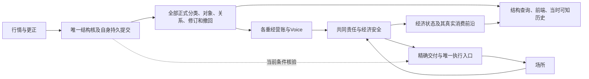

# #1339 架构 R2：正式结构持续产出

**RF-02已按用户“要产出”的决定完成架构修订。R2协议和整体推荐分别完成独立文档复核，读取范围内均为0H/0M/0L；当前等待完整架构采纳。** 这不是生产实现或运行验收，整图#1323尚未完成。

推荐以[完整架构推荐R2](/tmp/newchanlun-1339-architecture-r2-20260909/author/SCHEME-COMPARISON-R2.md)及其绑定协议作为图内SPEC基础。它保留完整分类、逐重经营、全部观察与旧入口收敛范围，撤销旧R1中公共经济日志故障连带暂停正式结构、结构/经营共轮及经济观察阻塞。

经济域故障时，结构自身健康就继续走“行情→正式结构→观察/历史”。前端分别显示完整结构与经济侧的缺项、可信旧版本和实际消费前沿。经济恢复按当前适用结构和真实责任重核，不能补造故障期经营历史或批量补发旧候选。

**采纳时须明确接受的代价**：一份已经决定、量价/投影冻结并不可撤地交给唯一执行入口的精确命令，此后即使经济侧新发现风险，仍可能来不及阻止其首次调用；全部最大可能责任一直保留。尚未交付的普通准备没有这个例外。必须在结构核验或实际调用边界成立的条件仍须可核，遗漏、缺覆盖或无能力就拒绝；本方案没有声称执行时两域共同最新或网络恰一次。

## 当前结果与边界

| 项目 | 当前状态 | 证据 |
|---|---|---|
| RF-02故障要求 | 已确认：交易暂停时正式结构仍须产出 | [用户决定](/tmp/newchanlun-1339-architecture-r2-20260909/USER-DECISION.md) |
| R2跨域协议 | 架构合同层独评通过，初评3M/1L四项全关，残留0H/0M/0L | [协议独评](/tmp/newchanlun-1339-architecture-r2-20260909/review/REVIEW-RF02.md) |
| 整体架构承接 | 限定集成独评通过，13项检查、残留0H/0M/0L | [整体集成独评](/tmp/newchanlun-1339-architecture-r2-20260909/review/REVIEW-COMPARISON-R2.md) |
| 完整范围 | 44ST、35FG、RF-01、62轴/10组合及16工程状态的经济事实保留；发送/观察状态按20CR替代 | [整体推荐](/tmp/newchanlun-1339-architecture-r2-20260909/author/SCHEME-COMPARISON-R2.md) |
| 架构采纳及SPEC | 尚未批准；RF-02回答不代替采纳上述完整协议和边界 | [下一步骤](/tmp/newchanlun-1339-architecture-r2-20260909/NEXT-REVIEW.md) |
| 证明、生产、前端、回放及paper/live | 本轮未实现或运行；不能把文档关项计作验收通过 | [14项验收义务](/tmp/newchanlun-1339-architecture-r2-20260909/ACCEPTANCE-RF02.md)及协议独评I-01–06 |

四项修订分别是：完整适用条件及检查阶段不可漏项；持续合规请求在S本地稳定点取得有限公平核验机会；同命令X持久原子消费一次调用权；权威未决与观察未知分层。结构不等经济锁/RPC/ack，失效命令不等待未来行情复活，重复收据和崩溃未知不自动重发。

## 可审阅工件及读取次序

1. [整体架构推荐](/tmp/newchanlun-1339-architecture-r2-20260909/author/SCHEME-COMPARISON-R2.md)：整体组织、完全分类、四案差异、代价和整图路线。
2. [R2协议](/tmp/newchanlun-1339-architecture-r2-20260909/author/PROTOCOL-R2.md)与[20项替代/继承表](/tmp/newchanlun-1339-architecture-r2-20260909/author/CONTRACT-REPLACEMENTS.md)：对旧R1相关条款有明确替代优先级，不能拼成第三套协议。
3. [协议独评](/tmp/newchanlun-1339-architecture-r2-20260909/review/REVIEW-RF02.md)与[整体集成独评](/tmp/newchanlun-1339-architecture-r2-20260909/review/REVIEW-COMPARISON-R2.md)：分别记录19CE/14RA/20CR/5OP关项和整体承接射程。
4. [原完整包](/tmp/newchanlun-1339-architecture-20260908/DELIVERY.md)：完整分类目录、工程状态、观察底图、四案整合、旧入口终态及既有独评。原41件字节保持，涉及跨域协议与推荐的旧结论按本轮20CR替代，旧签署不延伸到新稿。

初始反例、第一次评审和两次冻结快照保留。作者稿里的“待独立关项”是该冻结版本编写时状态；当前结论以本页和最终独评为准。协议JSON中旧额度状态已经仅作元数据更正，10节正文和协议MD未改，精确差异和独立补签均单独留证。当前无额度阻塞。

四事件24排列复用原两个抽象守卫，只能排除“两域必然共同最新”的主张；它没有建模完整条件清单、稳定队列、网络或X调用占有，不能充作新协议证明。真实失效源闭包、证书实例、网络栅栏、持续输入进展、场所身份/回查和前端恢复仍必须实际验收。

全部新工件位于本票专属草稿目录；未修改主仓代码、Lean、GitHub票面、服务或交易，未合入main、harvest或关票。架构采纳后形成图内SPEC，经过SPEC批准再实施和独评，按既定门推进旧入口收敛、完整历史回放与paper同核，直至整图目的地及关图纪律全部满足。
