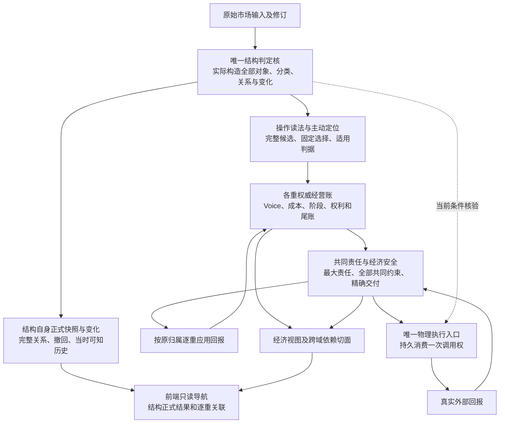

# #1323 架构重评 R2：结构独立产出、完整分类与逐重经营

> #1339 是当前需求与架构步骤；整图 #1323 的目标仍是实装、验收和合法关图。本文由本体整合，协议与推荐集成均待本轮独立关项；尚未获架构采纳或SPEC批准。需求范围与RF-02已确认，K4在范围外。

当前推荐是以[本轮R2协议](/tmp/newchanlun-1339-architecture-r2-20260909/author/PROTOCOL-R2.md)及[20项明确替代/继承关系](/tmp/newchanlun-1339-architecture-r2-20260909/author/CONTRACT-REPLACEMENTS.md)组成的完整修订架构作为图内SPEC基础，取得本轮独立关项后再请用户采纳。它保留此前从需求独立推导的“逐重权威账＋共同责任”组织，按RF-02将正式结构从经济日志、经营轮和全局观察等待中分离。组织与A2趋同有明确需求依据，但不直接采纳原A2或旧R1全稿；新协议由本体接回编写，独立复核只按其实际阅读射程签署。

这一建议同时受三项已定要求约束：单重权威账故障且全部共同约束仍可核时，健康重必须继续新增；后台必须完整计算并交付全部合法分类、组合、关系与变化；公共经济安全故障导致交易暂停时，结构自身健康就必须继续正式产出。相应需要可独立核实的责任证据、完整计算到前端的路径，以及不等待经济域的结构提交和消费。进程数量、数据库品牌和类名不能替代这些验收。

**需要在采纳时明示的主要代价**：正式结构拥有自身持久顺序和发布，公共经济故障不阻断它。交易采用财务侧精确命令的不可撤交付、结构侧当前条件核验及X唯一调用占有；精确交付后经济新风险仍可能来不及阻止此前这份命令的首次调用，最大责任继续保留，尚未交付的普通准备没有该例外。结构在本域开始修订前封门，核验时已失效的依据不能发送；适用条件缺分类、覆盖或核验能力则不支持执行。该组织增加条件证书、分域恢复、一次调用权和本地公平服务义务，尚无吞吐、时延或恢复时间实测。

## 1. “完全分类”落实到什么

[分类目录 r2](/tmp/newchanlun-1339-architecture-20260908/author/CLASSIFICATION-CATALOG.md)列出62个轴或公式族、10组跨轴合法性合同，以及32个证明、同步、工程实例或具体待定事项的定位。它承接全部44条结构需求；35条经营需求另接[经营与工程状态合同](/tmp/newchanlun-1339-architecture-20260908/author/independent-design-state-contracts.md)中的16个软件状态轴和各自数值、集合域；其中ES-01/02/03/05/15等涉及发送、未决/未知和观察闭包的条款按R2的CR-14–16替代，不能将旧单M位与新两域协议同时适用。**这些数量是交付目录规模，不是已证的市场状态总数。**

对每一真正分类轴，先明确对象与良构域 D，再证明所有分支 P 在 D 上不漏不重：

`∀x∈D, Σᵢ 1[Pᵢ(x)] = 1`。

随后还须证明真实结构确实落入 D、程序与判据一致、所声称合法的组合可构造、合法转换保持不变量。单个对象的一根轴取唯一类别；不同轴、不同对象同时存在的事实全部保留，不能让一个小转大标签覆盖中枢关系或其他级别的买卖点。接口缺数据、计算未完和已登记未裁边界各有准确去向，均不能让“完全分类已完成”的验收通过。

具体修订包括：包含折叠的非包含追加分支；力度空输入与语义非空样本分开；三类点未完成输入与正式确认分开；小转大必要条件与已发生事实分开；下钻固定选择后的失败与其他候选成功可以并存，后者不得救回前者。六谓词64种编码中，给定 Origin LevelView 的同类别买卖互斥已排除37种，剩余至多27种只是约束允许上界，不能报成27种都已证明可达。

静态分区、程序等价和构造证明按规则/程序版本保存并复用。每次推进仍要实际计算全部对象与适用轴，记录输入范围、见证、结果和变化；不要求每根K线重跑Lean，也不允许只填一张“全轴已算”的收据来替代计算。

当前交付建立了全分类目录及逐项实现/验收合同，**尚未补齐全域证明或实现完整分类**。32项也不等于32个新教义待裁：例如三笔相切、三类严格端点、力度首末式已有权威定义，应做同步与投影证明；G-003明确只是描述性观察，不是缺口。独立选父价格挂法及Type2/3的N/A证书处理保留已有具体残留，不能暗填默认规则。

## 2. 提议的整体组织

图中是职责和依赖，不规定每个框独立进程。结构S的接纳、计算、正式提交、索引、结构流与历史不等待经济C的日志、Pending、ack、经营轮或全局总览序号。共同责任只保存核实约束所需的独立证据与许可，不替每重计算成本或决定方向。操作读法不反写结构主干；外部真实成交也不改写结构定义。

- **结构与定位**：输入一次，按同一组判据造各级结构；每个对象、候选、关系和变化都有身份、规则版本、来源和获知时点。后台输出包含无当前实例的分类目录，并提供当前全部实例。
- **逐重经营**：重持久，Voice按自身生命周期开始和退出；成本、回本、增长、换档及尾账可沿真实事件追踪。固定Q、实际持量、增长权益分开，尚未裁的会计桥继续具名保留。
- **共同责任和执行**：先持久保留最大可能责任，再允许本地承诺；精确交付、结构核验与X持久OwnAttempt明确区分。只有同命令首次原子占有的执行者有一次调用权，重复只查原状态，崩溃未知不自动重发；释放依据是对应责任的不可再执行证据和所需账收据。坏账仍可能占用的责任保留，不能从净额或超时推断资金可重用。
- **观察**：结构快照和增量来自同一S会话及固定切面，可单独正式完整；跨域经营视图另带各域前沿、实际消费结构版本、缺项和可信旧cut。结构到动作到真实回报可双向追溯，经济反向消费索引未更新不能挡结构撤回；前端不补判后台没算出的结构。

## 3. 四案按当前要求的差异

下表评价原稿设计合同及本轮所需改造，不评价已经运行的系统。完整原文证据和80项矩阵见[原案重评](/tmp/newchanlun-1339-architecture-20260908/author/EXISTING-REEVALUATION.md)；当前分类接入与旧措辞订正见[分类整合附录](/tmp/newchanlun-1339-architecture-20260908/author/EXISTING-CLASSIFICATION-INTEGRATION.md)。

| 原案 | 可复用的组织 | RF-01所需变化 | 完整分类与观察的接入 | 主要新增负担 |
|---|---|---|---|---|
| B-r1：证据工作台＋承诺核 | 集中经济提交及证据发布 | 改故障读集，独立保存坏重责任证明，让健康请求不依赖坏账恢复 | 工作台产生全部目录实例，承诺核结果进入同会话Query/Watch | 集中事务的简洁性减少；不能只靠poolReady或局部UI宣称故障继续 |
| A2-r3：逐重私账＋共同提交 | 已有坏Book不可恢复而健康Book在公共界内新提交的合同 | 主要组织可保留；精确落实证据有效性、失效获知和发送顺序 | 共享结构发布＋逐重账及公共切面，补每轴全结果；JoinCut限于相应跨域消费，不可阻断结构范围 | 多日志协议、条件证书和独立恢复；经济待决锁不能挡结构，共享净单撤单仍可能延迟其他重 |
| C3-r1：独立经营答案＋资源基座 | 专题发布、依赖说明、持久续算 | 改每重资源权威的故障边界和健康请求必读集，不能让坏重阻塞必要成员齐备 | 完整答案及支持关系适合细分结果，仍要实际接齐目录与全值消费 | 需要同时维护答案依赖、资格、资源证明及恢复闭包 |
| C2-r2：整版执行程序变体 | 全状态/Frame和整版可重放发布 | 必须修改完整输入、结果、根与恢复合同，使坏账子域不阻健康提交 | 完整状态与Delta接入逐轴、组合、变化及前端路径 | 原“完整S一次提交”的简单性减少，需子域证据与组合恢复 |

四案都能够继续设计到满足当前观察要求，不能因为C3有支持图就免证完全分类，也不能因为共享数据库就判B必须换成私有Book。原A2的RF合同最接近已确认需求，因此独立推导与它趋同有明确理由。新版采用自身明确写出的协议；原案其他限制或合同并不随名字自动生效。

本表的原案组织与RF-01比较沿用已核的旧比较射程；RF-02带来的以下结论是本轮集成推论：B/C3/C2若把正式结构发布并入必须等全部经济输入/根齐备的提交，须拆除该依赖；A2的多日志组织也必须检查共享发布、JoinCut、保留ack及恢复锁是否反压结构。没有任一原案凭名称自动满足RF-02。所有方案若采用本轮两域条件交付，均须承担同样的完整条件、真实发送隔离、稳定服务与故障验收，不能借改名免除。

## 4. 协议修订与独立复核范围

**外部事实已知、共同约束仍旧**：旧草稿先把回报写进独立inbox，稍后通知共同域；这期间可能用已失效的界许可新发送。新版在解释风险语义之前，于同一安全日志同时保存原报并登记受影响约束的待核项。新保留和E-Release读取相同待核集合、证据版本及有效条件；核完一条不能清掉后来另一条。普通回报若可证明仍被坏重保留责任覆盖，可清该待核项且无需等坏重入账，健康重继续新增。

**部分成交后改单重复分量**：首次冻结100，已成40，旧单仍可能成60时，新独立价单可分配量为0。取消期间旧单再成20，取得不可再执行及历史累计完整证据后，新单最多40。采用原子改单必须有场所合同证明其共享同一冻结上限；其余走取消、核完整终态、唯一转移剩余量。两条路径都维持“已成＋各独立可成交额度分配的最大可能未计执行量≤首次冻结量”；有场所累计上限与互斥保证的原子改单链共享一份分配，旧新版本不重复计量，不能只看最终净仓。

上述P4/P7经济规则继承旧稿已读结论；P4原来同时排序结构修订的部分由R2明确撤销，旧签署不覆盖新协议。R2初评另发现条件阶段不完整、busy拒绝可使交易一直得不到核验、同收据可重复触发调用和未决/未知混淆。作者已分别补完整清单与Unsupported、有限稳定服务、X同ID持久调用占有及知识状态分层，当前待独立关项。最新状态见[本轮交付](/tmp/newchanlun-1339-architecture-r2-20260909/DELIVERY.md)。文档反例闭合不是模型检查、运行活性或场所能力实证。

## 5. 后端处理到前端显示的验收路径

[完整观察底图](/tmp/newchanlun-1339-architecture-20260908/author/FULL-STATE-OBSERVATION.md)提供逐步合同。小转大必须能从必要条件出现追到实际转折、不同级别背驰及当时获知证据；中枢扩展必须能看到参与中枢、核心和外缘、重切成员及实际构造的高级对象。关系成立与高级对象已构造是两个事实，尚缺构件时准确显示缺件。

RF-02还须实际切断经济日志、查询或连接，保持结构自身健康，观察正式新结构、撤回、替代、快照/续接和AsKnown继续；经济恢复不能把未发生的经营处理回填成当时已知。持续结构输入且健康重始终合规时，还须看见新经营提交及真实条件核验机会；不得靠市场停更、每次busy拒绝或共享ack反压通过。

这条链逐层验收：正本判据与边界 → 完整分区及真实构造 → 生产入口实际计算 → 全对象与变化发布 → 同源快照/续接 → 每类前端入口 → 历史与逐重消费对拍。任何一层没有通过，都不能用下一层界面能画图作为替代。

本轮新增三轴有界静态核查已经发现：六态定义没有进入所查生产装配字段；中枢关系虽进入完整Move输出，信号增量接口会清掉相关对象；逐点六位BSP不等于每级唯一LevelView签名的生产桥。这些是已核路径内的断点，不能推广成全仓每个出口均缺失；旧三条代表链报告也不等于全部44条结构实现已查。

## 6. 从本候选到整图完成

[旧入口终态提案](/tmp/newchanlun-1339-architecture-20260908/author/OLD-ENTRY-DISPOSITIONS.md)按已封存扫描登记绑定真实入口、callee和preset，给保留迁移、只读、独立对照或退役条件。只列家族名不算旧实现收敛；也不能把大量import关系当成独立生产入口。入口去向是设计提案，当前没有停止服务或移走发送权，未结头寸、订单、费用与更正必须按原责任保存。

协议独立关项与本推荐集成检查完成后，仍须用户明确采纳此完整架构及其已交付命令窗口。此后按本仓Wayfinder流程形成图内SPEC，逐项落实真实待定选择、证明桥、身份/恢复及技术承载；用户批准SPEC后，再拆成从输入到可见结果的实施票DAG。具备实施资格且在批准范围内的票才进入Sandcastle；实装与独立评审接回后，按明确批准范围验收合入。原始输入与结构、逐重真实经营、旧入口收敛、前端、历史回放及paper同核都要达到#1323的目的地标准，才能合法关图并完成goal。

采纳本建议只确定这份修订架构作为SPEC基础；本轮尚无生产代码变更、项目或Lean运行、UI验收、paper/live、GitHub发布、main合入或关票。经济政策和场所能力未定项不会因架构采纳自动获得默认值。
