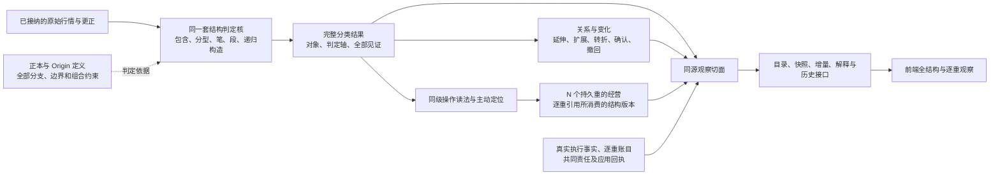

> 链接转换阅读版；正文语义与原稿一致。签署原字节：[原稿](../../../../payload/sources/newchanlun-1339-architecture-20260908/author/FULL-STATE-OBSERVATION.md)，SHA256 `aa65047a2887d35e3f4ec916f54f2660f789ea8e5bef32c2ce72457c2f2c689b`。当前批准状态见归档根APPROVAL.json；原稿中的待审状态保留为发生时记录。

# 后端完全分类到前端完整观察

本件是 #1339 架构重评的共同要求，不替任何候选指定账目所有权、存储或进程。用户已要求后端处理完整结构，前端能够看到全部分类、关系和变化；本件把这条路径与逐项验收连接起来。当前仍是设计，未实施。

前端不再从买卖标记、几何矩形或净仓位补推后端缺失的结构。完整分类结果和每次变化先由后端产生，接口保持其对象身份、判定依据与获知时点，前端负责查询、筛选、绘制和展开证据。经营结果不得反向改变结构判据。

## 一条对象从计算到可见的完整合同

| 环节 | 必须给出的结果 | 验收失败实例 |
|---|---|---|
| 目录 | 对象/轴、定义域、全部叶或参数化分支、等号边界、组合与转换约束；没有当前实例也可查 | 只列当前枚举、只列有买卖信号的类别 |
| 判定 | 同域恰一分类；正交轴分别给结果；全部候选和见证按其真实身份保留 | `if/else` 吞掉二类与三类重合；用 `Other` 掩盖漏支 |
| 构造 | 原始事实到合法输入域、递归父子与完成证据均可追溯 | 给了分类标签却不能指出对应对象；把几何包含当父子 |
| 变化 | 前后对象/关系、发生位置、首次获知、修订原因及被消费版本 | 只给最终状态，历史小转大或中枢扩展被后续状态覆盖 |
| 输出 | 完整切面或准确声明的局部切面；分页共享切面，游标有连续性与断档恢复规则 | 信号差分清空结构；缺少对象被表示为空；混用两个会话的快照和流 |
| 前端 | 能遍历目录、查看所有轴与对象、展开关系/证据，并按当时可知回放 | 接口字段存在但页面无入口；前端自行用未来信息补早期标记 |
| 经营关联 | 每个重消费的结构/读法/定位版本、决定、准入、真实执行及账目变化 | 用当前结构解释旧成交；用净头寸代替各重成本和尾账 |

这七行都须针对分类目录逐项兑现。目录总条数、返回类型中存在 enum、快照 hash 相等和少数图形样例都不能替代这份验收。

## 两个必须走通的结构场景

**小转大**：先保留末次级中枢相应三类点这一必要条件；它出现而原趋势继续也是合法结果。实际发生 q 级转折，并有 r<q 的背驰与真实结构归因时，再记录小转大。必要条件出现时间、转折发生位置和实际获知时点分别保存；下钻取不到锚不会生成小转大。无同级一类点时，仍须保留原文规定的二类点分支，并区分本级转折锚与次级构成一类。

**中枢扩展**：给两个具体中枢的核心/外缘关系与精确边界；同时保留九段处理、重切窗口和上级构造的实际结果。已形成上级中枢时展示全部构件及父子关系；构件尚不足时展示已有关系和具体缺件。`level_lift` 标记不能充作高级对象及血缘证据。单元离开、首次回试、中心破坏、两个中心之间的发展关系分属各自对象，不用一个全局状态互相覆盖。

## 当前已有实现的三种不同断点

依据本轮[三轴源码核查](../evidence/CLASSIFICATION-OUTPUT-PROBE.md)，限定在其记录的 dirty 源码版本和出口范围：

- 六态的纯函数存在，尚未接入当前生产 `Classification` 的构造与字段。
- 中枢发展关系在完整 `Classification` 内可由 `MoveBlock` 字段及范围恢复；下游信号差分会清空相关结构。
- 逐点六位 BSP 真正产生并保留，Γ 诊断 JSONL 也导出六位；尚未据此建立每级 `LevelView` 投影与唯一签名的完整桥。

本次核对的 `PyThetaStream` 直接出口没有导出这三个轴。以上是有界静态证据，不代表已经遍历所有出口、执行全部分类或验收前端。

## 完成判据

分类目录里的已有定义必须全部实现；明确仍需裁定或实例化的边界必须先结清对应合同。运行时可以准确展示数据不足、计算未完或证据失效，但这些状态不能使“完全分类已完成”的验收通过。

后续 SPEC 和 tracer bullet 必须从同一原始输入贯通判定、实际构造、完整输出、前端可达及逐重消费，再按全部分支与边界展开。项目要求的形式化、测试、回放与 paper 验收在实施阶段执行，当前均未运行。整图 #1323 的完成标准继续有效，#1339 的设计交付不等于整图完成。
