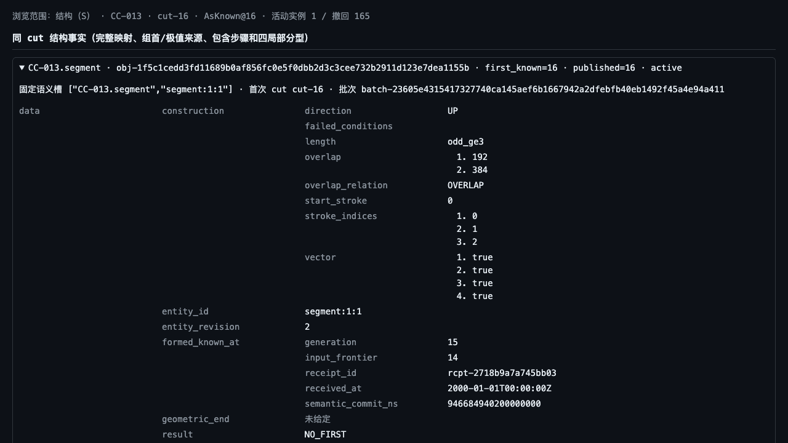

# #1404 / TB-02-C 实现交付

工作草稿，活期绑定 #1404。基线 `8619a20f2800095e6bb9ec20ba2607a744740f91`，分支 `codex/1404-seed-first-20261007`。由原生管理子代理接回 Sandcastle Codex 工蜂，根任务完成修复、独立补审和正式验收；交付 commit 由本报告所在 PR 绑定，合入 main 另待具体版本批准。

## 交付面

正式新笔流进入现有 `FeatureSeqState`/段划分状态机，记录三笔闭公共区间、完整构造条件、FIRST 原笔与标准元素、方向性包含前后及来源、试探/实际分型与原始 gap。没有从最终 `Segment` 倒推过程，也没有独立宽档算法。完整段端准入补上已签 CC-011/013 的方向、奇数、闭重叠和顶>底检查；全量与增量共用同一条件函数。

同一 `advance_core` 和 cut 将事实投影为 typed 候选、seed、FIRST、发展/终结对象、关系、变化与具名范围版本，沿现有内容 ID、fact_key、compute_diff、持久结构表和查询/游标通道发布。几何段端与形成/终结首次获知分别保存；普通追加不挪首次获知，输入事实修订沿 #1392 同一代际函数处理。

第二种终结不交付。CC-012/013 整轴保留 `not_implemented`，本片对象照实以 `run` 和 `TB-02-C` scope 呈现；不足三笔只发具名 seed_candidate，不产 seed 或段。会话规则版本更新为 `s2-axis-quantifiers+new-bi/1+segment-first/1`，旧规则写入由既有版本门拒绝，避免静默混跑。本片保留第一分型原始 gap，遇到它明确等待后续片；即使旧状态机将 c 封闭视为 strict 触发，也不在本票输出中冒充无缺口第一种。依赖这一未交付边界的后续候选不发布。本票不声明完整段语义、一般同价域、真实交易或 #1460 产品图已交付。

## 原件与独立预期

只取已签 `.chanlun/review-results/issue1339-r2-spec-20260909/view/spec/{SPEC,INTERFACE-CONTRACTS,EFFECTIVE-CONTRACTS}.md` 的本片条款，以及 payload `SPEC-COVERAGE-INPUT.json` 的 CC-011/012/013、ST-007/048、LC-02。闭重叠依据 SPEC:58,265 与 classification_axes/10，旧“未裁”注记没有覆盖它。

独立手算与输入先于首次段运行冻结在 `s_session/tests/fixtures/tb02c/{ORACLE.md,raw-ledger.json,hand-oracle.json}`。raw 15 前缀是有效三笔 seed；完整 raw 27 是六笔、无 gap 分型，几何端 raw 13、获知不早于 raw 26。镜像独立通过价格取负/高低交换构造。不是实现输出反写 oracle。`contract-seed.json` 是公共类型边界测试数据，不能替代 raw oracle。

## 必要接线的额外文件

- `parser/inclusion.rs`：同次事实载体加段事实字段；不改变包含判据。
- `s_session_v2/tb02a.rs`：允许公共投影读取新增 typed kinds。
- `s_session_v2/tb02a_facts.rs`：同 cut 目录证据识别本片对象与剩余范围。
- `s_session_v2/tb02b.rs`：只将既有 `fact_basis` 开放给同级模块，避免自建笔/段两套代际。
- `browser/index.html`：typed 清单接到已有客户端导出，目录按钮和证据区接纳TB-02-C scope，继续用已有只读卡片展示；无产品界面重做。
- `test_tb01c_browser.cjs`：VM 装入页面本来已加载的真实 TB01C 模块，原断言不减、不 ignore。

实际文件全集见 `FILES.json`。没有修改教义、已签 SPEC、资金政策或生产资源数值。s_query_integrity.py 的必要兼容修复按已发布 A/B/C 规则选择轴集合，保留旧 B cut 公共读取；未改 #1394 分配/性能实现。

## 验证结果

四个 R3 正式运行全部成功，每轮 28 根自然 raw 经正式 S/Q，完成公共 snapshot/watch、旧 cut 重访、独立手算预期、正常停机/epoch 变更/重启，以及真实 Chromium 的 cut16/28 检查。上行和下行各两份完整原件均为 161 条，逐字节相同，分别为 470,987,732 与 475,548,429 字节。比较未排除字段、未重命名身份、未重排数组。

原 R3 总入口因旧比较器 16 MiB 单记录上限退出1；四个运行的退出码均0。随后只对已有原件做流式 JSONL 验真和完整字节比较，未重跑服务，原失败收据仍保留。事前布局从28输入、采集控制流和17张权威表推导，重复键、浮点、共同截断、缺顶层字段、错误身份/次序和额外尾部均不放行。字节不同只报告尚未证实语义相同。解析使用固定 ijson 3.5.1，内存随最大标量及当前对象键集合增长；不据此声明S7资格。

最终 Rust 定向10项、Python14项、Node5项通过；R3运行前的release构建已通过，原二进制摘要保留。工蜂初版的段模块20项、特征序列15项等记录保留，但其通过不冒充根任务修复后的新测试。准确指纹、检查范围、原始日志和正式收据见 VALIDATION.json；完整性推导与独立评审分别见 R3-COMPLETENESS-REVIEW.md、REVIEW.md、COMPARATOR-REVIEW.md。

本次修复包括：发展态来源止于实际扫描前沿、成员边只绑定该成员两端来源、Python优化模式仍执行oracle校验、旧B规则回读兼容、浏览器正确识别段逻辑槽，以及大记录离线对拍。R3后另修几何已失败仍带第二种等待提示，并允许已有收据重复复验。最终两方向28前缀回归确认不进入该几何失败分支，因此复用原R3非失败域正式证据；失败域理由变更由定向parser测试验收，未声称最终release重新运行四arm。新Rust库与正式S bin定向测试均已编译通过。



旧9K随机oracle在严格段构造下失去多窗口/空投影覆盖，已换成267根有效raw。原逐前缀位精确对拍和三个覆盖断言全部保留；实测T==1为190、T>1为2、空投影2，测试体0.05秒。此项只修测试输入，未调整生产准入，见ORACLE-FRONTIER-DIAG.md和final-oracle.txt。

## 复现

在独立测试环境安装 `python -m pip install -r s_session/tests/requirements-tb02c.txt`。该依赖只供验收比较器，未进入S/Q运行时。

```sh
python -B -m unittest discover -s s_session/tests -p 'test_tb02c_*.py' -v
node --test s_session/tests/test_tb02c_contract.cjs
python s_session/tests/tb02c_harness.py --compare-existing "$TB02C_COMPLETED_RUN"
```

已有正式原件目录为 `/Volumes/AgentStorage/issue1404-formal-r3-20261007`。比较命令保留原件。COMPARISON-RESULT.json不存在时新建；存在时重新完整比较，并核对收据一致，保持原字节和时间戳；结果不同则报错并保全原收据。新机器要重跑时，使用 `tb02c_harness.py --help` 所列参数指定新OUTPUT、构建binary、现成Python/Node/Playwright；加 `--execute` 执行。浏览器可用 `TB02C_CHROMIUM_EXECUTABLE` 指定现成程序。正式输入与手算账簿在 `s_session/tests/fixtures/tb02c/`。

## 边界

相切按闭重叠测试，但闭重叠为真并不代表完整seed成立。笔端价5→10→0→5的公共区间[5,5]成立，完整四条件为1101，顶>底失败；公共parser层测试覆盖这一差别，未冒称正式raw相切验收。额外raw相切草案仅经手算订正，未作为本次服务验收证据。

规则版本为 `s2-axis-quantifiers+new-bi/1+segment-first/1`。旧A/B cut按其发布规则回读；旧规则写入仍走既有VersionMismatch门，没有自动迁库，也未声称旧库写入升级完成。

第二种终结、第二序列扫描、一般同价域、全域可达性证明、资源资格与完整9011、真实交易及#1460产品界面仍由各自后续工作承担。CC-012/013整轴仍是not_implemented。本票的运行验收不关闭父TB、SPEC或整图#1323。
