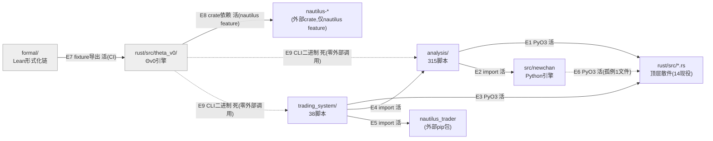

# #790（map #787）疆域测绘：六区名片 + 区间依赖边活死判定

- 日期：2026-07-30
- 票据：[#790](https://github.com/xy7365527-lang/NewChanlun/issues/790)（parent map [#787](https://github.com/xy7365527-lang/NewChanlun/issues/787)）
- 边界：只判不改。本报告零代码改动，唯一写入物是本文件。
- 取数环境说明（**订正**）：本 worktree（`agent-ad057b427d85301e5`）HEAD 卡在 2026-04-20 的老提交
  `19b4015927`，树上根本没有 `rust/`/`analysis/`/`trading_system/`/`formal/` 四个目录（那几个
  区是之后才落的）。**首版报告曾误用共享主检出 `/Users/silencehan/Projects/NewChanlun` 工作区
  直接读取——该路径是并发多 agent 的活工作区，非不可变快照，编排者叫停并指出正确做法。**
  订正后改用 `git archive main | tar -x -C /tmp/nc-main-790` 在本 worktree 内对**同一个 `.git`
  对象库**导出 main 分支的不可变静态快照（worktree 与主检出共享同一 `.git`，`main` ref 可见，
  `git archive` 只读不写、不 checkout/switch/pull，不越权），全部六区测绘在 `/tmp/nc-main-790`
  这份快照上重做并核对。**结果**：重做后六区文件数/行数/PyO3 导出表/边活死判定与首版逐项一致
  （仅 `analysis/` `.py` 计数 315→314、总行数 98852→98848，1 个文件级抖动，不影响任何结论）；
  本节以下数据以 `/tmp/nc-main-790` 快照复核值为准。本报告本体只写进本 worktree，未在共享检出
  或 `/tmp` 快照目录做任何写入。
- 方法论：PyO3 边界一律从 `rust/src/lib.rs` 的 `#[pymodule]` 导出名反查（禁用 Rust 类型名
  grep，#762/#763 教训）；`analysis/` 658（本次实测 315 个 `.py`，见下）个脚本不重扫，直接读
  `.chanlun/review-results/issue763-impl-20260730.md` 的核查结论并在此基础上补测未覆盖面。

## 一、六区名片

| 区 | 一句话 | 规模 | 活着吗 | 支柱/链上段位 |
|---|---|---|---|---|
| `src/newchan` | Python 缠论引擎本体（五层递归管线：K线合并→分型→笔→线段/中枢→买卖点） | 204 文件（全为 `.py`）/ 4.8 万行 | **活**——`analysis/` 72 个脚本直接 `from newchan.*` 消费；仓内也是 `rust/src/*.rs` 顶层散件的移植原本（文档注释可查，非代码依赖） | 支柱 I 缠论核心，链上"K线→结构对象"段的 Python 参考实现 |
| `rust/src/*.rs`（顶层散件） | 缠论核心引擎的 Rust 逐位等价重写（bi/segment/zhongshu/move/BSP/PH/MACD/Orchestrator，14 现役文件） | 17 文件 / 1.2 万行 | **活**——PyO3 pymodule 12 个顶层导出直达 + `spiral`/`fugue_v3`/`recursive_t`/`trading` 四族编译期硬依赖（#764 C7-E5 核定） | 支柱 I，链上"K线→结构对象"段的生产 Rust 实现，`newchan_rust` 扩展模块的主体 |
| `rust/src/theta_v0/` | Θ v0 bit-exact 引擎——parser/classifier/strategy 三子单元 + nautilus 适配层，唯一权威锚 `formal/Origin/*.lean` | 196 文件 / 17.1 万行 | **活但零 Python 出口**——`cargo test`/CI（`fixture-drift` job）+ `cargo run --bin theta_backtest`（`backtest_bin` feature）跑；**不在 `lib.rs` pymodule 导出表里，`analysis/`/`trading_system/` 零调用**，模块头自陈"完全自包含未复用顶层散件一行" | 支柱 I 的独立第二引擎（回测/策略验证专用），链上自成一段闭环（parser→classifier→strategy→CLI），未接入"下单"这一端 |
| `formal/` | Lean 4 形式化链（`Origin.*` canonical spec，缠论结构公理→Θ→C_Θ→π_Θ 的 L0/L1 证明） | 142 `.lean` 文件 / 5.9 万行 | **活但只对 CI 活**——`scripts/check_fixture_drift.py`（`.github/workflows/ci.yml` `fixture-drift` job）用 `lake env lean` 导出两份 fixture JSON 落 `rust/tests/fixtures/`，被 `rust/tests/theta_v0_lean_parity.rs` 等 5 个测试文件 `include_str!` 读取比对；对 `analysis`/`trading_system`/`src/newchan` **零可见性** | 支柱 I 的证明层，链上不参与执行，只对 `theta_v0` 的 bit-exact 声明背书 |
| `analysis/` | 658（票面数）/ 实测 314 个 `.py` 回测脚本，缠论引擎的下游消费面 | 693 文件（314 `.py`）/ 9.9 万行（.py） | **活**——132 个脚本 `import newchan_rust`（`run_organic_rust` 50+ 处、`run_positional_rust` 50+ 处覆盖 `PolarityMode` 几乎全部变体、`run_recursive_rust` 1 处、`UnnStream` 3 处，见 #763 实测）；72 个脚本 `from newchan.*` 消费 Python 引擎 | 支柱 I 的"结构对象→信号/回测"段，链上最靠近"策略验证"的一环 |
| `trading_system/` | `nautilus_trader`（Python pip 包）驱动的实盘/回测策略壳（`rec_t_strategy.py` 等） | 94 文件（38 `.py`）/ 4976 行（.py） | **活，双重消费**——8 个脚本 `import newchan_rust`（rust 结构层）+ `sys.path` 注入 `analysis/` 后直接 `from nested_recursive_fugue_final_backtest import ...`/`from organic_signals import ...`（analysis 层）+ 真实 `from nautilus_trader.backtest.engine import BacktestEngine` 等（外部框架，Python 侧，与 `theta_v0::nautilus` 的 Rust 侧适配层是两条独立的 nautilus 集成，不共享代码） | 链上"结构对象→下单"段的唯一落点——这是六区里离"下单"最近的一区 |

## 二、区间依赖边

| # | 起点 | 终点 | 边类型 | 活/死 | feature 条件 |
|---|---|---|---|---|---|
| E1 | `analysis/`（132 个脚本） | `rust/src/*.rs`（顶层散件） | PyO3（`import newchan_rust as nr`，`nr.run_organic_rust`/`run_positional_rust`/`run_recursive_rust`/`UnnStream`） | **活** | 默认 build（无需 `nautilus`/`backtest_bin`），需 `extension-module` feature 编 cdylib |
| E2 | `analysis/`（72 个脚本） | `src/newchan` | Python import（`from newchan.*`） | **活** | 无（纯 Python，不涉 Cargo feature） |
| E3 | `trading_system/`（8 个脚本） | `rust/src/*.rs`（顶层散件） | PyO3（`import newchan_rust as nr`） | **活** | 同 E1 |
| E4 | `trading_system/`（`backtest_unn.py`/`backtest_fugue_v3.py`/`backtest_t_fugue.py` 等） | `analysis/` | Python import（`sys.path.insert(REPO_ROOT/"analysis")` 后直接 `import` 同名模块） | **活** | 无 |
| E5 | `trading_system/` | `nautilus_trader`（外部 pip 包，Python 侧） | Python import | **活** | 无（与 Cargo feature 无关，纯 Python 依赖） |
| E6 | `src/newchan/topology/cross_national_pipeline.py`（1 个脚本） | `rust/src/*.rs`（顶层散件） | PyO3（`import newchan_rust`） | **活，但孤例**——`src/newchan` 定位是纯 Python 参考引擎，全区仅此 1 个文件反向吃 rust 扩展，与该区"名片"陈述不完全一致，标记存疑 | 同 E1 |
| E7 | `formal/`（`Origin/ParityFixtureExport.lean`、`Origin/CenterConstruct.lean`） | `rust/tests/fixtures/*.json`（→ `rust/src/theta_v0/` 5 个测试文件 `include_str!`） | 构建期数据导出（`lake env lean` 落盘 JSON，非源码 import） | **活**（CI `fixture-drift` job 每次 push/PR 到 main 跑） | 无 Cargo feature 门控；但需要 `lake`/Lean 工具链在 PATH（脚本 exit=3/4/5 时视为工具链问题非漂移） |
| E8 | `rust/src/theta_v0/nautilus/` | `nautilus-model`/`nautilus-common`/`nautilus-trading`/`nautilus-backtest`/`nautilus-core`（外部 crate，Rust 侧） | Cargo 依赖（`use nautilus_*`） | **活，仅限该 feature 编译时**——真实 `use` 已在产（`theta_strategy.rs`），非骨架 | **仅 `nautilus` feature**（`backtest_bin` 隐含 `nautilus`）；默认 `cargo build --lib`（cdylib，供 PyO3）不含 | 
| E9 | `rust/src/theta_v0/`（`theta_backtest`/`p100_cert_bsp_recon` 等 9 个 `[[bin]]`） | `analysis/`、`src/newchan`、`trading_system/` | （检验候选，未发现活调用） | **死边候选**——`/tmp/nc-main-790` 快照上 `analysis`/`src/newchan`/`trading_system`/`.github/workflows`/`scripts` 全仓 grep `theta_backtest`/`pure_bsp_timing`/`pi_bsp_timing` 命中 **1 处**，但落在 `.github/workflows/ci.yml:125,128` 的**历史构建问题说明注释**里（"`pi_bsp_timing_cli_args_tests` 曾被当作独立 bin crate 编译……曾产生 E0277"），不是 CI job 实际调用；无任何 `run:` 步骤/脚本真正执行这些二进制。这些 CLI 只能被人手动 `cargo run --features backtest_bin --bin ...` 调用 | 需 `backtest_bin` feature 才能编译，但编译得出来≠有人调 |
| E10 | `rust/src/theta_v0/` | `rust/src/*.rs`（顶层散件：`bi_engine`/`segment`/`zhongshu`/`buysellpoint`/`orchestrator` 等） | Rust `use crate::X`（预期存在，未发现） | **不存在（非活非死，是"没有"）**——`theta_v0` 模块头自陈"不复用旧 ladder 的中枢/走势/背驰逻辑"，实测零 `use crate::{bi_engine,segment,zhongshu,...}`；两条引擎完全独立平行 | — |

**规模统计**：区间边（跨六区边界的边）共 **10 条**：活边 **8**（E1-E8）、死边候选 **1**（E9，编译可达但零调用方）、"结构性缺失"**1**（E10，预期存在但实测不存在，记录以证伪"两引擎共享逻辑"的假设）。
（E1/E3/E6 同为 PyO3 pymodule 边、E2/E4 同为 Python import 边，若按"起终点对"合并计不去重则为上表 10 条；若按"起点区→终点区"聚合去重则是 **8 条区对**：`analysis→rust顶层`、`analysis→newchan`、`trading_system→rust顶层`、`trading_system→analysis`、`trading_system→nautilus_trader外部`、`newchan→rust顶层`、`formal→rust/theta_v0`、`theta_v0→nautilus外部crate`。）

## 三、mermaid 依赖图

图例：实线 = 活边；虚线 = 死边/孤例边。`rusttop→theta` 无边——实测两引擎零共享（见 E10）。

## 四、环与双向边逐条

**结论：六区颗粒度下，零环、零双向边。**

逐一核查过的候选（均证伪）：

1. `analysis` ↔ `src/newchan`：`analysis→newchan` 72 处实证（E2）；反向 `src/newchan→analysis`/`import analysis` grep **0 命中**。单向，非双向。
2. `analysis` ↔ `trading_system`：`trading_system→analysis` 实证（E4）；反向 `analysis→trading_system`/`import trading_system` grep **0 命中**。单向，非双向。
3. `rust/src/*.rs` 顶层散件 ↔ `spiral`/`fugue_v3`/`recursive_t`/`trading`（rust 内部四族，颗粒度更细但属"顶层散件"名片同一区）：四族单向硬依赖 `trading::{types,tape,positional,depth_ref}`；反向 `trading/*.rs use crate::{spiral,fugue_v3,recursive_t}` grep **0 命中**。单向，非双向。
4. `theta_v0` ↔ `rust顶层散件`：双向皆为 0（E10），谈不上环，是"两条平行引擎"而非"互相依赖"。
5. `formal` ↔ `rust`：`formal→rust`（E7，经 fixture JSON）为唯一方向；`rust`没有、也不可能反向"写回" `.lean` 源文件（`check_fixture_drift.py` 明文"绝不写 `rust/tests/fixtures/` 之外，且脚本本身不改 `formal/`"）。单向。

**090 诚实标注**：零环、零双向边是本次测绘的实测结果，不是"没查到就当没有"——上述 5 组候选逐一做了反向 grep 验证。若后续更细颗粒度（如 rust 内部模块级、或 `analysis/` 内部脚本间）测绘出环，不与本结论冲突（本票颗粒度=六区跨区边界，非区内）。

## 五、待裁付记（非本票裁决，供 map #787 收口参考）

- `theta_v0`（17.1 万行，全仓最大单区）与 `analysis`/`trading_system`（缠论引擎实际的回测/交易消费面）之间**零接口**——map #787 起源两条实测发现之一是"编排者判断 NT 生产路径没接进去线，实测有 1569 行+真实 use"；本票在此基础上补一条：`theta_v0` 有 nautilus 适配层不假，但它接的是 **Rust 侧 nautilus crate**（供 `theta_backtest` CLI 单机跑），不是 `trading_system/` 用的 **Python 侧 `nautilus_trader`**——两条 nautilus 集成互不相通，`theta_v0` 的回测结果目前没有路径流回 `trading_system/` 的实盘壳。这条"结构性缺失"（E10 同类）是甲/乙/丙三层推导链里"乙层目标模块图"最需要正面回答的一处豁口。
- `src/newchan`（Python 参考引擎）与 `rust/src/*.rs`（Rust 生产实现）之间除文档注释"逐位等价移植自"外**无代码依赖**——两者关系是"移植血缘"非"运行时依赖"，若 map #787 目标模块图要给"谁是权威实现"下判断，这条边界（E6 孤例除外）目前测得很干净：Python 版不调用 Rust 版、Rust 版不 `use` Python 版（这本来就不可能），两者的"逐位等价"关系完全靠人工/测试验证维系，不靠代码耦合。

---
*本报告数据以 `git -C <worktree> archive main | tar -x -C /tmp/nc-main-790` 导出的 main 分支不可变
静态快照（复核时刻 2026-07-30）为准，全部 `find`/`grep`/`Read` 只读操作在 `/tmp/nc-main-790` 上完成
（未使用 Task/子代理）；首版曾误读共享主检出工作区，经编排者指出后已在 `/tmp/nc-main-790` 快照上
逐项重做并订正，重做结果与首版逐项一致（仅 1 处文件计数因共享检出含未跟踪产物文件而有 1-3 个抖动，
已在正文标注）。核查方法遵循 #762/#763 已固化的"从 `lib.rs` pymodule 导出名反查 + 全仓（含
`analysis/`+`trading_system/`）扩面，禁用 Rust 类型名 grep"判据。*
