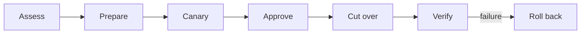

# Maximize Autonomy Inside Explicit Authority

Capability tells a worker how to cause an effect. Authority specifies which
effect an identity may cause, to which resource, in which environment, for how
long, and under what approval and recovery contract. Keeping those contracts
separate permits broad autonomous work in reversible environments and narrow,
revocable grants at consequential boundaries.

## Give reversible work a broad envelope

Let the worker inspect, edit, build, test, simulate, and iterate where effects
are isolated and recoverable. Most mistakes in that envelope are inexpensive
feedback. Ryan Lopopolo's argument that [most mistakes are not consequential]
shifts the security question toward consequence and recovery instead of
demanding error-free stochastic work.

[most mistakes are not consequential]:
  https://x.com/_lopopolo/status/2072102011546591295

An authority grant should identify:

- the worker identity;
- the operation and target resource;
- the environment and scope;
- the grant lifetime and revocation path;
- any approval or separation of duties;
- the audit receipt and postcondition; and
- the rollback or recovery path.

The capability contract can remain stable while these grants vary by identity,
environment, and consequence.

## Keep credential custody outside the trajectory

A command can feel ambient without making its credential model-visible. A broker
or sidecar can resolve narrowly scoped key material from secure storage at the
action boundary so `gh` behaves like an ordinary tool while the key stays out of
model context and the repository. Ryan describes both the [credential isolation
goal] and [ambient access with credentials held by a sidecar].

[credential isolation goal]: https://x.com/_lopopolo/status/2046021111440458027
[ambient access with credentials held by a sidecar]:
  https://x.com/_lopopolo/status/2061150109232939288

One internal-product job began with the outcome “read Slack and identify inbound
outages” so a person would no longer have to copy messages into the trajectory.
Owning that whole job required Slack access, then agent-requestable credentials,
then keychain access and safe handling of cryptographic material. Only after
building that supporting path could the worker return to outage triage. This
[credential-management recursion] belongs in the harness because the worker must
be able to discover and use organizational capabilities while custody, resource
scope, and approval remain enforced at the action boundary.

[credential-management recursion]:
  https://www.aakashg.com/how-pms-ship-100k-lines-of-code/#:~:text=the%20thing%20I%20have%20to%20build%20first%20is%20like%20credential%20management

[Read-only agent identities] make inspection useful without granting mutation.
[Endpoint-bound access] adds an independent revocation boundary: disable one
agent-facing route without exposing or rotating the underlying credential. A
grant can expire or be withdrawn even when a trajectory is still running.

[Read-only agent identities]: https://x.com/_lopopolo/status/2046656417508294829
[Endpoint-bound access]: https://x.com/_lopopolo/status/2046026270132387870

Human identity and access controls provide the baseline. Prompt injection and
model-readable context make secret isolation, resource scope, and revocation
especially explicit. The [identifiable enterprise workers] account describes
agents as identities under company IAM, with inspectable trajectories for
security and governance teams. Tool calls, effects, and trajectory records form
that inspection surface; authorization remains grounded in identity and action
records.

[identifiable enterprise workers]:
  https://www.latent.space/p/harness-eng#:~:text=deploy%20highly%20observable%2C%20safe%2C%20controlled%2C%20identifiable%20agents%20into%20the%20workplace

## Stage consequential effects

Split high-consequence work into stages whose authority and evidence are
independently legible:

[Enabling Codex to Upgrade My Robot Vacuum] makes the sequence concrete. Loki is
a robot vacuum running the open-source Valetudo firmware. A custom Tailscale
daemon provides its remote-access path. The worker could inspect releases,
compare upstream build behavior, build a candidate, and copy it into an isolated
slot. A second Tailscale identity and state directory on the same vacuum let the
candidate boot, join the tailnet, and accept SSH without replacing production.

A person authenticated the canary identity. After the canary proved remote
access, a fresh production backup and a separate approval guarded cutover. The
workflow then verified production SSH and logs before stopping the canary
daemon, while retaining its state for the next upgrade. The two human grants
therefore authorize different consequences: creating a new network identity and
replacing the only production access path.

[Enabling Codex to Upgrade My Robot Vacuum]:
  https://hyperbo.la/w/robot-vacuum-canary-tailscale/#:~:text=Human-in-the-loop%20work%20ended%20up%20being%20two%20operations

Each stage grants only the authority needed for its effect. Canary proof does
not imply production authority; production access does not prove the deployed
system is healthy. [Prove the Outcome in the Real Environment] owns the evidence
that closes each claim.

[Prove the Outcome in the Real Environment]: ../proof/

## Interpret instructions through the authority contract

An instruction to “merge” means complete the repository's protected workflow. It
does not silently grant bypass authority. An instruction to prepare a deployment
grants preparation, not production cutover. When an irreversible target or scope
remains ambiguous after inspecting the local policy, the worker asks before
crossing the boundary.

Human involvement follows consequence and recoverability. A typo, a reversible
test deployment, an admin merge, and a production credential rotation need
different gates. The primary trajectory can still own the whole job while
calling a person for the bounded decision only that person may make.

## Encode settled boundaries mechanically

Put stable authority rules in identity policy, typed domain operations, scoped
tools, environment boundaries, tests, and merge gates. Make [wrong actions
unavailable] where consequence justifies the restriction. Keep instructions for
judgment that the system cannot yet express.

[wrong actions unavailable]: https://x.com/_lopopolo/status/2044956579653673136

Mechanical policy needs one decision point. Decode a requested effect into a
typed operation at the capability boundary, evaluate it against the identity's
grant, and return a precise denial with the safe next action. The same authority
model then governs direct commands, scheduled work, and higher-level domain
tools.
