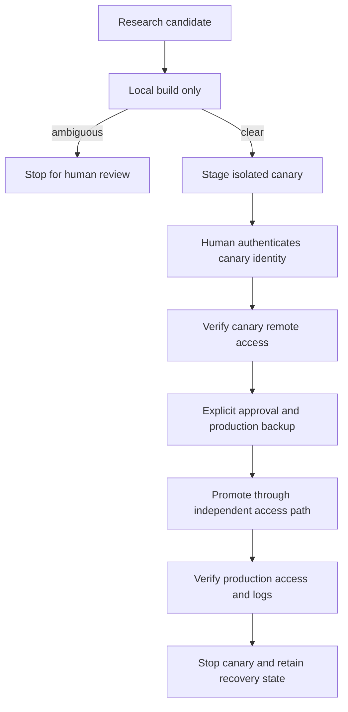
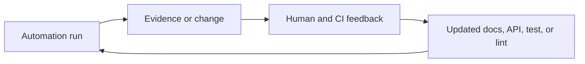

# Infrastructure as a Typed Control Plane

Ryan’s private homelab repository treats infrastructure changes as typed,
testable domain operations. It combines infrastructure definitions, host
configuration, deployed services, local operator tooling, generated
configuration, monitoring, documentation, and operations that can cut off their
own recovery path. A human operator and an agent must both be able to act
without reconstructing years of context from memory.

## Risks the harness must own

The repository spans several technical universes. Declarative infrastructure
describes cloud and local resources. Configuration management converges hosts.
Deployed Go services run on the network. A separate Go universe provides local
development and operator tools. Python supports infrastructure automation and
linting. Node is retained only for deterministic text formatting. Generated
monitoring configuration must agree with inventory and source configuration.

Those surfaces have different failure modes:

- a stale document can produce a wrong but plausible operational decision;
- a duplicated tool version can make local and CI behavior diverge;
- a floating artifact selector can change a deployment without a reviewed
  repository diff;
- a command that mixes parsing, defaulting, and execution can silently target
  the wrong system;
- a malformed remote script can partially execute if transfer is truncated;
- an upgrade to the software providing remote access can destroy the access path
  needed to repair it; and
- removing a dependency can reduce provenance risk while increasing locally
  owned correctness risk.

The harness makes these risks legible and assigns each one to an architectural
or operational owner.

## Route context just in time

The root agent guide is intentionally short. It establishes the operating
contract, maps the major repository domains, names the normal verification
commands, and routes work to specialist documents. Those documents carry Go
design, dependency review, documentation style, and high-risk deployment
guidance.

The specialist documents have distinct jobs:

- the Go operating model explains package ownership, typed boundaries,
  capability-shaped interfaces, and command structure;
- the domain-first model provides worked examples of turning transport data into
  durable domain values;
- the dependency model explains how to choose between the standard library, a
  trusted specialist, and repository-owned code;
- the documentation guide defines what belongs in durable run memory; and
- one versioned contract per scheduled role defines scope, authority,
  validation, reporting, and escalation.

This creates progressive disclosure. A dependency update does not need the full
deployment runbook. A deployment change does need the Go operating model and the
relevant safety contract. The repository is the durable system of record.

The guide also states a repeatable loop: classify the task, read the routed
context, inspect the existing ownership boundary, make a scoped change, run
proportional proof, and record any newly durable lesson in the repository. That
last step turns a successful session into a better environment for the next
session.

### Keep operational docs current

A scheduled documentation-freshness role keeps operator guidance aligned with
the configuration that provisions and monitors the homelab. It compares operator
pages with nearby evidence in configuration management, infrastructure
definitions, monitoring, home automation, repository tooling, and workflow and
dependency metadata. Each finding names the stale or missing page, the source
configuration that contradicts or supplements it, a concrete correction, and any
uncertainty requiring human judgment.

The role is report-only by default. It cannot edit files, create a branch, or
open a pull request without an explicit follow-up. It prioritizes drift that can
affect safe operation—inventory, routing, backup, monitoring, scheduled work,
versions, and access paths—and leaves style-only churn alone. Local repository
evidence takes precedence over inference; claims about outside behavior require
an authoritative upstream source.

The role's versioned contract also owns its learning loop. Human responses to
those findings, pull-request review, and failed validation become candidates for
improving the next sweep. Automation-authored comments carry a stable marker so
the role does not mistake its own output for human supervision.

## Let architecture carry instructions

The repository divides Go into two package universes. One contains local
operator and development tooling; the other contains deployed services and
shared runtime packages. Production code in the deployed universe cannot import
the local-tooling universe. A repository lint enforces that direction, while
tests may cross the boundary to assert repository-wide invariants.

This is architecture as prompt. A worker does not have to infer whether a
deployment policy helper belongs in a runtime binary. The dependency direction
answers the question, and CI rejects the wrong answer.

### Domain ownership before command shape

Commands adapt inputs and execution around domain-owned policy. The preferred
pipeline is:

```go
raw, err := flags.Parse(args)
if err != nil {
	return err
}

opts, err := options.Resolve(raw, inventory)
if err != nil {
	return err
}

return operation.Run(ctx, opts, capabilities)
```

The three representations are intentionally different:

1. `raw` preserves what the operator supplied;
2. `opts` contains parsed domain values and defaults resolved from explicit
   sources of truth; and
3. the operation receives values that are already valid plus only the
   capabilities it needs.

A custom lint prohibits raw flag-set construction outside command-owned flag
packages. Another limits direct process construction to a small set of adapter
boundaries. Domain packages receive a repository-rooted command capability or a
narrow transport interface instead of inventing working directories,
environments, and subprocess behavior.

### Keep relationships inside values

External inventory output is decoded into an internal transport representation
and converted into domain values that retain their parent context. A host-like
value therefore knows the cluster-like value needed to answer naming and
targeting questions. Callers request a fully formed target from those values.

In generalized form:

```go
type Environment struct{ state environmentState }
type Machine struct {
	environment *Environment
	state       machineState
}

func (m Machine) Address() Address
func (m Machine) RemoteTarget() Target
```

This prevents a caller from holding a machine without the context required to
interpret it. It also prevents dozens of callers from independently rebuilding
naming policy with strings.

The same technique appears in remote operations. User-provided target strings
are parsed once into typed targets, sources, and destinations. Read, write,
copy, and reachability are separate public capabilities. SSH, archive formats,
checksums, staging, and shell commands remain internal mechanisms.

## Make repository policy semantic code

The repository contains a catalog of focused, repository-owned lints. They
complement general linters with repository-specific rules. The catalog currently
protects concerns such as:

- the boundary between local tooling and deployed code;
- placement of raw CLI parsing;
- the small set of packages allowed to create processes;
- interrupt-aware contexts in executable entry points;
- checked write errors for formatted output;
- a ban on local lint-suppression comments;
- immutable selectors across workflows, infrastructure, and package manifests;
- agreement between the canonical Python pin and workflow installs;
- agreement between the canonical Python pin and static-analysis language
  targets;
- safe structure for shell templates sent to remote machines; and
- discoverable purpose documentation for every custom lint and every owned
  configuration-management role.

Each lint has a local explanation of the invariant and why it exists. Its
diagnostic includes the remediation path. Tests exercise both the live
repository and small positive and negative in-memory fixtures. This matters for
agents: a failure identifies the violated invariant and the boundary that owns
the correction.

### Model facts and parse canonical files

The strongest policy checks load the canonical file through a domain parser and
ask a semantic question:

```go
toolchains := LoadToolchainManifest(repo)
workflows := LoadWorkflows(repo)

node := toolchains.RequiredVersion(Node)
for _, setup := range workflows.NodeSetups() {
	requireEqual(setup.Version, node)
}
```

The same model is used for the Go module, package manifest, package-manager
workspace, Python project, Terraform configuration, workflow YAML, and
configuration-management defaults. A version bump changes the canonical data and
the lockfile it owns. Tests derive expected cross-surface values from that data.
Parser fixtures use arbitrary representative versions to test parsing; they do
not become another source of current-version truth.

This creates an important distinction:

- **current state is data**: runtime and tool versions live in their canonical
  manifests; and
- **durable policy is code**: exact pinning, a cooling-off interval, a minimum
  maturity rule, an approved trust class, or a required relationship can be a
  named domain concept.

Confusing those categories produces brittle policy: duplicated current-version
constants, large string-built fixtures, and unrelated fixture edits for every
upgrade. Separating them makes ordinary maintenance small while keeping the real
invariant executable.

## Let supply-chain policy follow capabilities

The repository carries a small, classified dependency set. It retains
specialists where they own a difficult domain: the official parser for an
infrastructure language, first-party cloud and networking clients, mature system
integration, a line-aware YAML parser, and selected high-trust Go ecosystem
packages. Direct dependencies are classified by capability and upstream trust
boundary. A new unclassified direct dependency fails with a prompt to perform a
design review.

The policy asks four questions before adding or removing code:

1. What exact capability is needed?
2. Which domain owns it?
3. Is the behavior narrow and stable enough to own locally?
4. Which choice produces the lower total correctness, security, update, and
   maintenance risk?

That leads to several concrete controls:

- a single toolchain manifest is the canonical source for language and
  bootstrap-tool versions;
- CI setup steps are checked against that manifest or the language's canonical
  module file;
- direct dependencies and tool dependencies must belong to approved capability
  classes;
- package-manager selection is exact and integrity-qualified;
- Node has no runtime dependency surface and is retained only for a single
  deterministic formatter;
- CI actions use immutable commit identifiers with human-readable release
  comments;
- runner images are fixed rather than selected by a moving `latest` label;
- container and downloaded deployment inputs are versioned or content-addressed
  and checksummed;
- default workflow permissions are read-only, with additional authority scoped
  to the job that needs it; and
- cloud validation uses short-lived identity federation rather than stored
  long-lived credentials.

### One policy, several ecosystem renderings

One small domain value owns the cooling-off interval and renders it into the
units and syntax expected by the dependency updater, the Node package manager,
and the Python resolver. Tests then load each real configuration and compare its
semantic value with the shared policy.

This is a compact but representative harness pattern: centralize policy meaning
while each ecosystem retains its native representation. The repository owns the
relationship among them.

The update automation adds judgment that cannot be reduced to semver alone. It
classifies an upstream as patch-rich, patch-light, or tagless; applies a
cooling-off window; inspects authoritative release artifacts; preserves old
checksums when they provide rollback value; separates logical update domains
into reviewable changes; and fails closed when provenance or release behavior is
ambiguous.

## Transfer responsibility when removing a Markdown dependency

The deployed documentation service once depended on a general Markdown
implementation. The repository replaced it with a first-party implementation
because the required dialect was constrained and the general dependency carried
more capability and supply-chain surface than the service needed.

The replacement transferred four explicit responsibilities into the repository:

- an abstract syntax tree defines the supported document model;
- a parser converts source into that model;
- a renderer converts the model into HTML; and
- a sanitizer owns URL schemes, generated identifiers, and CSS-class tokens.

The supported surface is documented by behavior rather than an unsupported claim
of full standards compliance. Confidence comes from several independent proof
layers:

- golden Markdown/HTML fixture pairs for the service's real feature set;
- edge-case vectors for block and inline parsing;
- selected upstream CommonMark and GitHub-flavored Markdown vectors;
- a test that parses and renders the complete checked-in documentation corpus;
- tests for unsafe link schemes, escaping, fragment generation, writer errors,
  and cancellation; and
- aggregate statement coverage of the parser, syntax tree, renderer, and
  sanitizer enforced at 100 percent in the normal race-enabled test path.

Coverage ratchets branch exercise. Golden vectors and corpus tests establish
compatibility; sanitizer tests protect the security boundary; race and
error-path tests establish operational behavior.

The maintenance trade is explicit. The repository removed an upstream maintainer
and transitive graph from the deployed service, but it accepted ownership of
parsing ambiguity, escaping, standards drift, and future feature requests. The
replacement is credible because the confidence surface grew when the dependency
surface shrank.

## Model consequential operations as a state machine

The clearest operational example is upgrading the remote-access software on a
constrained robot-vacuum device. A failed production replacement could remove
the network path needed to repair the device. The harness therefore models the
operation as phases with different identities, state, and authority.



The scheduled role may inspect upstream releases, compare feature-selection
behavior, reason about required networking capabilities, and perform a local
cross-build. It cannot deploy. Missing release notes, unclear feature changes,
or behavior touching remote access and routing stops the automation for human
review.

After approval, the canary uses a separate binary slot, runtime state,
communication socket, log, and network identity. Staging must not overwrite
production state or reboot the device. Production promotion requires a fresh
backup. Cutover is performed through the independently verified canary access
path, and both access and logs are checked before the isolated daemon is
stopped. Recovery state is retained.

The command surface mirrors the state machine. Build, canary deploy, canary
authentication, canary access check, production backup, promotion, production
verification, and canary cleanup are separate operations rather than flags on
one permissive deploy command. Typed targets and a narrow remote transport make
the phases unit-testable. Recording fakes prove which identity each phase uses,
which remote writes occur, and—critically—which production mutations do not
occur during canary work.

Remote shell scripts have another unusual guardrail. Their executable body must
be contained in a `main` function invoked exactly once at the end. If transfer
is truncated, the device may receive definitions but cannot execute a partial
operation. A custom lint enforces the shebang, strict mode, body shape, and
single final invocation. This is a small invariant derived from the actual
failure mode of streaming scripts over a remote transport.

## Close the feedback loop with versioned automations

Scheduled prompts are intentionally slim. They identify a role and direct the
agent to the versioned contract in the repository. The contract defines:

- the owned scope and explicit exclusions;
- whether the default mode is report-only, change-producing, build-only, or
  deploy-capable;
- authoritative sources to inspect;
- cooling-off and risk classification;
- required validation and evidence;
- commit, pull-request, and review behavior;
- human approval and abort conditions; and
- the final summary schema.

Examples include dependency maintenance, documentation freshness, controlled
guest updates, documentation deployment, and the high-consequence device
upgrade. The documentation-freshness role is report-only by default. The
high-consequence upgrade role can prepare and build but not deploy. A routine
documentation publisher may deploy only from a clean, current primary-branch
checkout and lets a domain command derive its target from canonical inventory.

Automation-authored comments carry a stable marker so a later run can
distinguish its own state from human review. Each contract requires the next run
to inspect human feedback, failed validation, and follow-up requests and then
update the durable contract or guardrail before repeating the same class of
mistake. Task memory stores run-specific state; repository documentation stores
behavior that must survive the run.

This is a concrete closed loop:



## Generate observability from source of truth

Repository tools generate monitoring configuration from typed inventory and
configuration-management intent. They apply domain selection rules and render
scrape targets, service state metrics, and log-routing inputs. Check modes
compare regenerated output with the checked-in artifact and fail with the exact
command that refreshes it.

An inventory transition changes the monitoring view through the same domain
values used by operator tools. Tests protect selection before serialization:
which machines are current, which roles imply a log agent, which endpoints
belong in a scrape job, and which retired targets must disappear. Golden output
verifies the final rendering.

The repository also exposes desired infrastructure state as metrics and gives
deployed services narrow readiness and access-log surfaces. Remote rendered
configuration can be collected through typed read capabilities for comparison
with repository intent. In the high-risk deployment flow, separate canary and
production logs plus explicit remote-access checks are required proof, not
optional troubleshooting aids.

The pattern is broader than monitoring: derive observability from the same
source of truth as operation, and make the evidence available through bounded
commands an agent can invoke.

## Match proof to the changed surface

The local verification interface is grouped by risk and artifact type. It
includes formatting across all retained languages, general linting, workflow
security analysis, infrastructure validation, generated-configuration checks,
race-enabled Go tests, and the Markdown coverage ratchet. Narrow targets support
iteration; the full relevant targets are required before delivery.

CI mirrors those surfaces with pinned toolchains and immutable actions. It
builds and race-tests Go, verifies generated monitoring inputs, checks
infrastructure projects independently, audits Go and Node dependencies, and
formats or lints Python, shell, YAML, Terraform, workflows, and text. Cross-file
policy tests verify that CI consumes canonical versions rather than becoming a
second version manifest.

The proof strategy is deliberately plural:

- parser and value constructors get table tests;
- policy packages get positive and negative fixtures plus live-repository
  checks;
- generated configuration gets freshness or equivalence checks;
- domain selection and target construction are tested before final rendering;
- remote operations use recording transports to prove side effects and their
  absence;
- visible documentation rendering uses golden output and the full corpus; and
- high-risk operations retain human approval, canary evidence, logs, access
  checks, and rollback state.

Map every green check to the claim it establishes.

## How the harness evolved

The repository history records an iterative rollout driven by operating needs.
Scheduled maintenance first acquired versioned contracts and stable feedback
markers. The risky device operation was then split into build, isolated canary,
backup, promotion, verification, and recovery phases. Repeated dependency work
produced canonical manifest parsers, capability classifications, cooldown
policy, and immutable-selector checks. A dependency-removal project produced the
owned Markdown boundaries, upstream vectors, corpus tests, and a coverage
ratchet. Domain refactors then produced typed remote targets, repository-rooted
capabilities, the raw/resolved/executable command pipeline, and lints that
prevent regression.

The rules came from observed operating and review needs. Once a lesson proved
durable, it moved from a patch comment into a document, domain API, test, or
lint. The implementation sequence records how operating feedback became durable
repository structure.

## Maintenance and supply-chain outcomes

The approach produces several practical benefits:

- version bumps touch canonical manifests and tool-owned lockfiles instead of a
  web of duplicated test literals;
- commands inherit consistent repository roots, cancellation, parsing, and
  default-resolution behavior;
- agents receive actionable local diagnostics instead of relying on reviewer
  memory;
- scheduled roles can do useful asynchronous work without inheriting deployment
  authority;
- narrow owned code replaces broad dependencies only when confidence can be
  rebuilt locally; and
- failure recovery is designed into high-risk operations before cutover.

It also has costs and limits:

- repository parsers and custom lints are production code and require tests;
- 100 percent statement coverage does not prove standards compatibility;
- a multi-ecosystem infrastructure repository still has a meaningful supply
  chain even when each direct dependency is justified;
- upstream release inspection and network-backed freshness checks can be
  ambiguous or unavailable;
- documentation can drift unless freshness is continuously compared with
  machine-readable source; and
- canary isolation reduces deployment risk but cannot make a physical device as
  reproducible as a disposable test environment.

The dependency model treats owned code as a liability, automation stops on
ambiguity, and the high-risk runbook preserves a human gate.

## What to transfer

The reusable unit is a set of relationships:

1. **Route context:** keep the root guide navigational and put reasoning next to
   the domain that consumes it.
2. **Separate data from policy:** read current versions and inventory from
   canonical manifests; encode only durable relationships and risk rules in
   policy code.
3. **Model the operation:** parse external syntax once, resolve defaults with
   explicit knowledge, and pass typed values to the domain.
4. **Constrain capabilities:** make process execution, filesystem scope, remote
   transport, credentials, and deployment authority explicit dependencies.
5. **Teach with guardrails:** every local lint should name the violated
   invariant and the preferred repair.
6. **Replace confidence with confidence:** when deleting a dependency, add the
   fixtures, adversarial cases, corpus tests, and enforcement that cover the
   newly owned responsibility.
7. **Make risk a state machine:** separate assessment, build, canary, approval,
   backup, cutover, verification, and recovery when an operation can destroy its
   own control plane.
8. **Close the loop:** convert repeated human feedback, failed runs, and
   operational surprises into the earliest durable document, API, test, or lint.
