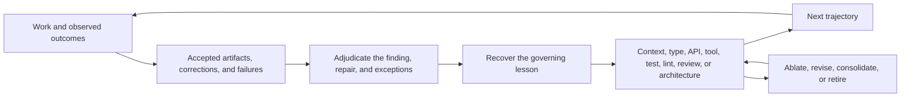

# Preserve Coherence and Own Lifetime Risk

Coding agents can make implementation attempts abundant while each accepted
change still adds constraints and maintenance obligations to a shared system.
Product intent, compatibility contracts, migration discipline, dependency
decisions, proof corpora, and release identity determine whether [the next 5,000
changes] accumulate into a coherent system. Ryan Lopopolo describes the changed
economics as [abundant implementation] with future carrying costs still owned by
the repository.

[abundant implementation]: https://x.com/_lopopolo/status/2032592873502421333
[the next 5,000 changes]: https://x.com/_lopopolo/status/2052834431996666267

## Make coherence cumulative

The OpenAI team behind the seminal harness-engineering essay developed [an
internal product] for five months from an empty repository. Codex generated its
roughly one million lines of code and about 1,500 merged pull requests. Internal
launch and adoption show that the strategy worked through that initial
development period. How the architecture will behave over years, as agents
repeat accepted patterns and successive models change the worker, remains the
essay's open question about [long-term architectural coherence]. Ryan Lopopolo
later names the objective [long-term coherence of agent-produced artifacts] and
observes that [work is an iterative game]. Each trajectory is temporary; the
environment around it can carry judgment from one lived outcome into the work
that follows.

[an internal product]:
  https://openai.com/index/harness-engineering/#:~:text=Five%20months%20later%2C%20the%20repository%20contains%20on%20the%20order%20of%20a%20million%20lines%20of%20code
[long-term architectural coherence]:
  https://openai.com/index/harness-engineering/#:~:text=What%20we%20don%E2%80%99t%20yet%20know%20is%20how%20architectural%20coherence%20evolves%20over%20years
[long-term coherence of agent-produced artifacts]:
  https://x.com/_lopopolo/status/2052834649152618908
[work is an iterative game]: https://x.com/_lopopolo/status/2052858891835465813

[Code Reds Need Maintenance Loops] argues that an emergency response should
leave a maintained human, programmatic, or agentic loop for the invariant it
discovered. [Run Known Work as a Continuous Loop] describes the resulting
operating contract.

[Code Reds Need Maintenance Loops]:
  https://hyperbo.la/w/code-reds-need-maintenance-loops/#:~:text=That%20understanding%20should%20become%20a%20maintenance%20loop%20the%20team%20leaves%20behind
[Run Known Work as a Continuous Loop]: ../continuous-maintenance/

Harness engineering applies the same move to agent trajectories. Accepted
artifacts preserve examples of the quality bar. Corrections, failed rollouts,
incidents, and user responses reveal gaps between results and that bar. The
harness preserves the evidence, distinguishes a finding from its proposed
repair, learns from the reviewed outcome, and promotes each stable lesson to its
earliest durable owner. [The Production Function Changed] illustrates the
sequence with a missing `fetch` policy: encode it as a guardrail with 100 percent
code coverage and exhaustive table-driven tests, migrate the codebase in one
pass, and surface descriptive failures for later violations.

[The Production Function Changed]:
  https://hyperbo.la/w/production-function-changed/#:~:text=that%20guardrail%20into%20place%20with%20100%25%20code%20coverage%20and%20exhaustive%20table-driven%20tests%2C%20migrate%20the%20codebase%20in%20one%20go

Settled invariants can become bounded guarantees through types, APIs, tools,
tests, lints, and architecture rules. Complete migrations establish those
invariants across the existing population; executable ratchets preserve them in
later work. The guarantee extends only as far as the invariant and enforcement
surface faithfully model the real requirement. Contextual judgment remains
retrievable through guidance, examples, and review. [Turn Feedback Into
Infrastructure] traces how a lesson moves from evidence to the appropriate
owner.

[Turn Feedback Into Infrastructure]: ../feedback/

Coverage of known failure classes accretes while controls consolidate. A point
correction begins as evidence; the durable lesson may belong upstream in a
domain model or architecture, making another downstream validator redundant.
[Blessed work] supplies information-dense positive examples of taste and
structure that negative checks cannot express. A gameable grader can reward the
proxy while the real outcome regresses, and designing an [unhackable grader] is
itself hard. Later runs need claim-boundary evidence that the intervention
improves real outcomes. Gardening removes stale, overfit, and redundant controls
before they become competing instructions.

[Blessed work]: https://x.com/_lopopolo/status/2054037448297201696
[unhackable grader]: https://x.com/_lopopolo/status/2056991142093508831

## Optimize for the next 5,000 changes

Future velocity is part of today’s acceptance criteria. Each change should leave
a coherent base for the changes that follow. Cumulative carrying cost enters
through the requested outcome: architecture, migration completion, and the
effect on future work.

Abundant agent labor lowers the cost of implementation attempts. Integration,
sequencing, compatibility, and future regret remain expensive. A known
exhaustive migration has a discoverable population and a settled destination.
[The no-await-in-loop migration] enabled the lint, fixed 600 violations, and
exhaustively added test coverage in the same pull request. Its population and
definition of done were mechanically legible.

[The no-await-in-loop migration]:
  https://hyperbo.la/w/production-function-changed/#:~:text=I%20turned%20on%20no-await-in-loop%20from%20ESLint,exhaustively%20add%20test%20coverage

An architectural program has a different shape. [The existing architecture may
be the source of the drag] and the destination invariant may be legible while
the safe route must still be learned. Intermediate changes need to be useful on
their own, mergeable amid ordinary repository traffic, reversible or
supersedable, and able to reduce the risk of the later integration.

[The existing architecture may be the source of the drag]:
  https://x.com/_lopopolo/status/2052837107400679555

Artichoke is a Ruby implementation in Rust built around mruby, a Ruby virtual
machine written in C. Rust-owned interpreter state crossed into C calls that
could call back into Rust while mruby's garbage collector ran. The 2020 design
stored all state behind `Rc<RefCell<State>>`, which provided shared ownership
and runtime borrow checking. That wrapper prevented independent borrows of state
components, while Ruby core and standard-library implementations reached through
public interpreter capabilities into VM internals.

[Artichoke's state-model refactor] attempted to replace that ownership model
across Rust-to-C VM calls, C-to-Rust callbacks, garbage collection, public
interpreter APIs, and extension code. Pull request #442 combined the correction
in one noncompiling 114-file change. The work then spread across 50 merged
preparation pull requests while 200 pull requests landed in the repository,
followed by more large integration attempts and runtime failures before the
replacement merged. Each accepted change had to improve the base for the
eventual integration while remaining useful in the moving repository. The open
harness problem is how to help the worker choose intermediate states that are
independently useful and make the eventual integration safer and easier to
continue.

[Artichoke's state-model refactor]: ../../evals/artichoke-state-modeling.md

The size of the diff and run provide little information about whether a safe
route is already known. In a separate case, Ryan describes [a 60-hour,
350-million-token refactor]—one of the hardest refactors of his career—completed
as a single pull request after an initial prompt and two follow-ups. Artichoke
needed a long stream of independently merged preparation because the route
itself remained uncertain. Ryan's phrase [fear of another fifty pull requests]
names the missing capability: anticipating regret across future changes. Durable
plans, decision state, dependency relationships, and ratchets make more of that
horizon observable. Ryan treats reliable foresight across that horizon as an
open capability problem. [Software Work Is No Longer Scheduled] keeps difficult
interface refactors among the work that still requires sustained human
judgment.

[a 60-hour, 350-million-token refactor]:
  https://www.aakashg.com/how-pms-ship-100k-lines-of-code/#:~:text=350%20million%20tokens%20on%20a%20single%20PR
[fear of another fifty pull requests]:
  https://x.com/_lopopolo/status/2064221034547753105
[Software Work Is No Longer Scheduled]:
  https://hyperbo.la/w/software-work-not-scheduled/#:~:text=Building%20a%20product%20from%20zero,all%20require%20sustained%20human%20judgment

Every accepted intermediate change becomes prompt material for the next
trajectory. [Canonical local examples] shape the immediate continuation; durable
contracts and ownership preserve coherence across many rewrites.

[Canonical local examples]: ../domain-modeling/

## Choose what must survive a rewrite

Implementations can be exploratory evidence, generated output, or one rendering
of a durable contract. Preserve the artifacts that express product intent and
let a new implementation prove equivalence:

- behavioral and domain specifications;
- compatibility surfaces and migration rules;
- decisions and architecture boundaries;
- dependency and supply-chain policy;
- proof corpora and known failure cases; and
- release identity and operational contracts.

Symphony is an issue-tracker-based system for supervising coding agents. It
ships a behavior specification from which teams can produce independent
implementations, so [Stop Treating Code as the Artifact] calls it a “ghost
library”: the shared contract is the dependency, without a shared code package.
A [specification-distillation loop] can recover that contract from a blessed
implementation, grade a fresh implementation, and refine the specification from
the comparison. Exploratory code is disposable after it reveals a useful
sequence, invariant, or missing boundary. The [feedback loop] promotes that
lesson into the smallest durable owner so the next implementation inherits it.

[Stop Treating Code as the Artifact]:
  https://hyperbo.la/w/code-is-not-the-artifact/#:~:text=the%20spec%20is%20the%20distribution%2C%20and%20the%20source%20tree%20is%20one%20generated%20artifact
[specification-distillation loop]:
  https://x.com/_lopopolo/status/2051410617937125508
[feedback loop]: ../feedback/

Ryan’s instruction to [replace “codebase” with “artifact”] extends this
coherence loop beyond source repositories. Code can remain inside the trajectory
while the user reviews the domain outcome and its proof; [last-mile deployment]
supplies the surrounding context, capability, and authority.

[replace “codebase” with “artifact”]:
  https://x.com/_lopopolo/status/2076878736507736390
[last-mile deployment]: ../last-mile-deployment/

## Treat dependencies as ownership decisions

A dependency decision chooses who will maintain and verify a capability over the
repository’s lifetime. A trusted specialist upstream can own a complex, evolving
standard. A narrow first-party implementation can lower risk when the required
behavior is stable, transparent, central to the domain, and cheap to test.

An OpenAI team replaced a generic `p-limit`-style dependency with a [first-party
map-with-concurrency helper] tailored to its runtime. The helper integrates with
the repository's OpenTelemetry instrumentation and has complete test coverage.
Bringing this bounded capability in-house made its behavior inspectable and
modifiable in the repository while transferring responsibility for every future
correction and extension to the team.

[first-party map-with-concurrency helper]:
  https://openai.com/index/harness-engineering/#:~:text=we%20implemented%20our%20own%20map-with-concurrency%20helper

The [internalized-dependency burden] is explicit: a local implementation starts
with none of the upstream project’s accumulated scale, compatibility, or
security confidence. The repository must rebuild evidence for the subset it now
owns.

[internalized-dependency burden]:
  https://www.latent.space/p/harness-eng#:~:text=to%20internalize%20that%20dependency%2C%20you%E2%80%99re%20back%20to%20zero

## Rebuild confidence when ownership moves

Removing a package transfers compatibility, security, provenance, update, and
maintenance responsibility into the repository. Evidence may include a real
corpus, conformance and negative fixtures, fuzzing or properties, provenance
review, explicit package ownership, and a plan for new inputs or standard
changes.

[Dependency Ownership] develops the decision record for retaining,
internalizing, or forking a capability. It also records trust classes such as an
explicitly approved `golang.org/x/` namespace without flattening every
third-party source into one risk category.

[Dependency Ownership]: dependency-ownership.md

## Keep policy authoritative and controls proportional

Current pins belong to authoritative manifests. Policy code owns stable
relationships such as approved major lines, trust classes, cooling-off periods,
and required checks. The [supply-chain posture] combines those relationships
with a mostly single-toolchain system, a small reviewed dependency set, and a
reliable path to security updates.

[supply-chain posture]: https://x.com/_lopopolo/status/2059023029666214126

Every durable control carries maintenance and attention cost. Add one for a
concrete failure class or valuable invariant, place it at the earliest semantic
owner, and retire weaker duplicates. Ask who maintains it, what evidence it
adds, and how much it slows the ordinary loop.

[Harness Engineering the Blog Build (Again)] applies this posture with one
toolchain and workspace, centralized dependency catalogs, semantic domain types,
explicit package ownership, and repository-specific structural checks. The
controls reinforce one architecture and avoid a second policy system beside it.

[Harness Engineering the Blog Build (Again)]:
  https://hyperbo.la/w/harness-engineering-the-blog-build/#:~:text=codify%20repo%20contracts%20as%20tools%20and%20lints%20instead%20of%20tribal%20memory

## Preserve release identity

The artifact delivered should be the artifact tested. Rebuilding under greater
deployment privilege introduces a second supply chain and severs the earlier
proof. The [release-integrity note] develops immutable artifact identity,
provenance, canary evidence, approval, rollback, and verification at the running
boundary.

[release-integrity note]: ../proof/release-integrity.md

Ongoing repinning, documentation gardening, compatibility retirement, and
world-model refresh belong to a [continuous maintenance loop]. Lifetime
ownership defines what must remain true; the loop keeps that relationship
current as repositories, ecosystems, and workers change.

[continuous maintenance loop]: ../continuous-maintenance/
