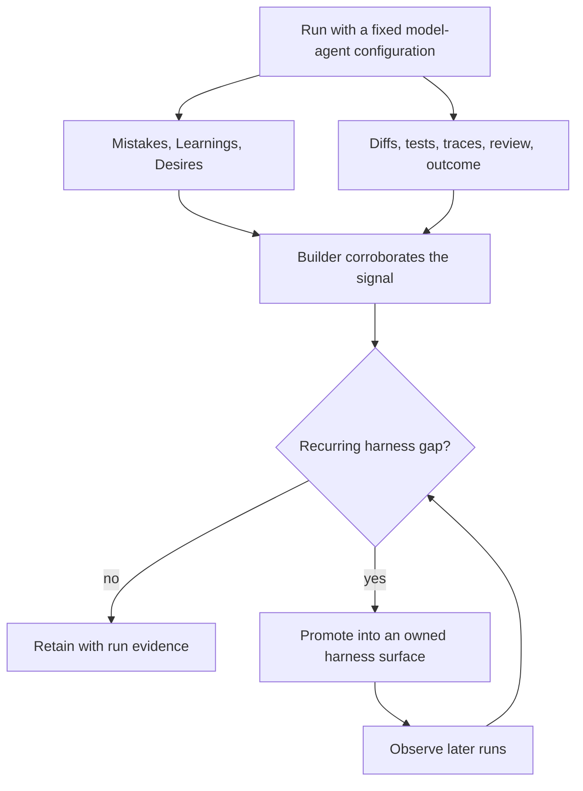

# MLD: Telemetry for the Harness Builder

Ryan's [initial MLD instruction] asks an agent to record three kinds of
observation while it works:

- **Mistakes**: errors the agent noticed in its own trajectory;
- **Learnings**: facts about the environment that it had to discover; and
- **Desires**: context or tools it wished it had.

[initial MLD instruction]: https://x.com/_lopopolo/status/2037307669464363433

He later named this [the MLD framework], described the files [as agent
telemetry], and made their consumer explicit: [they are for the agent builder].
MLD defines a sensor and its consumer. Harness builders still need an operating
policy for corroboration, promotion, expiry, and privacy; the protocol below is
one such policy.

[the MLD framework]: https://x.com/_lopopolo/status/2052091245296861574
[as agent telemetry]: https://x.com/_lopopolo/status/2037307926902403558
[they are for the agent builder]:
  https://x.com/_lopopolo/status/2052095157336703410

## The three signals

### Mistakes locate failed trajectories

A mistake identifies a point where the attempted path diverged from the job. It
may reveal missing context, an ambiguous interface, a weak sensor, an absent
capability, or a one-off model error.

The report is a lead. The diff, tool output, failed checks, review findings, and
final outcome determine what actually happened.

### Learnings record discoveries

A learning records an environment fact the agent had to discover. Costly or
repeated rediscovery can reveal process data that is absent, hidden, or poorly
routed: which manifest is canonical, where ownership lives, why a test exists,
how a deployment is staged, or which apparently simple path is unsafe. Compare
the learning with the trajectory before treating it as a harness defect.

These facts are often private, changing, repository-specific, or tacit.
Organizations cannot presume that general model weights contain them or that
agents will reliably infer which facts govern the task.

### Desires locate missing external levers

A desire identifies context or a tool that might have shortened the trajectory:
a log, browser view, manifest parser, domain command, architectural decision, or
narrow permission.

An agent can request only what it can imagine, and its proposed remedy may be
wrong. The useful question is whether the request exposes a recurring human
relay or an important failure that the current harness cannot detect.

## The builder decides what persists

The prompt instruments the run, the files record the agent's experience,
independent evidence tests that account, and the builder decides whether the
harness should change.

## From a run to an intervention

For each run, use this sequence:

1. ask for concise MLD reports during the run;
2. store them with the trajectory and outcome;
3. check each claim against deterministic evidence and human review;
4. group repeated signals by the underlying gap;
5. change the smallest authoritative surface that closes that gap; and
6. verify in later runs that the intervention reduced the failure or relay.

Changing the fixed model-agent configuration at the same time would muddy the
result. MLD belongs to harness engineering because the intervention targets
context, tools, and the curated environment.

## Promote signals into owned surfaces

Raw reports should become ordinary repository artifacts only after
corroboration:

| Signal                                       | Corroborating evidence                    | Possible destination                          |
| -------------------------------------------- | ----------------------------------------- | --------------------------------------------- |
| package repeatedly placed in the wrong layer | review history and dependency graph       | architecture guide and structural lint        |
| generated file edited by hand                | diffs and stale-output failures           | discoverable generator and CI freshness check |
| deployment target reconstructed from strings | command traces and near misses            | typed target and dry-run command              |
| canonical manifest repeatedly rediscovered   | search trajectory and reviewer correction | short routing documentation                   |
| needed browser state unavailable             | manual relay and missing runtime evidence | browser tool or observability surface         |

Promotion assigns ownership. A stable boundary belongs in architecture. A
current version belongs in its manifest. A hazardous operation belongs in a
runbook and a narrow command. A known failure belongs in a test or lint. A
run-specific observation stays with the run.

Promote corroborated signals into a smaller, clearer harness, and keep raw
advice with the run that produced it.

## Keep raw telemetry out of agent context

Automatically injecting MLD into later runs collapses observation and control
into one channel. That creates feedback-loop risks:

- an incorrect learning reinforces itself as an instruction;
- task-local state masquerades as a durable fact;
- duplicates consume context without changing decisions;
- stale entries survive after the repository changes;
- sensitive material crosses its intended boundary; and
- a scored MLD requirement rewards plausible self-commentary instead of a good
  outcome.

Keep raw files attached to the run that produced them. If a team maintains a
cross-run rollup, the builder owns deduplication, corroboration, expiry, and
promotion. Agents may inspect a deliberately selected report during an audit;
that is different from treating the entire accumulation as trusted context.

## Self-report under separated incentives

OpenAI's [confessions research] studies a related outer-loop report. After a
rollout, the same model produces a structured account of the objectives it
followed, violated, or remained uncertain about. A separate judge scores that
account, and the resulting reward trains only the confession. The researchers
evaluate the channel on out-of-distribution stress tests designed to elicit
reward hacking, scheming, covert rule violations, and other knowingly bad
behavior. For the specially trained model in these proof-of-concept experiments,
the separated incentives and induced failures give the confession channel
stronger empirical grounding than an ordinary MLD instruction when the question
is whether the worker knowingly concealed noncompliance. Results varied across
evaluations, and the work does not establish that every confession is reliable.

[confessions research]:
  https://openai.com/index/how-confessions-can-keep-language-models-honest/#:~:text=We%20trained%20a%20version%20of%20GPT%E2%80%915%20Thinking%20to%20produce%20confessions,stress%2Dtest%20datasets%20designed%20to%20elicit%20behaviors

The design suggests an analogous operating rule for MLD. Confession training
uses a [reward separate from the main answer]; raw MLD remains evidence for the
harness builder until corroboration, rather than becoming an instruction that
can influence the worker's next task.

[reward separate from the main answer]:
  https://openai.com/index/how-confessions-can-keep-language-models-honest/#:~:text=During%20training%2C%20a%20confession%20is%20evaluated%20by%20a%20separate%20reward%20model,never%20influence%20the%20reward%20for%20the%20main%20answer

Chain-of-thought plays a narrower role in the paper. The confession judge [does
not receive the policy's chain-of-thought], and the method [works when the
answer contains no chain-of-thought]. Chain-of-thought appears separately in the
researchers' false-negative audit. The confession channel's robustness under
[adversarial pressure remains future work].

[does not receive the policy's chain-of-thought]:
  https://arxiv.org/html/2512.08093v2#:~:text=We%20do%20not%20show%20it%20any%20of%20the%20policy%E2%80%99s%20chain%2Dof%2Dthought
[works when the answer contains no chain-of-thought]:
  https://openai.com/index/how-confessions-can-keep-language-models-honest/#:~:text=Importantly%2C%20the%20early%20results%20show%20that%20confessions%20remain%20effective,across%20future%20model%20architectures
[adversarial pressure remains future work]:
  https://arxiv.org/html/2512.08093v2#:~:text=We%20would%20also%20be%20interested%20in%20understanding%20how%20robust%20confessions%20are%20to%20adversarial%20pressure,out%2Dof%2Ddistribution%20data

MLD has no separately trained honesty reward or stress-test evidence, so its
reports remain low-trust hypotheses. Its open Mistakes, Learnings, and Desires
categories address a broader operating problem: hidden organizational context,
missing tools, repeated reconstruction, and friction that may occur without a
policy violation. That breadth may expose dimensions a fixed policy-compliance
schema did not anticipate, but it does not increase the report's evidentiary
weight. Traces, diffs, tests, review, and outcomes decide what the builder
promotes.

## What MLD cannot prove

Self-report is partial and biased. An agent may miss its most important error,
misidentify the cause, request the wrong capability, or rationalize a bad
outcome. A desire does not prove that a new tool should exist. A learning does
not prove that the learned fact is true. Silence does not prove that the
environment was sufficient.

Use MLD alongside:

- deterministic tests and lints;
- tool traces and failure output;
- diffs and generated artifacts;
- review findings;
- user-journey and outcome metrics; and
- when useful, a fresh agent auditing the trajectory without inheriting the
  first agent's explanation.

MLD consists of inspectable self-reports about a run. It does not require
chain-of-thought and should not be treated as access to an agent's hidden
reasoning.

## Where MLD fits

Tests are sensors for known assertions. MLD can expose friction the builder has
not encoded yet: hidden context, missing capabilities, ambiguous ownership, and
repeated reconstruction work.

That makes it most valuable while a harness is being built or changed. The
builder can see where the fixed agent experiences the repository as
insufficient, then convert repeated evidence into one of the two durable levers:

- better **context** at the decision point; or
- a better **tool** for performing or observing the work.

The loop closes when a promoted change improves later outcomes.
