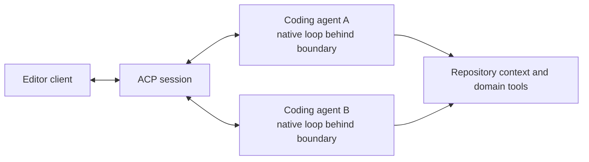

# Model-Native Semantics Across Agent Hosts

A coding agent's action language is part of the worker configuration. Models
learn tool names, schemas, patch grammars, result shapes, errors, and repair
sequences through post-training. The [native computer-use example] makes this
visible: once the tool was post-trained into the worker, it replaced bespoke
display and video plumbing. A host migration that preserves learned semantics
can retain leverage while adding sessions, permissions, provider choice, user
interfaces, or transport.

[native computer-use example]:
  https://www.aakashg.com/how-pms-ship-100k-lines-of-code/#:~:text=get%20to%20throw%20away%20all%20that%20bespoke%20code

The migration still creates a new worker condition. Semantic preservation
reduces migration risk; [Hold the Worker Constant] requires the new
model-agent-host combination to pass complete repository journeys again.

[Hold the Worker Constant]: README.md

## Treat the action language as a compatibility surface

Compatibility includes more than a valid tool call. Compare:

- which tools are present and how the model selects them;
- names, descriptions, and argument grammars;
- patch matching, atomicity, and partial failure;
- result shapes, errors, and omitted-detail retrieval;
- familiar repair sequences;
- permission scopes and approval choices; and
- timing, cancellation, compaction, and session behavior.

Even an awkward interface can become reliable after extensive exposure.
Replacing it with a cleaner abstraction spends learned behavior and must earn
that cost through better completion, safety, or access.

## Preserve semantics at each migration seam

Several preservation seams can coexist. A host can directly reuse a native
implementation and its model-visible grammar. An adapter can change transport
while preserving actions, results, failures, and permission behavior. A
client-agent protocol can leave the coding agent's internal loop intact while
carrying the session information a client needs.

Flattening can occur at any of these seams: a wrapper can rename actions, reduce
results and errors, change partial-failure behavior, or collapse permission
choices. Measure the resulting fidelity through complete journeys.

## Polytoken selects tools for the active model

[Polytoken] is a local-first coding-agent daemon for multiple providers. Its
[tool reference] says that a model's edit format selects its editing tool;
patch-oriented models receive `patch_edit`. That design preserves a model-shaped
editing surface while the host adds local sessions, facets, subagents,
permissions, and UI.

[Polytoken]: https://docs.polytoken.dev/introduction/
[tool reference]: https://docs.polytoken.dev/reference/tools/

Ryan's [Polytoken implementation observation] records that Polytoken directly
reuses Codex's open-source `apply_patch` machinery for this surface. The public
[Codex `apply_patch` instructions] expose the host-visible grammar supplied to
the model. Reusing the primitive carries its patch parsing and application
semantics into the new host. Polytoken still owns the approvals, model-visible
results, and partial-failure behavior around it; matched journeys must cover
those seams.

[Polytoken implementation observation]: ../../sources/ryan-notes.md
[Codex `apply_patch` instructions]:
  https://github.com/openai/codex/blob/main/codex-rs/core/prompt_with_apply_patch_instructions.md

This is coding-agent engineering that serves harness engineering well. A team
can choose Polytoken as its worker, retain a learned primitive, and concentrate
its deployment work on repository context, domain tools, authority, and proof.

## ACP keeps the coding agent behind the transport boundary

[Agent Client Protocol] standardizes communication between editors and coding
agent processes. The editor starts or connects to an agent, and the agent keeps
responsibility for its model and tool loop. ACP negotiates capabilities, streams
session and tool-call updates, carries permission requests, and provides
extension fields and methods.

[Agent Client Protocol]:
  https://agentclientprotocol.com/get-started/architecture

That separation can preserve agent-specific behavior while giving several agents
access to the same client. Fidelity depends on the adapter. ACP's core
[tool-call representation] includes raw inputs and outputs, progress, diffs,
terminal output, and permission choices; its [extension mechanisms] allow
implementations to negotiate additional behavior. Neither feature guarantees
that every native action survives a least-common-denominator adapter.

[tool-call representation]:
  https://agentclientprotocol.com/protocol/v1/tool-calls
[extension mechanisms]:
  https://agentclientprotocol.com/protocol/v1/extensibility

An adapter loses useful fidelity when it renames familiar actions, hides
structured errors, changes edit atomicity, reduces permission choices, or
suppresses extensions the selected agent needs. A common core with negotiated
extensions supports interoperability without requiring every agent to behave the
same way.

## Evaluate the complete migration

Run matched repository journeys before and after a host or action-language
change. Measure accepted outcomes, human intervention, semantic edit failures,
repair loops, permission precision, evidence quality, latency, and operational
cost. Include partial failures and cancellation, where transport differences
often become visible.

Keep learned semantics that help the worker complete the job. Adopt a changed
surface when matched journeys show better completion, safety, or environment
access after accounting for migration and repair costs.
