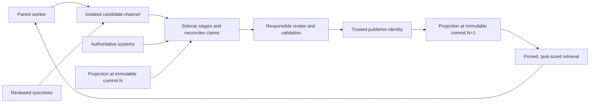

# Route Context Just in Time

Durable knowledge can be much larger than an agent’s active working set. Keep
the larger environment searchable, tell the worker what kind of context exists
and where to find it, and let the task pull in the next relevant slice. The
harness manages attention by making retrieval reliable across long trajectories
and repeated compaction.

[Disk is an infinite context sink] describes the underlying move: externalize
state, inspect a bounded preview, and let the agent use code to select the rest.
A local disk is a durable, searchable working store. Mounted corpora and
connectors make other authoritative sources addressable without transferring
their ownership. The target repository retrieves relevant slices and keeps its
local contracts and routes.

[Disk is an infinite context sink]:
  https://x.com/_lopopolo/status/2042702983893229946

Larger context windows reduce capacity pressure. Attention, retrieval quality,
conflicting guidance, and deciding which fact matters at the current step remain
scarce. [Deterministic context stuffing fails] once work crosses many
compactions; the worker must be able to recover the route again.

[Deterministic context stuffing fails]:
  https://x.com/_lopopolo/status/2062966895876215172

[The two-part context economy] places nonfunctional requirements in a space
where they can be pulled into context, then minimizes the context required to
apply them well. [Domain modeling] gives each requirement a durable owner and
representation. Just-in-time routing selects the relevant slice when a task
reaches the decision it governs.

[The two-part context economy]:
  https://x.com/_lopopolo/status/2030356581792293212
[Domain modeling]:
  ../domain-modeling/#make-nonfunctional-requirements-recoverable

## Route across distinct knowledge layers

Different bodies of knowledge enter a trajectory through different interfaces.

| Layer                 | Material                                                                                                                             | Agent interface                                              |
| --------------------- | ------------------------------------------------------------------------------------------------------------------------------------ | ------------------------------------------------------------ |
| Authoritative systems | Current records, events, permissions, and operational history                                                                        | Search, connectors, queries, and bounded tools               |
| Shared context stores | Curated cross-project ontology, operating principles, and source routes that preserve links to live owners                           | Mounted corpora, search, or a knowledge service              |
| Target repository     | Local architecture, schemas, decisions, critical journeys, runbooks, guardrails, and source routes                                   | Files, nested guidance, search, commands, and failing checks |
| Active context        | The task, current observations, plan, proof, unresolved decisions, and the slices selected from the other layers for the current run | Prompt, retrieval results, tool output, and summaries        |

[Deploy Into the Private Process-Data Iceberg] develops why operational and
organizational knowledge keep authoritative owners outside a product repository.
Just-in-time routing composes those sources for one task and leaves the broader
corpora in place.

[Deploy Into the Private Process-Data Iceberg]: ../last-mile-deployment/

## Curate the route beside each goal

Pair a goal-bearing parent worker with a [context sidecar]: a separate worker
that continuously manages small Git repositories the parent can grep and search.
The parent owns the outcome. The sidecar maintains the context projection for
that goal.

[context sidecar]:
  https://tessl.io/podcast/109/#:~:text=potentially%20give%20each%20agent%20in%20your%20enterprise%20sort%20of%20a%20sidecar,little%20git%20repositories%20that%20they%20can%20grep%20and%20search%20over

Publication separates observations from context approved for later work. The
parent emits questions, retrieval failures, unresolved terms, outcome evidence,
and other context gaps into a candidate channel isolated from the parent’s
retrieval tree. `MISTAKES.md`, `LEARNINGS.md`, and `DESIRES.md` are
[agent-emitted telemetry for the harness builder]. Corroborate those
self-reports before publishing them as context.

[agent-emitted telemetry for the harness builder]:
  https://x.com/_lopopolo/status/2037307669464363433

Completed work remains a rich source of candidates. Aakash Gupta’s interview
describes a [context library that interviews users and learns from completed
tasks]. The Latent Space interview separately describes [collecting agent
trajectories and distilling a team knowledge base]. Reviewed work supplies
candidates for the same reconciliation path. The sidecar stages and reconciles
those observations; the responsible domain owner approves context that encodes
judgment or policy.

[context library that interviews users and learns from completed tasks]:
  https://www.aakashg.com/how-pms-ship-100k-lines-of-code/#:~:text=a%20library%20with%20the%20ability%20to%20both%20interview%20the%20user%20and%20learn%20from%20all%20the%20tasks
[collecting agent trajectories and distilling a team knowledge base]:
  https://www.latent.space/p/harness-eng#:~:text=we%E2%80%99re%20collecting%20all%20the%20agent%20trajectories%20from%20Codex%20to%20slurp%20them%20up%20and%20distill%20them

Candidate material remains untrusted and excluded from the parent’s retrieval
path. It cannot trigger publication directly. The curator proposes a
claim-and-evidence diff in an isolated staging area, preserving source,
classification, and audience metadata. Sensitive material remains with its
authoritative owner. A publication policy names the responsible reviewers, the
mechanical updates that validators may accept, and the distinct identity allowed
to publish.

Ryan's private homelab repository provides a narrower analogue in a [scheduled
documentation-freshness role]. The repository-wide role compares operator docs
with the configuration and monitoring files that define current behavior. A
finding must name the stale page, the local evidence that disagrees with it, a
concrete edit, and any unresolved judgment. It is report-only by default; a
person explicitly authorizes the follow-up that changes the repository.

[scheduled documentation-freshness role]:
  ../domain-modeling/homelab.md#keep-operational-docs-current

The proposed goal-sidecar adds the isolated staging and publication boundary.
Feedback changes its curator as well as its projection. Human responses to
candidate reports, pull-request review, and failed validation update the
sidecar's versioned contract. Its own comments carry a stable marker and are
excluded from the human-feedback channel. That distinction prevents the curator
from treating its prior output as independent supervision while still letting
lived outcomes improve later sweeps.

The curator reconciles each candidate against authoritative sources and the
currently published projection. It records provenance, freshness, audience, and
unresolved contradictions. Accepted changes are published as an atomic commit.
Every projection read in a trajectory resolves through one immutable commit
hash. A normal refresh adopts a new hash between trajectories; a forced mid-run
refresh creates an explicit phase boundary and records the old and new hashes.
Live-query results remain outside the pinned projection by default. A reviewed
bounded snapshot may enter when source, audience, and retention policy permit
it. The maintained-document system in Aakash Gupta’s interview likewise [records
the repository revision where guidance is current] and [archives guidance when
it becomes irrelevant].

[records the repository revision where guidance is current]:
  https://www.aakashg.com/how-pms-ship-100k-lines-of-code/#:~:text=They%20embed%20git%20repository%20revisions%20of%20when%20they%20are%20current%20as%20of
[archives guidance when it becomes irrelevant]:
  https://www.aakashg.com/how-pms-ship-100k-lines-of-code/#:~:text=They%E2%80%99re%20sunset%20and%20archived%20when%20they%20become%20irrelevant%20or%20features%20get%20removed

Scheduled refreshes handle known volatility. A parent request can force a
freshness check when the current decision depends on newer state. The parent
still chooses which routes and slices the work requires. Agents that [garden the
Git repositories used to bootstrap tasks] are an adjacent example of automated
repository maintenance.

[garden the Git repositories used to bootstrap tasks]:
  https://www.aakashg.com/how-pms-ship-100k-lines-of-code/#:~:text=Things%20that%20garden%20the%20individual%20git%20repositories%20that%20are%20used%20to%20bootstrap%20all%20the%20tasks

The publication contract makes failures legible:

| Condition               | Curator behavior                                                                                                                 |
| ----------------------- | -------------------------------------------------------------------------------------------------------------------------------- |
| stale route             | mark its last-known revision and retrieve from the live owner before serving it as current                                       |
| contradictory sources   | preserve the conflict and route it to the owner whose judgment can resolve it                                                    |
| unavailable source      | report the source as unavailable and label the prior copy historical                                                             |
| excessive context       | improve the index and retrieval route; keep the served slice task-sized                                                          |
| curation lag            | serve the last published revision and report candidate queue status without exposing candidate contents                          |
| insufficient permission | return an explicit access gap and leave the material with its authoritative owner                                                |
| compromised publication | revoke the trusted reference, quarantine the revision, restore the last-known-good hash, and notify affected parent trajectories |

Fresh-session trials test whether the parent retrieves and applies the new
route. Ablation tests whether the context change caused the improvement, and
reviewed task outcomes determine whether the change remains published. Track
retrieval frequency, repository size, and commit count as operating signals;
judge success by task outcomes. The active window receives only the slice needed
for the current decision, while durable commits let later trajectories recover
the route after compaction.

The sidecar is a harness component with its own behavior. Version its selected
model and agent, prompts, tools, and permissions. Record the producing
configuration with each publication, and requalify the curation path when that
configuration changes.

[Pair Each Goal With a Context Curator] develops the deployment boundary,
projection ownership, and lifecycle.

[Pair Each Goal With a Context Curator]:
  ../last-mile-deployment/#pair-each-goal-with-a-context-curator

## Use `AGENTS.md` as a map

A root guide should contain:

- what the repository is and which compatibility surfaces matter;
- the operating loop expected for all work;
- a small set of task classes or golden paths; and
- links to the domain documents, commands, and proof appropriate to each class.

Architecture, dependency posture, generation contracts, runbooks, and domain
decisions belong beside the work they govern. Nested guides narrow the route as
the worker enters a package or domain. A [task-oriented repository maintenance
layout] can pair that map with human onboarding, durable automation runbooks,
and guardrails recovered from project history.

[task-oriented repository maintenance layout]:
  https://x.com/_lopopolo/status/2060767456302428343

The [canonical harness-engineering essay] describes a monolithic agent manual
that grew too large to be useful. A short root table of contents backed by
indexed design documents, product specifications, execution plans, and
references made progressive disclosure an owned repository feature. Link and
freshness checks kept those routes trustworthy.

[canonical harness-engineering essay]:
  https://openai.com/index/harness-engineering/#:~:text=give%20Codex%20a%20map%2C%20not%20a%201%2C000-page%20instruction%20manual

## Deliver context in three phases

The [AI Native DevCon talk] develops an operating trajectory in which context
arrives during grounding, the messy middle, and review and landing.

[AI Native DevCon talk]:
  https://tessl.io/registry/ainativedev/aidevcon-2026-ldn/0.100.8/files/talk-lopopolo-harness-engineering/transcript.md#:~:text=three%20phases%20I%20think%20about%20when%20we%27re%20talking%20about%20context%20delivery

### Grounding

Begin with a terse map: task class, relevant architecture and decisions,
critical journeys, and the commands that establish current state. The worker
should understand what it is changing and where to look while preserving routes
to deeper sources.

### The messy middle

Let code, tool output, test failures, browser state, logs, and diagnostics
reveal the next context. Errors should identify the violated invariant and the
likely repair. This phase is exploratory; a fixed step list cannot predict every
branch.

### Review and landing

Reapply role-specific reviewers, acceptance criteria, proof requirements, and
delivery policy after the artifact has a stable shape. The outcome bar and
critical journeys remain visible from grounding; landing brings their detailed
review lenses back to the completed artifact. Compress the trajectory into a
decision-ready packet that a person can review directly.

This timing keeps global context small and presents specificity where it can
change a decision.

## Let the worker discover the next layer

Files, search, ordinary CLIs, `--help`, and bounded structured output are strong
context interfaces because models already know how to explore them. A tool
description should state what capability exists and why it might matter. Deeper
schemas, examples, or manuals can load after the worker chooses it.

Guidance should [set expectations for seeking context]: what the worker is
doing, why it matters, what kinds of material to seek, and how the available
tools expose them. The agent can then reason about the local route as the task
and active window change.

[set expectations for seeking context]:
  https://x.com/_lopopolo/status/2062950475989725465

Tool output is phase-specific context. [Make Capabilities Legible and Operable]
develops quiet success, bounded results, actionable errors, and repair hints.

In a long Codex trajectory, this placement also affects compaction. High-signal
user intent can retain influence while older tool results are summarized or
discarded. Surface narrow guidance through repository reads, diagnostics, and
tool output at the decision point, then rely on durable routes to retrieve it
again. Keep the user message focused on the outcome, acceptance bar, and
authority that should survive the whole job. The exact retention policy belongs
to the chosen worker and must be requalified when that worker changes.

[Make Capabilities Legible and Operable]: ../tool-legibility/

## Place context at the latest reliable point

Every global instruction spends attention and narrows the worker’s choices. Keep
judgment in discoverable prose while the agent can retrieve and apply it
reliably. Use phase-specific reviewers and checks to present narrower guidance
only when the artifact or action makes it relevant.

Repeated misses, consequential risk, or retrieval failure across compactions are
evidence that a rule needs stronger placement. [Turn Feedback Into
Infrastructure] owns that promotion decision and the progression from late
guidance into durable controls.

[Turn Feedback Into Infrastructure]: ../feedback/

## Use skills to teach and runbooks to preserve work

A skill [teaches an approach to the job]. Its description advertises [what the
skill is and why it might matter], and the full instructions load when the
trajectory needs them. Long imperative skills can overfit one path and make the
worker refuse sensible exceptions.

[teaches an approach to the job]:
  https://x.com/_lopopolo/status/2063148351885918623
[what the skill is and why it might matter]:
  https://x.com/_lopopolo/status/2077149347528261712

Repositories can keep a broad skill library outside the location scanned by the
agent. A gitignored linking area can expose a [small task-relevant set] for one
trajectory, allowing many contributors to check in specialized skills without
loading all of them for every worker. Teams can still converge on a shared core
through repeated use and refinement.

[small task-relevant set]: https://x.com/_lopopolo/status/2077306653540749667

A runbook is a versioned contract for repeatable work. It records intent,
preconditions, steps, safety boundaries, evidence, escalation, and rollback. An
automation can stay thin by pointing to the repository-owned runbook.

[Enabling Codex to Upgrade My Robot Vacuum] shows both boundaries in a
consequential maintenance job. A scheduled prompt routes to a checked-in
automation contract that owns candidate selection and build-only authority. A
separate deployment runbook owns canary and production phases. The durable work
lives beside the tool and safety boundary, where people and agents can review
it.

[Enabling Codex to Upgrade My Robot Vacuum]:
  https://hyperbo.la/w/robot-vacuum-canary-tailscale/#:~:text=The%20repo%20carries%20the%20durable%20instructions

## Garden the routes and the corpus

Context routes have carrying cost. Keep cross-links machine-checkable, record
ownership and freshness where readers need them, and replace obsolete routes
with a canonical successor or an explicit tombstone.

[Test a curated knowledge base in a fresh session] to learn whether the worker
retrieves the right source and changes its behavior. The presence of a document
proves only that it was written. [Feedback infrastructure] owns ablation and
distillation; [Run Known Work as a Continuous Loop] develops recurring gardening
and retirement.

[Test a curated knowledge base in a fresh session]:
  https://x.com/_lopopolo/status/2048944585486012775
[Feedback infrastructure]: ../feedback/
[Run Known Work as a Continuous Loop]: ../continuous-maintenance/
