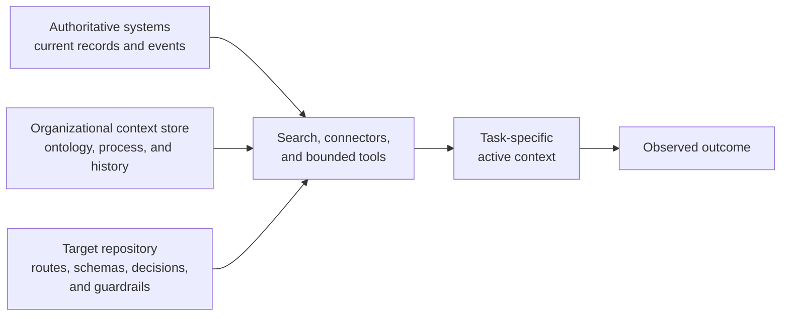
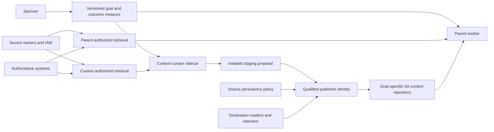

# Deploy Into the Private Process-Data Iceberg

General model weights contain the visible tip of an organization’s knowledge.
The work itself depends on a much larger submerged body of private, changing
process data: current records, local ontology, operating history, workflow
exceptions, tacit quality bars, and authority relationships. [The model does not
have your data], and organizations cannot presume that this material will be
present in general model weights or that an agent will reliably intuit which
parts govern a particular job. Last-mile deployment makes the relevant
relationships and capabilities available to a selected model-and-coding-agent
configuration held constant for the deployment.

[the model does not have your data]:
  https://x.com/_lopopolo/status/2051086282236068178

The resulting worker can perform a situated job. It knows which definition of
revenue the company uses, which customer is in a pilot, how an investigation is
normally run, what level of polish the team accepts, and which person can
authorize the next step.

## Discover the deployment surface

[Please Go Brr, on Token Mandates] treats broad token budgets as an
organizational search strategy. Leadership rarely knows in advance which
practitioners can shape an effective harness, which business problems can absorb
reasoning compute, or which combinations of context, tools, and access will
work. Distributed experimentation lets the organization’s existing experts
discover those patterns close to the work.

[Please Go Brr, on Token Mandates]:
  https://hyperbo.la/w/token-mandates/#:~:text=organizational%20discovery%20mechanism%20for%20learning%20how%20to%20deploy%20reasoning%20compute

A useful experiment identifies a situated job, the people who understand it, the
missing context, tools, or access, and evidence about the outcome. Those
discoveries can become shared context, paved environments, and bounded tools.
[Outcome-bound effectiveness] determines which patterns deserve lasting
investment.

[Outcome-bound effectiveness]: ../effectiveness/

## Model the work around the records

A useful organizational context store preserves the concepts that give records
meaning. Its data ontology names entities, metrics, identifiers, and their
relationships. Its work ontology names outcomes, workflows, actors, tools,
exceptions, evidence, and authority. Those models give current operational state
interpretable relationships.

The [business-ontology example] makes this concrete through an internal data
agent. Warehouse access alone cannot resolve competing definitions of revenue or
an active user. The agent also needs the company’s product lines, customer
segments, teams, pilot customers, current plan, and shared metric definitions.
Those relationships let it reason about how the business operates and produce an
answer that belongs to this organization.

[business-ontology example]:
  https://www.latent.space/p/harness-eng#:~:text=You%20have%20to%20understand%20what%20revenue%20is%2C%20what%20your%20customer%20segments%20are

[How PMs Ship 100K Lines of Code] describes a product form for accumulating that
semantic layer. A reusable context library interviews the user about the data
ontology and business metrics, learns from completed tasks, and makes the
resulting durable knowledge available to later runs. Domain experts can teach
the deployed worker through the work itself.

[How PMs Ship 100K Lines of Code]:
  https://www.aakashg.com/how-pms-ship-100k-lines-of-code/#:~:text=both%20interview%20the%20user%20and%20learn%20from%20all%20the%20tasks

Organization-specific nonfunctional requirements belong in the same model of
work. [What Does It Mean to Do a Good Job?] names the tone, taste, risk
tolerance, acceptable shortcuts, and degree of polish that teams usually
transmit through hiring and repeated exposure. These choices change with the
organization, product, and risk posture, making them part of the private process
data required for situated work. Their explicit form turns a general model's
many plausible expert styles into one current local standard.

[What Does It Mean to Do a Good Job?]:
  https://hyperbo.la/w/what-does-it-mean-to-do-a-good-job/#:~:text=tone%2C%20taste%2C%20risk%20tolerance%2C%20how%20much%20polish%20is%20enough%2C%20what%20shortcuts%20are%20acceptable

## Keep each kind of truth with its owner

Current records belong in systems that already own their permissions, history,
and update path: warehouses, issue trackers, document systems, logs, source
repositories, customer systems, and operational databases. Search and connectors
can retrieve an authorized slice without creating a second stale copy.

Organization-wide context may need a separate managed corpus. Its owner
maintains rights, retention, freshness, and access while target repositories
retain the architecture, schemas, decisions, and guardrails required to change
and verify their own systems.

The target repository owns the knowledge required to change and verify that
target: architecture, schemas, critical journeys, local decisions, guardrails,
and routes to authoritative sources. When a broader context store exists, its
owner maintains the corpus’s rights, retention, freshness, and access model. The
active trajectory receives the smallest relevant projection across these
sources.

This boundary keeps a product repository focused and reviewable. A whole-corpus
snapshot needs an explicit owner for provenance, permissions, currency,
retention, and deletion. Actual mutations write through the system that owns the
affected state; reviewed stable lessons return to the owner responsible for
their future use. [Route Context Just in Time] develops how an agent crosses
these layers without loading all of them into its working set.

[Route Context Just in Time]: ../just-in-time-context/

## Pair each goal with a context curator

In [Basis’s context repositories in OpenAI Build Hour], Mitch Troyanovsky
describes `Arnold`, the production monorepo, and `Atlas`, a second Git
repository for company context outside the production tree. Codex can combine
personal notes, company operating knowledge, and production code while those
bodies of information retain separate update paths.

[Basis’s context repositories in OpenAI Build Hour]:
  https://rewiz.app/channels/%40openai/build-hour-api-codex#:~:text=we%20have%20two%20repos%20in%20our%20company

Use the goal as the deployment unit. Its sponsor—the person or team accountable
for the outcome—defines the goal version, outcome measure, requested systems and
scope, and conditions that trigger revision. The goal directs a parent worker: a
chosen model-and-coding-agent pair operating in its harness. Ryan Lopopolo
writes that [`/goal` is for processes and outcomes]: one goal can drive many
work units and produce many pull requests or artifacts. A context-curator
sidecar maintains the organizational context selected for that continuing
purpose.

[`/goal` is for processes and outcomes]:
  https://x.com/_lopopolo/status/2051758630312280085

The sidecar can record changing work, current phase, and context gaps under the
goal. The sponsor owns changes to the goal itself. Each material goal revision
creates a new version and triggers requalification of the context projection,
permissions, and outcome measure.

The goal-specific repository is a derived projection. It holds routes,
goal-scoped synthesis, decisions, examples, provenance, and bounded snapshots.
Volatile records remain in live systems. Submit target rules to the target
repository’s owner and reusable organization-wide knowledge to the shared corpus
owner. Context that exists only for the goal expires with it.

The parent, curator, and publisher use distinct identities and receive separate
grants. Publication requires source-owner permission to persist, compatibility
with the destination repository’s readers, classification, storage, and
retention policy, and permission for the intended parent to read the result. A
curator’s broader source access cannot widen the parent’s scope. Snapshot
material only when these conditions align; retain a live route for everything
else. Secrets and credential material stay out of the repository. Git authorship
metadata records change history without establishing identity or authority.

A Git repository of Markdown and small structured files is sufficient for this
durable, text-shaped projection. Coding agents already know how to search, read,
compare, and patch it. The implementation can be [“just Codex and a Git repo
full of Markdown”]. Repository hosting adds review and access control, while
explicit citations preserve source provenance.

[“just Codex and a Git repo full of Markdown”]:
  https://x.com/_lopopolo/status/2063119284084023805

Bootstrap records the sponsor, goal version, worker identities, qualified parent
and sidecar configurations, authoritative systems, destination audience and
retention, and initial source routes. When the goal ends, stop the scheduled
work and revoke the sidecar’s credentials. Source owners and applicable policy
determine whether goal-only context is archived or destroyed. A deletion commit
does not erase Git history. Assured deletion also addresses repository history
and controlled caches, clones, and downstream copies. Material with strict
deletion obligations remains a live reference outside the projection.

[Route Context Just in Time] owns the curation, publication, serving, and
evaluation loop for this projection.

## Promote stable decisions to their owner

Some operational conversations produce decisions that should outlive the thread.
A decision belongs in the layer whose future work it governs. In the
[cryptography example in OpenAI Build Hour], an internal OpenAI product team had
worked with security to choose an approved cryptography implementation. The
decision remained in Slack, so a new engineer working with Codex added a
different npm cryptography dependency. The team recovered the decision and
encoded a repository guardrail requiring the approved implementation and
forbidding alternate npm cryptography packages, then reran the change. Encoding
the scoped rule in the repository makes it available to future changes while
Slack retains the decision history.

[cryptography example in OpenAI Build Hour]:
  https://rewiz.app/channels/%40openai/build-hour-api-codex#:~:text=I%20partnered%20with%20our%20security%20engineering%20team%20to%20upgrade%20our%20app%20to%20the%20blessed%20cryptography%20library

Promotion requires judgment. Record the decision’s scope, owner, effective date
or superseding condition, and enforcement surface. Preserve a link to the
originating evidence when it helps explain the choice. Leave volatile facts in
their authoritative system and retrieve them when the task requires them.

[Turn Feedback Into Infrastructure] develops how repeated corrections and failed
trajectories become durable controls.

[Turn Feedback Into Infrastructure]: ../feedback/

## Expose context and capability together

Harness engineering presents private process data through two coupled surfaces:

- retrievable context that explains the domain, current state, intent, and
  constraints; and
- bounded tools that let the worker inspect and act where the process lives.

Ryan’s axiom [code is how an agent uses a computer] names the worker’s internal
action language. A coding agent can search files, query systems, transform
formats, call APIs, inspect interfaces, produce artifacts, and verify results.
The code can remain inside the worker’s execution path while the user receives a
domain outcome.

[code is how an agent uses a computer]:
  https://x.com/_lopopolo/status/2043495733375230026

This changes how scarce expertise is distributed. A data team traditionally
encodes its leverage into golden tables and dashboards that anticipate common
questions. An agent with the team’s data ontology and business context can
[deliver the bespoke service directly], producing the answer or artifact the
current user needs. The same move applies to investigations, support workflows,
financial analysis, research, administration, and other expert work.

[deliver the bespoke service directly]:
  https://x.com/_lopopolo/status/2049939343901606332

## Give domain experts a paved lane

Domain experts already know the hard part of their work. [Coding Agents for
Technical Non-Engineers] shows how a managed environment lets them encode it:
standardize a language and package workflow, make the runtime compatible with
endpoint security, distribute agent guidance through enterprise configuration,
and provide a small approved toolkit for common transformations. Scientists,
analysts, operators, support staff, and security researchers can turn an
investigation or repeated task into a reviewable, repeatable artifact.

[Coding Agents for Technical Non-Engineers]:
  https://hyperbo.la/w/coding-agents-for-technical-non-engineers/#:~:text=Domain%20experts%20already%20have%20the%20hard%20part

The paved lane also gives the worker a bounded route back to the expert. In
[Code Is Free], a worker identifies the person responsible for a security
assumption, explains why the assumption may no longer hold, and asks the exact
question the repository cannot answer. The expert retains decision authority;
the harness preserves the answer's provenance and scope. [Accrue Domain
Expertise Through the Work] develops how reviewed answers become durable context
and executable guardrails.

[Code Is Free]: https://www.youtube.com/watch?v=U2O14Jd3MBU&t=395s
[Accrue Domain Expertise Through the Work]:
  ../feedback/#accrue-domain-expertise-through-the-work

## Serve users who never see code

The domain expert who shapes the harness and the end user who consumes its
service are different roles. A scientist or analyst may inspect and retain a
repeatable script. A support specialist, executive, or customer may work only
with a domain request and the resulting dataset, investigation, report,
presentation, decision packet, completed workflow, or application. Ryan argues
that [not everyone needs to know about or see the code]; the experience
translates their problem into work the agent can execute well.

[not everyone needs to know about or see the code]:
  https://x.com/_lopopolo/status/2047037215864418486

The user should be able to verify the result in domain terms. The boundary
exposes controls appropriate to the claim: provenance for sourced conclusions,
preview and approval for consequential mutations, artifact identity for
delivered outputs, and observed postconditions for completed workflows. The
[coherence loop] lets accepted and failed domain artifacts improve context,
tools, boundaries, and checks for later users. The resulting [proof in the
user’s domain] does not require the user to review the intermediate program.

[coherence loop]: ../durable-systems/#make-coherence-cumulative
[proof in the user’s domain]: ../proof/

## Measure situated effectiveness

The deployment succeeds when the worker can complete valuable work with the
organization’s current knowledge, quality bar, and authority. Corpus size and
tool count are inputs. The relevant measures are outcome quality, human
attention, latency, risk, and maintenance burden.

The economic opportunity lies in [putting the model in position to do the work].
That position is specific to a customer’s knowledge, workflows, environment, and
authority, which makes the surrounding deployment system part of the product.

[putting the model in position to do the work]:
  https://x.com/_lopopolo/status/2031963382929375432

[Optimize for Measured Effectiveness] develops the evaluation boundary.

[Optimize for Measured Effectiveness]: ../effectiveness/
