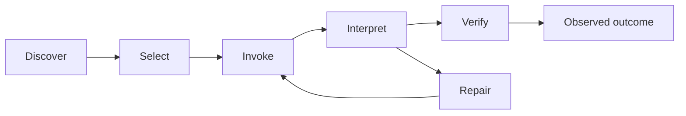

# Make Capabilities Legible and Operable

A capability becomes usable when the worker can discover it at the moment of
need, recognize when it applies, invoke it correctly, interpret bounded results,
recover from failure, and verify its effect in the real system. Every edge in
that loop contributes context to the trajectory.

## Make discovery and familiarity work together

Dynamic or unfamiliar capabilities need a compact model-visible catalog: a
meaningful name, purpose, input shape, result shape, and first useful call. The
[tool-discovery contract] develops this interface as tokens delivered by a live
server. Skills, repository routing, CLI help, and native application affordances
can expose the same essentials.

[tool-discovery contract]:
  https://hyperbo.la/w/tool-discovery/#:~:text=names%2C%20descriptions%2C%20input%20schemas%2C%20and%20example%20calls

Familiarity is a separate axis. A POSIX command can exploit strong learned
priors yet remain invisible until the worker knows it is installed. A Model
Context Protocol (MCP) server can advertise named tools and their input schemas
immediately, while the model may still have to learn each novel invocation and
result shape. Ryan Lopopolo's [CLI and MCP comparison] and [familiar POSIX CLI]
argument make this tradeoff explicit.

[CLI and MCP comparison]: https://x.com/_lopopolo/status/2031821445454876896
[familiar POSIX CLI]: https://x.com/_lopopolo/status/2031834223930458283

Use progressive disclosure for both. Advertise what and why compactly. Load
detailed schemas, examples, or manuals after selection. Preserve familiar
commands when they close the job cleanly; introduce a new surface when it adds
domain capability, exposes otherwise unreachable state, narrows authority,
reduces context cost, or supplies reliable verification.

The [Electron tool-transport migration] makes this compatibility boundary
concrete. Codex needed to connect to the team's Electron application through the
Chrome DevTools Protocol. The first interface exposed that connection through
MCP. A teammate later replaced it with a local TypeScript daemon and a small CLI
because the worker needed only two or three operations. After the migration,
Codex still reached the Electron application through that small set of
Chrome-DevTools-backed operations, and Ryan's workflow continued without
interruption. End-to-end journey tests should protect that behavioral contract
across future transport changes.

[Electron tool-transport migration]:
  https://tessl.io/podcast/109/#:~:text=completely%20replaced%20the%20MCP%20connection%20in%20his%20codebase%20with%20a%20TypeScript%20daemon

## Design every result as context

The worker has to decide what happened and what to do next from success output,
structured results, errors, logs, and repair hints. Useful tool behavior
includes:

- quiet success;
- bounded, stable structure where the result will be inspected mechanically;
- the violated invariant and affected target on failure;
- a known recovery action when one exists;
- a retrieval path for omitted detail;
- an inspection or dry-run mode for consequential effects; and
- a postcondition query or side-effect receipt.

The [failure-only tool output] account describes formatters and tests that
suppress passing noise and expose the failing portion. The suppression belongs
at the tool boundary. The tool runs the complete job, preserves its complete
output and true exit status, returns the bounded result needed for the next
decision, and supplies a stable route to the omitted evidence.

A context-unsafe test command creates a recognizable failure signature: the
worker preemptively pipes an expensive command such as `cargo test` through
`head` or `tail`. `head` can close the pipe and terminate the test process
before completion. `tail` normally reads through completion but discards earlier
evidence. Without pipeline-status handling, either filter can also hide the test
process's exit status. When a late failure depends on earlier context, that
discarded output is unavailable. A repository-owned wrapper or test reporter
should run the complete job once, preserve its true status and full output,
return a semantic failure summary, and make the underlying evidence queryable
without rerunning the test.

[failure-only tool output]:
  https://www.latent.space/p/harness-eng#:~:text=only%20output%20the%20failing%20parts%20of%20the%20tests

## Expose the smallest interface that closes the job

Native commands work well for capabilities already represented in the model's
experience. Domain tools earn their place when they make an inaccessible system
addressable or compress repeated operational mechanics into the concepts the job
actually uses. A replacement host for a learned tool should preserve its action
names, argument and result shapes, errors, approval behavior, cancellation, and
lifecycle semantics. CLI, MCP, and other adapters should remain thin over the
typed package that owns those concepts, so each surface invokes the same policy
instead of implementing a parallel domain model.

The [model-native semantics note] develops the compatibility surface between a
worker's learned tools and a host. [Make the Repository Teach the Agent]
develops typed capability boundaries and canonical ownership.

[model-native semantics note]: ../fixed-worker/model-native-semantics.md
[Make the Repository Teach the Agent]: ../domain-modeling/

## Descend to a missing primitive

Whole-job delegation reveals capabilities from the outside in. Begin with the
desired outcome. When the work reaches an unavailable primitive, treat that
primitive as a nested whole job. The worker or harness builder can descend
through the dependency chain, build or import the smallest durable capability,
then return to the original outcome.

The original goal in the [credential-management recursion] was for Codex to read
Slack and identify inbound outages without a person copying messages into the
trajectory. Slack access required credential management; the worker needed an
interface for requesting credentials; that interface required keychain access
and secure-coding constraints around sensitive material. Ryan describes this
kind of capability search recursing six to eight layers. Once this search
reached a usable primitive, the team worked back up to outage triage. Each
imported capability expanded the jobs future workers could complete.

[credential-management recursion]:
  https://www.aakashg.com/how-pms-ship-100k-lines-of-code/#:~:text=the%20thing%20I%20have%20to%20build%20first%20is%20like%20credential%20management

This recursive path is also feedback. The missing edge identifies a durable
environment improvement. A one-off relay leaves the same capability hole for the
next trajectory.

## Give the worker the real system

Operability spans the application, browser and DOM, logs, analytics, metrics,
traces, source data, issue trackers, review, CI, deployment preparation, and
proof artifacts. [Agent Utilization Is the New Performance Ceiling] inventories
that full lifecycle. OpenAI's [worktree-local application loop] shows
application instances, browser control, and observability closing a real
application loop.

[Agent Utilization Is the New Performance Ceiling]:
  https://hyperbo.la/w/agents-agents-agents/#:~:text=Most%20of%20the%20software%20lifecycle%20is%20reading%20logs
[worktree-local application loop]:
  https://openai.com/index/harness-engineering/#:~:text=we%20made%20the%20app%20bootable%20per%20git%20worktree

Let the worker launch and instrument its own environment. Human relay adds
latency and strips away the state needed for diagnosis. A capability is complete
when the worker can observe its postcondition, retrieve the relevant evidence,
and repair or roll back a failed attempt.

The [Electron component workbench] shows this boundary in a UI system:
production design-system components form the action surface, while DevTools,
runtime telemetry, semantic state, and rasterized output make the result
observable.

[Electron component workbench]:
  ../proof/#give-the-agent-access-to-the-real-system

Capability does not grant permission. [Maximize Autonomy Inside Explicit
Authority] defines the identity, scope, lifetime, approval, audit, revocation,
and recovery contract around consequential effects.

[Maximize Autonomy Inside Explicit Authority]: ../authority/
