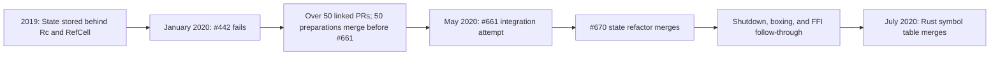
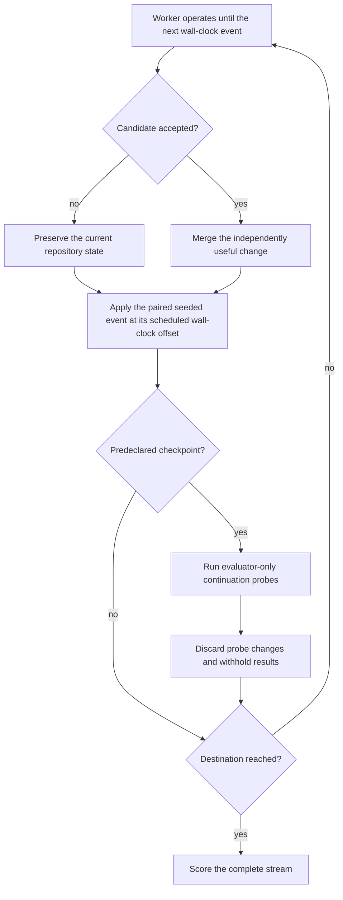

# Future Regret in Artichoke's State Refactor

Artichoke is a Ruby implementation in Rust built around mruby, a Ruby virtual
machine written in C. Rust-owned interpreter state crosses into C calls that may
call back into Rust while mruby's garbage collector runs. In 2020, Artichoke
stored that state behind `Rc<RefCell<State>>`: `Rc` provided shared ownership,
while `RefCell` checked borrowing at runtime instead of through ordinary Rust
compile-time rules.

That wrapper prevented independent borrows of state components. At the same
time, Ruby core and standard-library implementations reached through the
interpreter's public capabilities into VM internals. A first-party Rust symbol
table—the map from Ruby symbol names to interned identifiers—made the combined
limitation concrete. The implementation needed several state components to
interact through ordinary Rust borrows, which the existing model could not
express.

Ryan Lopopolo's first whole-tree attempt, [Destructure State (#442)], changed
114 files with 2,088 additions and 2,101 deletions. It never reached a compiling
state. Its description identifies four changes that had become entangled: state
ownership, movement across the Rust–C FFI boundary, mutable interpreter
requirements across the public API, and a rewrite of most extension code. The
experiment also contained useful local improvements, which became the beginning
of a much longer stream of work.

[Destructure State (#442)]: https://github.com/artichoke/artichoke/pull/442

The hard capability is choosing a stream of independently useful, mergeable
changes that lowers the cost and risk of a later destination while ordinary
repository traffic continues, then replanning when runtime evidence falsifies
the route. The history shows what this capability would have to accomplish. It
does not show that a fixed model-and-agent worker can reproduce the
decomposition reliably.

## The state change became a program of work

The problematic state wrapper originated in [commit c39cc77], an early commit
that stored the Rust interpreter in mruby's user-data pointer. The final
refactor describes the recovery from #442 as “over 50” spawned pull requests.
The public cross-reference timeline identifies 50 causally linked preparations
that merged before #661 opened. Their descriptions and comments call them
extracted from, inspired by, related to, or required for #442. Ryan authored
all 50.

[commit c39cc77]:
  https://github.com/artichoke/artichoke/commit/c39cc778900ff26d1ce8109f7235554e9e6c525a

The first extraction wave removed incidental work from the failed branch and
lowered the cost of later edits. [Unused array backend removal (#458)] deleted
1,573 lines. [Removal of the generated converter matrix (#487)] removed more
than 1,000 implementations and reported a ten-percent reduction in clean-build
time. [Virtual-filesystem rearchitecture (#497)] replaced a general fake
filesystem with a smaller component designed around Artichoke's actual loading
semantics. Bug fixes for exception propagation, range handling, and missing
Array behavior landed independently of the eventual refactor.

[unused array backend removal (#458)]:
  https://github.com/artichoke/artichoke/pull/458
[removal of the generated converter matrix (#487)]:
  https://github.com/artichoke/artichoke/pull/487
[virtual-filesystem rearchitecture (#497)]:
  https://github.com/artichoke/artichoke/pull/497

The next changes altered the interpreter's shape. [Parser state and APIs
(#467)], [PRNG state (#469)], and [output state (#539)] split the large state
container into components. [Global-variable capabilities (#562)], [the VFS
capability boundary (#655)], [the Regexp capability boundary (#658)], and [the
PRNG capability boundary (#659)] moved extension code away from raw state and VM
access.

[parser state and APIs (#467)]: https://github.com/artichoke/artichoke/pull/467
[PRNG state (#469)]: https://github.com/artichoke/artichoke/pull/469
[output state (#539)]: https://github.com/artichoke/artichoke/pull/539
[global-variable capabilities (#562)]:
  https://github.com/artichoke/artichoke/pull/562
[the VFS capability boundary (#655)]:
  https://github.com/artichoke/artichoke/pull/655
[the Regexp capability boundary (#658)]:
  https://github.com/artichoke/artichoke/pull/658
[the PRNG capability boundary (#659)]:
  https://github.com/artichoke/artichoke/pull/659

The remaining preparation propagated explicit ownership through public APIs and
extension call sites. [Mutable evaluation (#480)] required unique access for VM
mutation. [Allocating conversion traits (#488)] distinguished conversions that
allocate on the interpreter heap. [Interpreter-aware Value methods (#622)] and
[removing the interpreter from Value (#631)] made VM access explicit and removed
the interpreter clone previously carried by every Ruby value. [Mutable
Rust-backed values (#644)] closed the last extension trampoline gaps.

[mutable evaluation (#480)]: https://github.com/artichoke/artichoke/pull/480
[allocating conversion traits (#488)]:
  https://github.com/artichoke/artichoke/pull/488
[interpreter-aware Value methods (#622)]:
  https://github.com/artichoke/artichoke/pull/622
[removing the interpreter from Value (#631)]:
  https://github.com/artichoke/artichoke/pull/631
[mutable Rust-backed values (#644)]:
  https://github.com/artichoke/artichoke/pull/644

The [complete preparation ledger] preserves all 50 links and their functional
grouping.

[complete preparation ledger]: ../sources/artichoke-state-refactor-ledger.md

The stream mixed one-file cleanups with a 50-file virtual-filesystem
replacement. It delivered independent repairs and established the capability and
state seams required by the final ownership change.

Two issues made concrete prerequisites explicit. [Global-variable APIs (#116)]
were needed to remove raw VM access from Regexp and MatchData; #562 delivered
them. [Parser encapsulation (#468)] recorded an API that could not return a
borrowed parser context through `RefCell`; #670 closed it. The broader [mruby
backend migration (#127)] later cited #442 as the best record of the work that
moved backend implementations behind `artichoke-core` traits.

[Global-variable APIs (#116)]: https://github.com/artichoke/artichoke/issues/116
[Parser encapsulation (#468)]: https://github.com/artichoke/artichoke/issues/468
[mruby backend migration (#127)]:
  https://github.com/artichoke/artichoke/issues/127

This work ran against a moving repository. GitHub's historical PR index records
[200 merged pull requests] between January 24 and May 9, 2020. The 50
preparatory PRs were one quarter of that traffic. Any evaluation that freezes
the base until a refactor is complete removes the integration pressure that
shaped this history.

[200 merged pull requests]:
  https://github.com/artichoke/artichoke/pulls?q=is%3Apr+is%3Amerged+merged%3A2020-01-24..2020-05-09

## Preparation reduced uncertainty; integration remained large

[Remove Rc wrapper around Artichoke State (#661)] was the second integration
attempt. Its description makes the result explicit: despite 50 linked pull
requests, it still changed 111 files with 2,633 additions and 1,972 deletions.
The branch accumulated 41 commits, many named `temp` or `fixup`, and was opened
with a do-not-merge label so its history could be cleaned before landing.

[Remove Rc wrapper around Artichoke State (#661)]:
  https://github.com/artichoke/artichoke/pull/661

The remaining work was cross-cutting. Every Rust-to-C VM call had to place
`State` in mruby's user-data pointer before C could re-enter Rust or run garbage
collection. Every C-to-Rust callback adapter, or trampoline, then had to extract
that state and restore it on return. The attempt exposed failures that the
preparation stream had not removed:

- a Windows run of the leak test terminated with `STATUS_ACCESS_VIOLATION`;
- [the use-after-free fix] explains that allocations could trigger a GC while
  the Rust state was absent from mruby's user-data pointer, allowing live Array
  members to be collected and later dereferenced; and
- Ryan's self-review created follow-up issues for [misplaced registry traits
  (#666)], [suppressed conversion errors (#667)], [suspected pinning
  requirements (#668)], and [an arena API that had become fallible (#669)].

[the use-after-free fix]:
  https://github.com/artichoke/artichoke/commit/f1dcf8b1f4181eab7504c5fcd25785a7ec9ffc98
[misplaced registry traits (#666)]:
  https://github.com/artichoke/artichoke/issues/666
[suppressed conversion errors (#667)]:
  https://github.com/artichoke/artichoke/issues/667
[suspected pinning requirements (#668)]:
  https://github.com/artichoke/artichoke/issues/668
[an arena API that had become fallible (#669)]:
  https://github.com/artichoke/artichoke/issues/669

The cleaned [state refactor (#670)] merged on May 9. It was still a 110-file
change. Three days later, [the shutdown regression (#674)] fixed an intermittent
Windows segfault introduced by #670: `State` was destroyed before `mrb_close`
performed its final GC, so the free functions held by class and module specs had
already died.

[state refactor (#670)]: https://github.com/artichoke/artichoke/pull/670
[the shutdown regression (#674)]:
  https://github.com/artichoke/artichoke/pull/674

The architectural work continued. [A new heap-object boxing scheme (#707)]
removed another `Rc<RefCell<_>>` design, propagated conversion failures, and
closed a debt recorded during #661. [Broader FFI-boundary coverage (#723)] moved
state into mruby around more VM calls and removed a temporary need to disable
the GC. [The Rust symbol table (#730)] finally landed on July 3, completing the
feature that had exposed the state-modeling bug. [Fallible arena creation
(#734)] closed another issue introduced by the integration attempt. Registry
traits created in the backend during #661 did not reach their intended
`artichoke-core` owner until the [registry-trait migration (#1355)] merged in
September 2021. Maurizio Del Corno authored #734. Stuart Hinson led #1355, with
commits from Ryan Lopopolo.

The follow-through separated two kinds of open work. The pinning concern in #668
was retired after #674 identified destructor ordering as the fault. Moving the
registry traits to their intended owner remained accepted debt until #1355
completed it sixteen months later. A durable migration record must let falsified
hypotheses disappear while preserving obligations that outlive the main
refactor.

[A new heap-object boxing scheme (#707)]:
  https://github.com/artichoke/artichoke/pull/707
[Broader FFI-boundary coverage (#723)]:
  https://github.com/artichoke/artichoke/pull/723
[The Rust symbol table (#730)]: https://github.com/artichoke/artichoke/pull/730
[Fallible arena creation (#734)]:
  https://github.com/artichoke/artichoke/pull/734
[registry-trait migration (#1355)]:
  https://github.com/artichoke/artichoke/pull/1355

The preparation stream reduced the work left in the successful refactor and
merged substantial improvements along the way. The final ownership transition
remained non-routine, a shutdown lifetime failure and FFI-coverage gaps remained
undiscovered, and some architectural boundaries remained open. Counting merged
preparatory PRs would overstate the result; judging only the final 110-file diff
would discard four months of risk reduction and learning.

## Evaluate future regret

“Fear of future regret” is observable when early decisions preserve options,
retire known risk, raise later completion rates, and reduce completion cost.
Runs have a fixed budget and must still reach the destination; an endless
sequence of preparatory changes does not pass.

### Separate calibration from measurement

The Artichoke replay is a contaminated development case. This page, the source
manifest, and the preparation ledger disclose the historical route, and the
public GitHub history may already be represented in model training data. The
replay can still calibrate fixtures, graders, event schedules, and score
interpretation. It cannot support a general capability claim.

A development replay needs a target-specific context projection that excludes
every file and reachable source which reveals the historical route. A content
scan must cover references outside `evals/`, including the durable-systems,
lineage, domain-modeling, and source-library pages that discuss Artichoke. The
projection records its exact file manifest and the exclusion scan. This reduces
direct leakage from the harness while leaving training contamination unresolved.
Capability measurement therefore needs a fresh private target or a materially
transformed stateful Rust–C fixture with the same classes of pressure and a
different valid route.

### State the destination and hold the worker constant

Start the Artichoke calibration at #442's base commit,
[artichoke/artichoke@4424ed9]. The worker must make a first-party Rust symbol
table possible by replacing the interpreter's ownership and interior-mutability
model. It may deliver a sequence of independently useful changes while ordinary
repository traffic continues. The evaluator grades the following invariant while
leaving the implementation open:

[artichoke/artichoke@4424ed9]:
  https://github.com/artichoke/artichoke/commit/4424ed934b403293124a6a3cb690b2191d039f5d

- Rust-owned interpreter state remains sound when C calls back into Rust or
  triggers garbage collection;
- independent state components can interact without hiding aliasing failures
  behind runtime borrow checks;
- VM internals are encapsulated behind interfaces defined by their owner;
- public Ruby behavior, platform support, leak behavior, and shutdown semantics
  remain compatible; and
- the symbol table does not reopen the ownership model.

Equivalent architectures may pass. `NonNull`, `with_ffi_boundary`, Artichoke's
exact trait set, and the historical 50-PR sequence are outside the acceptance
criteria.

Pin the model and coding-agent host. Give every condition the same repository
state, authority, tools, event stream, budget, tests, CI results, fresh
sessions, and blank durable migration ledger. The ledger can preserve
hypotheses, accepted changes, abandoned paths, current obstacles, and removal
conditions across sessions. The baseline receives the repository's ordinary
guidance. The treatment adds target-independent guidance from the
[harness-engineering context bundle] that passed the contamination scan. This
comparison holds the ledger affordance constant while estimating the context
bundle's effect. An evaluation of the ledger itself uses a separately randomized
context-by-ledger factorial design.

[harness-engineering context bundle]: ../README.md

### Longitudinal run

Give the worker normal repository tools and authority to implement and submit a
sequence of pull requests. The evaluator runs each candidate through focused
tests, the Ruby spec suite, leak and GC stress tests, documentation, and
supported platform CI. A candidate can merge only when it is independently
correct and useful. The merge rule and rubric are fixed before launch. Automated
checks verify objective boundary claims, and qualitative review is
condition-blind. Review returns rubric fields and ordinary failure evidence
without proposing a decomposition or repair. Any coaching becomes a recorded
human intervention or a separately declared oracle condition.

Use elapsed wall time as the primary scheduling clock and acceptance horizon.
Before condition assignment, freeze the event corpus or generator, inclusion
rule, arrival offsets, and seeds. Historical calibration declares how candidate
route changes are excluded from concurrent traffic; transformed fixtures use a
generator defined without inspecting condition outcomes. Escrow the event
realizations and their hashes. Replay the identical event at the same elapsed
offset in each matched run, regardless of how many candidate pull requests that
run produced. Fix maximum worker and subagent concurrency. Inference, tool
execution, CI and review waits, and retries all consume the wall-clock horizon.
Tokens, compute, tool calls, and human attention remain separately reported
diagnostics. A resource-clock experiment is a different estimand and needs its
own predeclared schedule and results.

For each world, create matched baseline and treatment runs with the same initial
state and seeded event stream, then randomly assign the two clones to
conditions. Vary initial states and event seeds across worlds. Treat the matched
world, rather than its continuation probes, as the unit of uncertainty. The
worker must rebase, revise, postpone, or abandon work through the ordinary
repository workflow.

Before any work merges and at the same predeclared wall-clock checkpoints in
each condition, fork the repository and run repeated continuation probes under
identical fixed wall-clock budgets with the same pinned model and coding-agent
host. Each fresh probe attempts the remaining ownership and symbol-table
objective. Two probe contexts answer different questions:

- A neutral probe receives the target snapshot and its ordinary guidance. It
  includes every accepted code, test, document, plan, skill, and ledger artifact
  that actually merged, but receives no external harness bundle. This estimates
  repository-mediated attainability.
- An assigned-harness probe receives the same target snapshot plus the
  supplemental context assigned to the primary arm. This estimates the total
  continuation effect, including direct help from the bundle.

Predeclare every readable artifact in each probe. Do not add or remove the
ledger at probe time unless ledger availability is a randomized factor.

Probe changes are discarded, and their results remain evaluator-only. The
primary worker receives the same ordinary tests and CI evidence in both
conditions. Acceptance rate, elapsed time, retries, human intervention, and
remaining failure classes estimate how the repository state changed future
attainability. Feeding those hidden failure classes back to the treatment would
create an oracle-assisted feedback condition and must be evaluated as a separate
arm. Repeated probes estimate continuation variance within one world; they are
nested measurements, not independent treatment trials.

The declared destination measures continuability of a known migration. Option
preservation needs additional evaluator-held-out forks. Before condition
assignment, freeze and escrow the fork family, sampling distribution, seeds, and
realizations. At a scheduled checkpoint, instantiate the same evaluator-only
forks from each paired arm's frozen state: a new GC re-entry path, a state
component that needs independent borrowing, a conflicting public-API change, a
rollback demand, or a platform-specific shutdown constraint. Only the
continuation-probe workers receive the selected fork. Fixed-wall-clock probes
then measure whether the intermediate state accommodates those futures without
abandoning the declared destination. A route blueprint optimized for one known
probe cannot satisfy this measure by itself.

### Score the stream and the destination

| Dimension               | Observable evidence                                                                                                                                            |
| ----------------------- | -------------------------------------------------------------------------------------------------------------------------------------------------------------- |
| Destination             | The state invariant and symbol-table behavior pass at the real Rust–C, GC, shutdown, and Ruby boundaries.                                                      |
| Intermediate value      | Every merged change is correct on its own, carries focused proof, and removes a defect, dependency, unsafe edge, direct-state access, or other named obstacle. |
| Future attainability    | At a common wall-clock horizon, compare paired destination-acceptance rates and elapsed time to acceptance, with failures censored at the horizon.             |
| Option preservation     | Paired held-out forks remain compatible with the intermediate state and can be completed or safely declined without stranding the migration.                   |
| Compatibility           | Supported platforms, public APIs, Ruby specs, docs, leak behavior, and cleanup semantics remain intact throughout the stream.                                  |
| Mergeability            | Changes remain reviewable and rebasable while withheld repository traffic lands; stale work is replanned instead of forced through.                            |
| Reversibility           | Intermediate changes can be reverted or superseded without stranding half-migrated protocols or corrupting persistent state.                                   |
| Recovery                | The worker localizes platform, lifetime, and GC failures, updates the model of the problem, and changes the plan before continuing.                            |
| Human attention         | Record review rounds, clarification, manual debugging, intervention time, and decisions that the worker could not close.                                       |
| Architectural restraint | New traits and indirection have demonstrated consumers and clear owners; speculative generality and transitional APIs have removal conditions.                 |

Acceptance requires both the destination and a safe, mergeable stream. The
primary estimates are absolute destination acceptance by the common horizon, the
paired difference between arms, and elapsed wall time to acceptance. Report
uncertainty at the randomized-world level. Probe count and within-world variance
remain trajectory diagnostics. Change from an initial probe may help explain a
trajectory, but it is not an acceptance rule. Report unmergeable branches,
unsafe intermediate states, hidden human repair, and failure to reach the
destination.

Simple proxies are inadequate. PR count rewards fragmentation. Diff size
punishes irreducible migrations. A declining count of raw-state accesses can be
gamed by moving them behind an unsound wrapper. Continuation probes connect an
intermediate change to the future work it was meant to ease, while boundary
tests keep that measure anchored in correctness. Held-out forks test whether the
state preserves more than one scripted route. These results measure future
attainability under the pinned worker; they do not establish that the worker
predicted a particular future failure.

### Instantiate the design

The retrospective supplies a calibration case and an evaluation design. A run
needs an immutable experiment manifest that records:

- the target revision, prompt, reset procedure, and archived toolchain and CI
  environment;
- model, coding-agent host and version, tool inventory, authority envelope,
  maximum concurrency, wall-clock horizon, and treatment-projection digest;
- the event corpus or generator, inclusion rule, arrival schedule, escrowed
  seeds and hashes, and target-specific graders and merge rubric; and
- world count, matched assignments, checkpoints, probe contexts, held-out fork
  distribution, repetition counts, and randomization schedule.

Pilot the graders and probe budgets on disjoint worlds, then freeze the main
manifest. Use the pilot to select sparse checkpoints and avoid floor or ceiling
effects. Neutral destination probes form the core longitudinal measure.
Assigned-harness probes and held-out forks can run at fewer predeclared
checkpoints when the resource plan cannot support the full matrix. Determine the
world count from the expected paired effect and variance; do not expand the grid
after reading condition outcomes.

## Distinguish durable capability from a lucky decomposition

Run multiple trials from equivalent but non-identical worlds. Change the order
of concurrent merges, move one state responsibility, vary which platform reveals
the first fault, and use fresh or materially transformed stateful Rust–C
fixtures whose safe destinations admit different architectures. Keep the
destination invariant stable while changing the route.

A durable capability should:

- discover useful seams without seeing Artichoke's historical ledger;
- improve continuation probes across perturbations and repeated runs;
- abandon an early abstraction when evidence makes it expensive;
- preserve independently valuable work when the integration plan changes;
- respond to GC, lifetime, and platform evidence by revising the governing
  model; isolated guards leave the failure class open; and
- converge with bounded human attention and without relying on a privileged
  reviewer to supply the decomposition.

Success across these perturbations would show that the harness helps the fixed
worker create mergeable optionality, learn from repository evidence, and lower
future integration cost across more than one route.
