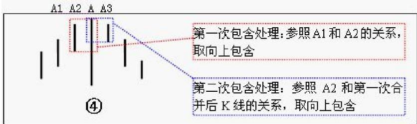

# 第四节 K线的包含关系

# 一、基本概念

K线包含关系：指一K线的高低点全在另一K线的范围里(如图 $\textcircled{1}$ )。

非包含关系的三相邻K线完全分类：分为四类——上升K线、顶分型、下降K线、(如图 $\textcircled{2}$ )

K线包含关系的处理：在向上时，把两K线的最高点当高点，而两K线低点中的较高者当成低点，这样就把两K线合并成一新的K线；反之，当向下时，把两K线的

最低点当低点，而两K线高点中的较低者当成高点，这样就把两K线合并成一新的K线。(如图 $\textcircled{3}$ )

# 二、概念要点

K线合并方向：假设，第n根K线满足第n根与第 $\mathsf { n } +$ 1根的包含关系，而第n根与第n-1根不是包含关系，那么，如果第n根K线的高点大于第n-1根K线的高点，则称第n-1、n、n+1根K线是向上的；如果第n根K线的低点小于第n-1根K线的低点，则称第n-1、n、 $\mathsf { n } +$ 1根K线是向下的。

K线包含关系的顺序原则：先用第1、2根K线的包含关系确认新的K线，然后用新的K线去和第3根比，如果有包含关系，继续用包含关系的法则结合成新的K线；如果没有，就按正常K线去处理。

# 三、分析理解

根据定义，任何人都可以马上得出以下的一些推论：

1、用[di,gi]记号第 i根 K线的最低和最高构成的区间，当向上时，顺次 n个包含关系的 K线组，等价于[maxdi,maxgi]的区间对应的 K线，也就是说，这 n个 K线，和最低最高的区间为[maxdi,maxgi]的 K线是一回事情；向下时，顺次 n个包含关系的 K线组，等价于[mindi,mingi]的区间对应的 K线。  
2、K线的包含关系遵守结合律，但不遵守传递律。也就是说，第 1、2根 K线是包含关系，第 2、3根也是包含关系，但并不意味着第1、3根就有包含关系。因此在 K线包含关系的分析和处理中，还要遵守顺序原则，就是先用第1、2根K线的包含关系确认新的 K线，然后用新的K线去和第三根比，如果有包含关系，继续用包含关系的法则结合成新的K线，如果没有，就按正常 K线去处理。

一个实例：如图 $\textcircled{4}$ ，中间K线A最长，似乎和前后有“很多的包含关系”，但正确的处理应该是：A2先和A

合并，取高点中的高点，低点中的高点。合并后的新K线和A3还有包含关系，那就继续合并，仍取高点中的高

点，低点中的高点。

# K线包含处理方法：

1、合并方向的确定：1和2无包含，2和3有包含，若2比1高则取向上包含；若2比1低则取向下包含；  
2、合并高低点的确定：若向上包含，

取两K线中高点最高为高点，低点最高为低点；若向下包含，取两K线中高点最低为高点，低点最低为低点。

3、合并顺序的确定：2和3有包含，先合并2和3得出新的K线，再与4比，若有包含则继续合并。

