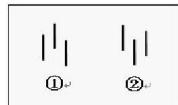

# 第五节 分 型

# 一、基本概念

顶分型：第二K线高点是相邻三K线高点中最高的，而低点也是相邻三K线低点中最高的。(如图 $\textcircled{1}$ )

底分型：第二K线低点是相邻三K线低点中最低的，而高点也是相邻三K线高点中最低的。(如图 $\textcircled{2}$ )

(分型的)顶：顶分型的最高点。

(分型的)底：底分型的最低点。

# 二、概念要点

所有的顶必须是顶分型的，反之，所有的底都是底分型的。也就是：没有顶分型，没有顶；反之，没有底分型，没有底。

# 三、分析理解

1、在实际操作中，如果在操作级别的K线图上，没有顶分型，那你就可以持有睡觉，等顶分型出来再说。  
2、一个顶分型之所以成立，是卖的分力最终战胜了买的分力，而其中，买的分力有三次的努力，而卖的分力，有三次的阻击。用最标准的已经过包含处理的三 K线模型：第一根 K线的高点，被卖分力阻击后，出现回落，这个回落，出现在第一根K线的上影部分或者第二根K线的下影部分，而在第二根K线，出现一个更高的高点，但这个高点，显然与第一根 K线的高点中出现的买的分力，一定在小级别上出现力度背驰，从而至少制造了第二根K线的上影部分。最后，第三根 K线，会再次继续一次买的分力的攻击，但这个攻击，完全被卖的分力击败，从而不能成为一个新高点，在小级别上，大致出现一种第二类卖点的走势。

由上可见，一个分型结构的出现，如同走势中枢，都是经过一个三次的反复心理较量过程，只是走势中枢用的是三个次级别走势。所谓一而再、再而三，三而竭，一个顶分型就这样出现了，而底分型情况，反之亦然。

3、分型中三根K线的指导意义：

首先，一个完全没有包含关系的分型结构，意味着市场双方都是直截了当，没有太多犹豫。包含关系（只要不是直接把阳线以长阴线吃掉）意味着一种犹豫，一种不确定的观望等，一般在小级别上，都会有走势中枢延伸、扩展之类的东西。

其次，还是用没有包含关系的顶分型为例子。如果第一K线是一长阳线，而第二、三都是小阴、小阳，那么这个分型结构的意义就不大了，在小级别上，一定显现出小级别走势中枢上移后小级别新走势中枢的形成。一般来说，这种顶分型，成为真正顶的可能性很小，绝大多数都是中继的。

如果第二根K线是长上影甚至就是直接的长阴，而第三根K线不能以阳线收在第二根K线区间的一半之上，那么该顶分型的力度就比较大，最终要延续成笔的可能性就极大了。

再次，一般来说，非包含关系处理后的顶分型中，第三根K线如果跌破第一根K线的底而且不能高收到第一根K线区间的一半之上，属于最弱的一种，也就是说这顶分型有着较强的杀伤力。

4、分型形成后，无非两种结构：一是成为中继型的，最终不延续成笔；二是延续成笔。对于后一种，那是最理想的，例如在日线上操作完，就等着相反的分型出来再操作了，中间可以去操作别的股票，这是效率最高的。而对于第一种情况，前面说过，可以看是否有效突破5周期的均线，例如对日线上的顶分型，是否有效跌破5日均线，就是一个判断顶分型类似走势很好的操作依据。

其一，更精确简单的，就是这分型所对应的小级别走势中枢里，是否出现第三类买卖点，而且其后是否出现走势中枢移动。例如，对于一个顶分型，该顶分型成立后，对于该分型区间在小级别里一定形成某级别的走势中枢，选择其中最大一个，例如日顶分型后，可以找到相应的5、1分钟走势中枢，一般最大的就是5分钟（30分钟没可能，因为时间不够）。如果该5分钟走势中枢或1分钟走势中枢出现第三类卖点，并该卖点不形成走势

中枢扩张的情形，那么几乎100%可以肯定，一定在日线上要出现笔了。

其二，可以100%肯定的，要不出现笔并最终有效完成该顶分型，那一定要出现某级别的第三类买点，否则就算有短时间的新高，也一定是假突破。所以结合小级别的走势中枢判断，顶分型是否延伸为笔，是可以当下一目了然的。如果你能有效地分辨中继分型，那么你的操作就会有大的进步。  
5、一般来说，可以把分型与小级别走势类型结合操作，例如日线与5分钟的。如果一个小级别的走势中枢震荡没有生成日K线的顶分型结构，那么，这个走势中枢震荡就没必要走了。后者就算打短差也要控制好数量。因为，没有分型，就意味着走势没结束，随时新高，你急什么？而一旦顶分型成立，必然对应着小级别走势的第一、二类卖点。其后，关键看新形成走势中枢的第三类买卖点的问题：一般情况下，如果是中继的，都是第三类卖点后形成走势中枢扩展，也就是有一个绝妙的盘整底背驰让你重新介入。这样，利用分型搞了一个美妙的短差，又不浪费其后的走势，这就是一个比较及格的操作了。

注意，利用分型，例如顶分型，卖了以后一定要注意是否要回补，如果一旦确认是中继的，应该回补，否则就等着笔完成再说。

但一定要注意，中继顶分型后，如果其后的走势在相应小级别出现背驰或盘整背驰，那么下一顶分型，是中继的可能性将大幅度减少。中继分型，有点类似刹车，一次不一定完全刹住，但第一刹车后如果车速已明显减慢，证明刹车系统是有效的，那么第二次刹住的机会就极大了，除非你踩错，一脚到油门上去了。

6、利用分型操作的难点在于：

一、必须与小级别的第二买卖点配合看，如果小级别看不明白，只看今天冲起来没破前一天高位或没跌破前一天低位，这样操作的效果不会太好。  
二、要利用好盘整背驰，这样就不会漏掉回补，或者是非盘整背驰而回补早了，一般来说，非盘整背驰的，一定要等待背驰出现才可以回补。买点的情况反过来就是了。

注意，大级别的分型和某小级别的第一、二买卖点并不是绝对的对应关系，有前者一定有后者，但有后者并不一定有前者，所以前者只是一个辅助。

7、有人可能要问，如果看30分钟图，可能K线一直犬牙交错，找不到分型。这有什么奇怪的，在年线图里，找到分型的机会更小，可能十几年找不到一个也很正常，这还是显微镜倍数的比喻问题。确定显微镜的倍数，就按看到的K线用定义严格来，没有符合定义的，就是没有，就这么简单。如果希望能分析得更精确，那就提高显微镜的倍数，用小级别的图，例如，不要用30分钟图，用1分钟图，这样自然能分辨得更清楚。再次强调，用什么图与以什么级别操作没任何必然关系，用1分钟图，也可以找出年线级别的背驰，然后进行相应级别的操作。看1分钟图，并不意味着一定要玩超短线，把显微镜当成被显微的物了，肯定是脑子水太多了

这些细微的技术问题，都需要不断磨练才能操作自如，现在，最好多找些图来看，先感受一下，否则一点概念都没有，操作什么？

