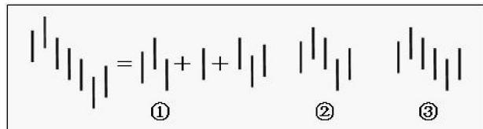
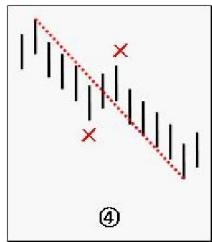

# 第六节 笔

# 一、基本概念

笔：两个相邻的顶和底之间构成一笔。笔的意义就是忽略掉相邻的顶和底之间的其他波动。

上升的一笔：即底分型+上升K线+顶分型；

下降的一笔：即顶分型+下降K线+底分型。

# 二、概念要点

# 笔的规范要求：

1、必须是一顶一底，顶必须对应底、或底必须对应顶。  
2、顶和底之间至少有一个K线不属于顶分型与底分型。  
3、还有一个最显然的，就是在同一笔中，顶分型中最高那K线的区间至少要有一部分高于底分型中最低那K线的区间，如果这条都不满足，也就是顶都在底低的范围内或顶比底还低，这显然是不可接受的。

满足上面的条件，就可以唯一确定出笔的划分。

# 三、分析理解

图 $\textcircled{1}$ 就是一笔的最基本的图形。图 $\textcircled{2}$ 顶和底之间共用一个K线，图 $\textcircled{3}$ 只有顶分型和底分形，中间没有其他K线，都不算一笔。在实际分析中，都必须要求顶和底之间都至少有一K线当成一笔的最基本要求。所以，笔，至少由顶、底在内的5根K线构成。如图 $\textcircled{1}$

两个顶（或底）能构成一笔吗？有两种情况：第一种，在两个顶（或底）中间有其他的顶和底。这种情况，

只要中间的顶和底不能构成一笔，就继续用一顶一底的原则，忽略中间的顶和底（图 $\textcircled{4}$ ）；第二种，在两个顶或底中间没有其他的顶和底，这种情况，意味着第一个顶或底后的转折级别太小，不足以构成值得考察的对象，这种情况下，第一个的顶或底就可以忽略其存在了。

所以，根据上面的分析，对第二种情况进行相应处理（类似对分型中包含关系的处理），就可以严格地说，先顶后底，构成向下一笔；先底后顶，构成向上一笔。而所有的图形，都可以唯一地分解为上下交替的笔的连

接。显然，除了第二种情况中的第一个顶或底类似的分型，其他类型的分型，都唯一地分别属于相邻的上下两笔，是这两笔间的连接。

# 划分笔的步骤：

1、确定所有符合标准的分型。如有K线包含关系，必须先行处理。  
2、如果前后两分型是同一性质的，对于顶，前面的低于后面的，只保留后面的，前面那个可以X掉；对于底，前面的高于后面的，只保留后面的，前面那个可以X掉。不满足上面情况的，例如相等的，都可以先保留(如图 $\textcircled{4}$ )。  
3、经过步骤二的处理后，余下的分型，如果相邻的是顶和底，那么这就可以划为一笔。

显然，经过上面的三个步骤，所有的笔都可以唯一地划分出来。

