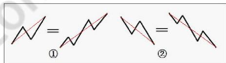
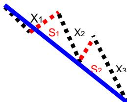
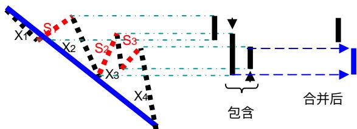
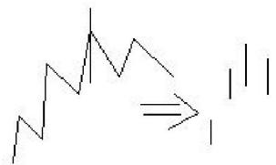
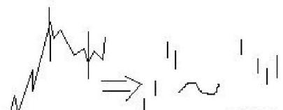
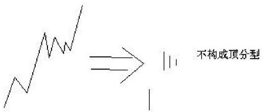
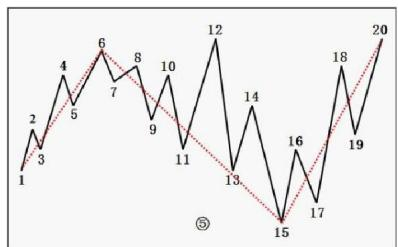

# 第七节 线 段

# 一、基本概念

线段：至少由三笔组成，而且前三笔必须有重叠的部分。

线段划分定理：线段被终结，当且仅当至少被有重叠部分的连续三笔的其中一笔终结。而只要构成有重叠部分的前三笔，那么必然会形成一线段。换言之，线段终结的充要条件，就是形成新线段。

# 二、概念要点

1、线段至少有连续的三笔（可以更多），但并不是连续的三笔就定构成线段，这三笔必须有重叠的部分。如图 $\textcircled{1} \textcircled{2}$ 是线段的最基本形态。  
2、线段无非有两种，从向上一笔开始的，和从向下一笔开始的。从向上一笔开始的线段，其终结也是向上一笔，其顶gi一定大于第一笔的

底d1，故该线段是向上的；同理从向下一笔开始的线段，其方向也是向下的。如图 $\textcircled{1} \textcircled{2}$ 。

3、和笔一样，从顶分型开始的线段，其终结一定是底分型；反之亦然。所以构成线段的笔数一定是奇数。

4、用S代表向上的笔，X代表向下的笔。

以向上笔开始的线段，可以用笔的序列表示：S1X1S2X2S3X3…SnXn。容易证明，任何Si与Si+1之间，一定有重合区间。而考察序列X1X2…Xn，该序列中，Xi与Xi+1之间并不一定有重合区间，因此，这序列更能代表线段的性质。

序列XX…X为以向上笔开始线段的特征序列，X为该特征序列的元素；序列SS…Sn成为以向下笔开始线段的特征序列，Si为该特征序列的元素。特征序列两相邻元素间没

有重合区间，称为该序列的一个缺口。

把每一元素看成是一K线，那么，如同一般K线图中找分型的方法，也存在所谓的包含关系，也可以对此进行非包含处理。经过非包含处理的特征序列，成为标准特征序列。

5、线段划分定理也可以理解为：只有形成新线段，原线段才结束（确定）。如图 $\textcircled{3} \textcircled{4}$ 是两线段组合的基本形态(这里的形态是不充分的)。

# 三、分析理解

# 线段划分的标准：

参照一般K线图关于顶分型与底分型的定义，可以确定特征序列的顶和底。注意，以向上笔开始的线段的特征序列，只考察顶分型；以向下笔开始的线段，只考察底分型。

在标准特征序列里，构成线段终点分型的三个相邻元素，只有两种可能：

第一种：特征序列为顶分型中，第1和第2二元素间不存在特征序列的缺口，那么该线段在该顶分型的高点处结束，该高点是该线段的终点；底分型反之亦然。

第二种：特征序列为顶分型中，第1和第2元素间存在特征序列的缺口，如果从该分型最高点开始向下一

笔开始形成的特征序列出现底分型（意味形成了新的线段），那么该线段在该顶分型的高点处结束，该高点是该线段的终点；底分型反之亦然。

强调，在第二种情况下，后一特征序列不一定封闭前一特征序列相应的缺口，而且，第二个序列中的分型，不分第一二种情况，只要有分型就可以。（见右图）

线段划分的程序：首先搞清楚特征序列，然后搞清楚标准特征序列，最后是标准特征序列的顶分型与底分型。而分型又以分型的第一元素和第二元素间是否有缺口分为两种情况。一定要把这逻辑关系搞清楚，否则一定晕倒。

  
情况1

  
情况2  
顶分型后的新特征序

假设某转折点是两线段的分界点，然后

对此用两种情况去考察线段划分是否满足，如果满足其中一种，那么这点就是真正的线段的分界点；如果不满足，那就不是，原来的线段依然延续。

特征序列的分型中，第一元素就是以该假设转折点前线段的最后一个特征元素，第二个元素，就是从这转折点开始的第一笔，显然，这两者之间是同方向的。因此，如果这两者之间有缺口，那么就是第二种情况，否则就是第一种，然后根据定义来考察就可以。

这里还要强调一下包含的问题。上面的分析知道，在这假设的转折点前后那两元素，是不存在包含关系的，因为，这两者已经被假设不是同一性质的东西，不一定是同一特征序列的；但假设的转折点后的顶分型的元素，是可以应用包含关系的。为什么？因为，这些元素间，肯定是同一性质的东西，或者就是原线段的延续，那么就同是原线段的特征序列中，或者就是新线段的非特征序列中，反正都是同一类的东西，同一类的东西，当然可以考察包含关系。

换一种思考方式：就是把线段的特征序列的元素，看成是K线；然后按K线的包含关系处理，就成了标准特征序列；最后看这标准特征序列的元素等同的K线是否有顶分型和底分型：有顶分型和底分型，那么这个顶分型和底分型就形成了新线段，原线段终结，否则原线段延续。

一个实例：如图 $\textcircled{5}$ ，6属于第一种情况，所以6是线段结束；同理15也属于第一种情况；9-10和11-12是包含关系，处理后为等同于11-10，所以点11不是线段的分界点；故该图有三段，分别是1-6，6-15和15-20。

