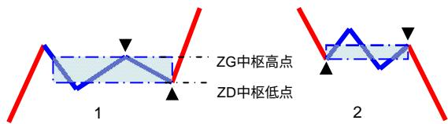
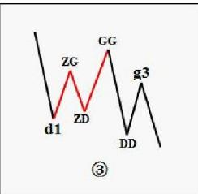
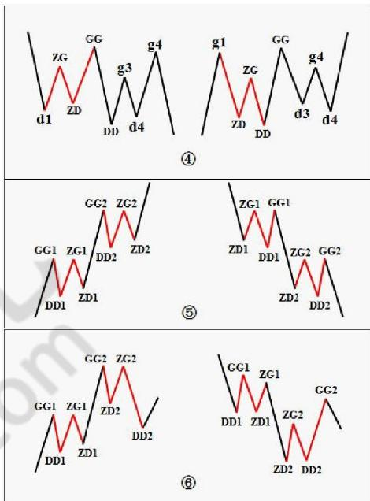

# 第八节 走势中枢

# 一、基本概念

走势中枢：某级别走势类型中，被至少三个连续次级别走势类型所重叠的部分。如图 1是下-上-下型走势中枢；图 2是上-下-上型走势中枢。

走势中枢定理一：在趋势中，连接两个同级别“走势中枢”的必然是次级别以下级别的走势类型。

走势中枢定理二：在盘整中，无论是离开还是返回“走势中枢”的走势类型必然是次级别以下的。

走势中枢定理三：某级别“走势中枢”的终结，当且仅当一个次级别走势离开该“走势中枢”后，其后的次级别回抽走势不重新回到该“ 走势中枢”内。

走势中枢中心定理一：走势中枢的延伸等价于任意区间[dn，gn]与[ZD，ZG]有重叠。换言之，若有 Zn，使得 $\mathtt { d } >$ ZG或 $\mathtt { g } < \mathtt { Z } \mathtt { D }$ ，则必然产生高级别的走势中枢或趋势及延续。

走势中枢中心定理二：前后同级别的两个走势中枢，后 GG<前 DD等价于下跌及其延续；后 DD〉前 GG等价于上涨及其延续。后ZG<前 ZD且后 GG〉=前 DD，或后 ZD>前 ZG且后 DD=<前GG，则等价于形成高级别的走势中枢。

# 二、概念要点

走势中枢的形成无非两种，一种是回调形成的（下-上-下型走势中枢）,一种是回升形成的（上-下-上型

走势中枢）。在走势中枢的形成与延伸，由与走势中枢形成方向一致的次级别走势类型的区间重叠确定。例如，回升形成的走势中枢，由向上的次级别走势类型的区间重叠确定。这些与走势中枢方向一致的次级别走势类型称为 Z走势段。相应的高、低点分别记为 gn、$\mathsf { d } ,$ 定义四个指标,GG=max(gn)，G=min(gn)，D=max(dn)，DD=min(dn)，n遍历走势中枢中所有 $Z _ { \infty }$ 。再定义 ZG=min(g1、g2)，ZD=max(d1、d2)，显然，[ZD，ZG]就是走势中枢的区间，如图 $\textcircled{3}$ 。

注意，次级别的前三个走势类型都是完成的才构成该级别的走势中枢，完成的走势类型，在次级别图上是很明显的，根本就不用着再看次级别下面级别的图了。

走势中枢的延伸：等价于任意区间 $[ { \mathsf { d } } ,$ gn]与[ZD，ZG]有重叠(如图$\textcircled{4}$ )。表现为盘整。

走势中枢的新生：即形成趋势(如图 $\textcircled{5}$ )。

走势中枢的扩展：即形成高级别的走势中枢(如图 $\textcircled{6}$ )。

# 三、分析理解

1、“连接两相邻同级别走势中枢的一定是趋势吗？一定是次级别的趋势吗？”首先，这不必然是趋势，任何走势类型都可能，最极端的就是跳空缺口后形成新的“走势中枢”；其次，也不一定是次级别的，只要是次级别以下，例如跳空缺口，就属于最低级别，如果图上是日线、周线，就不会是次级别了；最后，往往相连走势类型的级别越低，表示其力度越大，这也就是为什么缺口在分析中有比较强技术含义的理论依据所在。  
2、“盘整的高低点是如何造成的？”无论离开与返回的走势类型是何种级别的，站在最低级别上看，例如把 1分钟图当成最低级别，那么最后连接离开与返回走势类型连接处的最低级别图，只能有两种可能：

第一，三根以上1分钟K线的来回重叠震荡后回头；第二，1分钟K线无三根以上K线重叠的V型走势。对于第一种情况，这几根重叠K线最极端那根的极端位置，就构成盘整中的高低点，一般来说，这种情况比较少见；对于第二种情况，这个 V型尖顶那根K线的极端位置就构成盘整中的高低点，这种情况十分常见。这也是为何真正的低点和高点总是盘中一闪而过的理论依据。

3、这定理三中的两个次级别走势的组合只有三种：趋势+盘整，趋势+反趋势，盘整+反趋势。最用力的终结，就是：趋势+盘整。例如在上涨中，如果一个次级别走势向上突破后以一个盘整走势进行整理回抽，那其后的上涨往往比较有力，特别这种突破是在底部区间。  
4、走势中枢由前三个连续次级别走势类型的重叠部分确定，其后的走势有两种情况：其一、该走势中枢的延伸。其二、产生新的同级别走势中枢。而在趋势里，同级别的前后走势中枢是不能有任何重叠的，这包括任何围绕走势中枢产生的任何瞬间波动之间的重叠。因此，如果三个连续次级别走势类型的重叠区间虽然不和前面的走势中枢有任何重叠。但围绕该走势中枢产生的波动触及前面走势中枢延续时的某个瞬间波动区间，这时候，就不能认为该走势类型是趋势，而只是产生一个更大级别的走势中枢。

这里，必须把两种情况严格区分。其一、走势中枢以及其延伸。这种情况下，所有围绕走势中枢产生的前后两个次级波动都必须至少有一个触及走势中枢的区间。否则，就必然产生一个新的三次连续次级走势类型的重叠部分离开原来的走势中枢，这与走势中枢的延续矛盾。其二、一个走势中枢完成前，其波动触及上一个走势中枢或延伸时的某个瞬间波动区间，由此产生更大级别的走势中枢。这就是走势中枢扩展。

一个简单的例子就能区别以上的情况，例如，一个股票开盘立刻封涨停，那么，只能算是一分钟级别上出现了走势中枢的延伸，无论这个延伸有多长时间，都不可能产生更大级别的走势中枢。如果该股票第二天开始继续开盘涨停，那么就形成一个一分钟级别上的趋势，这个趋势可以无限延伸下去，但只要依然只是只形成一分钟的走势中枢，无论能连续涨停多少天，都不足以形成即使是五分钟的走势中枢，除非中途有打开涨停的时候。

换言之，走势中枢的延伸与不断产生新的走势中枢并相应围绕波动互不重叠而形成趋势，在这两种情况下，一定不可能形成更大级别的走势中枢。而要形成一个更大级别的走势中枢，必然要采取第三种的方式，就是

围绕新的同级别走势中枢产生后的波动与围绕前走势中枢的某个波动区间产生重叠。

