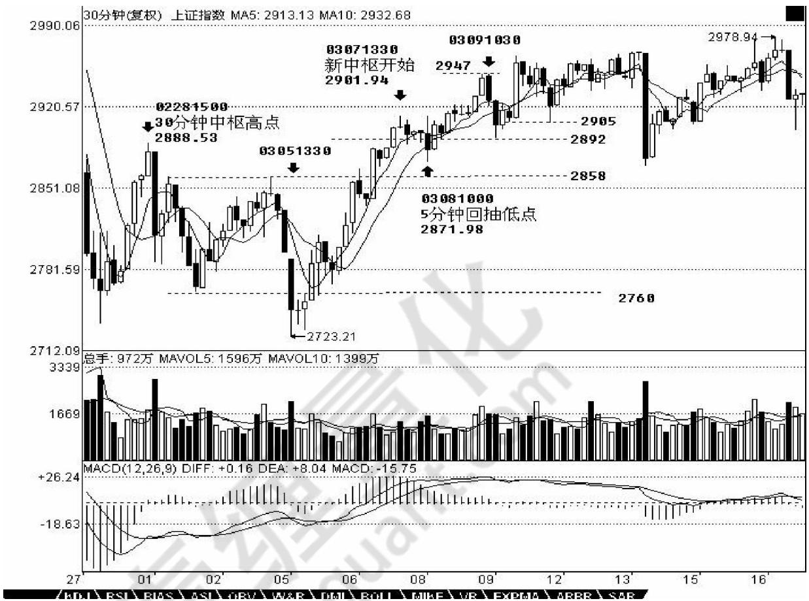

# 第二节 走势分解

# 一、基本概念

走势分解定理一：任何级别的任何走势，都可以分解成同级别“盘整”、 “下跌”与“上涨”三种走势类型的连接。

走势分解定理二：任何级别的任何走势类型，都至少由三段以上次级别走势类型构成。

# 二、概念要点

本理论，是人类历史上第一次用 100%理论推导的方式绝对地证明了走势分解的唯一性，这从上面关于笔、线段等分解的唯一性证明就明白，世界有哪种交易理论，是按这种绝对推理的方式构成的？显然没有，这才是本理论的最强大力量所在，前两个客观点如果没有最后这第三点，都是瞎掰。

市场总有其复杂的地方，使得市场的走势呈现一种多义性。多义性不是含糊的理论，是站在一个严格、精确的理论基础上，用同一理论以不同视角对同一现象进行分析。走势分析中的多种合理释义，这些释义都符合理论内在的逻辑。因此，这种多义性反而不是负担，而是可以用多角度对走势进行分析。

# 三、分析理解

1、站在任意一个固定级别里，走势类型是可以被严格划分的。例如，说一个5分钟的走势类型，显然不可能包含一个30分钟的走势中枢，因为按定义，一个单独的5分钟走势类型无论如何延续，也不可能出现一个30分钟的走势中枢。要形成一个30分钟的走势中枢，显然只能是3个以上5分钟走势类型的连接才可能。走势类型和走势类型的连接，这两个概念不可能有任何含糊的地方。5分钟走势类型，必须包含也最多包含5分钟级别走势中枢，至于是1个还是5个，都不影响是5分钟走势类型，只不过可被分类成是5分钟级别的盘整类型还是趋势类型而已。

显然，一个高级别的走势类型必然就是由几个低级别的走势类型连接而成，但不一定都是次级别的走势类型，例如，a+B+b，B是30分钟走势中枢，由3个5分钟走势类型构成，a、b是1分钟走势类型，那么 a+B+b这个30分钟走势类型就能分解成2个1分钟走势类型和3个 5分钟走势类型的连接。但我们还可以通过拆散重分，使得一个高级别的走势类型必然就是由几个次级别的走势类型连接而成，由于走势中枢里至少有三段次级别走势类型，所以就有了 “走势分解定理二”。

还是上面 $a + B + b$ 的例子，不妨假设 B中有三段 5分钟走势类型，分别表示为 B、B、B，那么 a+B+b=a+B+B+B+b=（ a+ B）+B+（B+b），显然（ $\mathsf { a } + \mathsf { B } )$ ）、B、（B+b）都是 5分钟走势类型，这就是该分解定理所说的东西。学过一点抽象代数的都容易理解上面的话。用抽象的话说，就是走势类型连接这种运算是符合结合律的。但走势类型的连接运算不符合交换率，这就是该运算的特别之处。因为已发生的交易是按时间次序排列的，时间不能倒流，已发生的交易也就不可能推倒重新排列。只要明白了走势类型连接运算的结合性，那就不难同时明白 “走势分解定理一”。

注意，走势是客观的，而用什么级别去分析这走势却是主观的。根据“走势分解定理一”，任何级别的任何走势，都可以分解成同级别“盘整”、“下跌”与“上涨”三种走势类型的连接，那么就意味着，按某种级别

去操作，就等于永远只处理三种同一级别的走势类型及其连接。还是上面a+B+b的例子，站在5分钟级别的角度，这里有三个走势类型的连接，站在30分钟级别的角度，就只有一个走势类型。那么，前面反复说的，确定自己操作的级别，就是确定自己究竟是按什么级别来分析、操作。例如，5分钟级别上下上三段，意味着在5分钟级别上有2个底背驰、2个顶背驰，按买点买、卖点卖的原则，就有2次的完整操作；而按30分钟级别看，如果不结合该30分钟走势类型之前一个30分钟走势走势类型分析，就无法确定买卖点，所以就无法操作。

任何走势，都可以在这些级别构成的分解中唯一地表达。但一般来说，对于一般的操作，没必要所有分解都搞到年、季、月这么大的级别，因为这些级别，一般几年都不变一下。你看，从 6124 点下来，N 个月了，还在 30 分钟级别里混，所以，一般来说，1、5、30 分钟三个级别的分解，就足以应付所有的走势。当然，对于大点的资金，可以考虑加上日级别的。

从纯理论的角度，操作级别越低，相应的效率越高，但实际操作级别是不可能随意低的，而究竟按什么级别来分析、操作，和你的资金等具体条件相关。例如， $\mathsf { T } { + } 1$ 的情况下，按1分钟以下级别的操作，就面临着不能顺利兑现的风险，而系统的操作，要把所有可能的情况都考虑其中，因此完全按1分钟以下级别的操作是不可能的，除非是 $T + 0$ 。此外，级别越小，平均的买卖点间波幅也越小，因此，那些太小的级别，不足以让交易成本、交易误差等相对买卖点间波幅足够小，这样的操作，从长期的角度看，是没有意义的。所谓的交易误差，可以包括很多，例如你看见买点到你实际操作完成，必然有一个时间差，因此也就有了价位上的差别，这对于大级别无所谓，但对特小级别，那就需要特别精确，而这是不可能长期达到的。

因此，根据各种情况，你就可以相应定好自己的操作级别，这样就可以按照相应的级别分析、操作。也就是说，一旦该级别出现买卖点，你必须进入或退出。也就是说，在你的操作级别上，你是不参与任何调整或下跌走势类型的。

2、走势类型连接运算的结合性，也就是走势类型的连接符合结合律，即A+B+C=（A+B） $\scriptstyle + \complement = \mathsf { A } +$ （ $_ { 8 + 0 }$ ），A、B、C的走势类型级别可以不同。因此，站在多义性的角度，根据该结合律，就不难知道，任何一段走势，都可以有很多不同的释义。  
2.1、如果市场都是标准的 $a + A + b + B + c$ （A、B的走势中枢级别一样，a、b、c是相对于A、B次级别的走势），那这市场也太标准、太不好玩了。市场总有其复杂的地方，使得市场的走势呈现一种多义性。而所有走势的多义性，都与走势中枢有关。例如，5分钟级别的走势中枢不断延伸，出现9段以上的1分钟次级别走势。站在30分钟级别的走势中枢角度，3个5分钟级别的走势类型重合就形成了，而9段以上的1分钟次级别走势类型，每 3段构成一个5分钟的走势中枢，这样也就可以解释成这是一个30分钟的走势中枢。这种情况，只要对走势中枢延伸的数量进行限制，就可以消除多义性，一般来说，走势中枢的延伸不能超过5段，也就是一旦出现6段的延伸，加上形成走势中枢本身那三段，就构成更大级别的走势中枢了。  
2.2 对 $a + A + b + B + C$ ，a完全可以有另一种释义，就是把a看成是围绕A这个走势中枢的一个波动，虽然A其实是后出现的，但不影响这种看法的意义。同样 c也可以看成是针对B的一个波动，这样整个走势其实就简化为两个走势中枢与连接两者的一个走势。在最极端的情况下，在 $a + A + b + B + c$ 的走势系列类型里，a和 c并不是必然存在的，而b完全可以是一个跳空缺口，这样，整个走势就可以简化为两个孤零零的走势中枢。把这种看法推广到所有的走势中，那么任何的走势图，其实就是一些级别大小不同的走势中枢。  
2.3 最简单的释义角度，就是级别。任何一段走势，都可以根据不同的级别进行分解，不妨用 $\mathsf { A } _ { \mathsf { m } }$ 的形式表示根据 n级别对 A段进行分解的第 m段，就有， $A = A _ { - 1 } + A _ { - 2 } + A _ { - 3 } + \cdots + A _ { n - 1 } = A _ { - 1 } + A _ { - 2 } + A _ { - 3 } + \cdots$ $+ A _ { 5 \cdot \pi 6 } = A _ { 6 0 \cdot 1 } + A _ { 8 0 \cdot 2 } + A _ { 8 0 \cdot 3 } + \cdots + A 3 0 + \pi 3 0 = A _ { 4 \cdot 1 } + A _ { 1 4 \cdot 2 } + A _ { 1 5 \cdot 3 } + \cdots + A _ { 1 5 \cdot 1 0 } = 3 .$ 等等，显然这些分解都符合本理论。而根据某级别进行操作，站在纯理论的角度，无非等价于选择该等式列中某个子式子进行操作。  
3、还有一种应用，就是关于走势的当下判断。当下判断，其基础在于采取的分解方式。例如，一个按 5分钟分解的操作角度与一个按 30分钟分解的操作角度，在同一时间看到的走势意义是不同的。更重要的是，在5分钟分解中完成的走势，在30分钟却不一定完成。例如 $A + B$ ，A、B都是 5分钟的走势类型，那么A+B走势，对于 30分钟的分解就是未完成的。根据走势必须完美的原则，未完成的走势必完成，也就是，在不同的分解角度，可以在当下看到不同级别的未完成的走势即将根据走势必完美原则产生的运动，这就为当下的操作提供了依据。  
3.1 按同级别分解操作，有更广泛、更精确的操作。  
3.1.1 对 5分钟的同级别分解，以最典型的 a+A为例子，一般情况下，a并不一定就是 5分钟级别的走势类型，但通过结合运算，总能使得a+A中,a是一个5分钟的走势类型，而A，也分解为 m段5分钟走势类型，则 $A = A + A _ { 2 } + \cdots + A _ { 0 }$ 。想考虑a+A是向上的情况，显然，Ai当i为奇数时是向下的，为偶数时是向上的，开始先有

A1、A2出现，而且 A1不能跌破 a的低点，如果 A2升破 a的高点而 A3不跌回 a的高点，这样可以把 $a + A + A _ { 2 } + A _ { 3 }$ 当成一个 a`，还是 5分钟级别的走势类型。因此，这里可以一般性地考虑 A3跌破 a的高点情况，这样，A1、A2、A3必然构成30分钟走势中枢。因此，这一般性的 $\mathsf { a } { + } \mathsf { A } ^ { \prime }$ 情况，都必然归结为a是 5分钟走势类型，A包含一30分钟走势中枢的情况。

把a定义为 $\mathsf { A } ,$ 则Ai与 $\mathsf { A } _ { + 2 }$ 之间就可以不断地比较力度，用盘整背驰的方法决定买卖点。注意，在实际操作中下一个 $\mathsf { A } _ { + 2 }$ 是当下产生的，但这不会影响所有前面 $\mathsf { A } _ { + 1 }$ 的同级别唯一性分解。这种机械化操作，可以一直延续，该走势中枢可以从30分钟一直扩展到日线、周线甚至年线，但这种操作不管这么多，只理会一点，就是Ai与 $\mathsf { A } _ { + 2 }$ 之间是否盘整背驰，只要盘整背驰，就在 $\mathrm { i } + 2$ 为偶数时卖出，为奇数时买入。如果没有，当i为偶，若 $\mathsf { A } _ { + 3 }$ 不跌破 Ai高点，则继续持有到 $A + k + 3$ 跌破 $\mathsf { A } _ { + \mathsf { k } }$ 高点后在不创新高或盘整顶背驰的 $A + k + 4$ 卖出，其中 k为偶数；当 i为奇数，若 $\mathsf { A } _ { + 3 }$ 不升破Ai低点，则继续保持不回补直到 $A + k + 3$ 升破 $\mathsf { A } _ { + \mathsf { k } }$ 低点后在不创新低或盘整底背驰的 $A + k + 4$ 回补。

看完上面这段，至少90%以上的人都心跳加速，头晕眼花。不过没办法，这是最精确的表述，画着图应该不难明白。以上的方法，最大的特点是，就是在同级别分解的基础上将图形基本分为两类，一类是“当i为偶$\mathsf { A } _ { + 3 }$ 不跌破 Ai高点”或“i为奇数 $\mathsf { A } _ { + 3 }$ 不升破Ai低点”；一类是“Ai与 $\mathsf { A } _ { + 2 }$ 之间盘整背驰”。对这两种情况采取不同的操作策略，构成了一种机械的操作方法。

投资，往往碰到这样两难的事情，就是一个小级别的进入，结果出现大级别的上涨，这时候怎么办？这时候有两个选择：一、继续按小级别操作，这样的代价是相当累，而且小级别操作的问题是对精确度要求比大级别高，而且资金容纳程度低；二、升级为大级别操作基础上部分保持小级别操作。对于资金比较大的投资，后者是比较实用的。

3.1.2 “Ai与 $\mathsf { A } _ { + 2 }$ 之间盘整背驰”，将演化出“当i为偶 $\mathsf { A } _ { + 3 }$ 跌破 Ai高点”或“i为奇数 $\mathsf { A } _ { + 3 }$ 升破 Ai低点”；因而相应演化出高一级别的走势中枢，例如在该例子里，Ai+1、Ai+2、 $A + 3$ 就是 30分钟的走势中枢，而所有更大的走势中枢，当然是先有高一级别才可能有，否则连30分钟的走势中枢都没有，哪里来日、周、月的？但这个现象就保证了，在同级别分解下，一个小级别的操作是可以按一个自动模式换档成一个高级别的操作。

一般情况下，在上面 5分钟同级别分解的例子中，只要从 A0开始到某个 At，使得 $\mathbb { A } { + } \mathbb { A } { + } \cdots$ . $+ A = B + B ,$ ，后者是 30分钟级别的同级别分解，这时候就可以继续按后一种分解进行相应的操作。当然，是否换档成后一种级别的操作，与你的时间、操作风格、资金规模有关。但本理论还是建议，可以进行这种短线变中线的操作，即使你的资金量很小，但如果出现一种明显的大级别走好，这种操作会让你获得稳定的大级别波动利益，因此，根据当下的情况去决定是否换档，就如同开车时根据路况等决定档位一样。

对于大资金来说，这种级别的操作可以一直延伸下去，可以变成N重层次的操作，每一重都对应着一定的资金与筹码，而相应对应着不同的节奏与波动。如果对古典音乐有点了解的，就知道，这如同赋格曲，简单的动机、旋律在N个层次上根据不同的转位、移位、对位等原则运动着，合成统一的乐曲。市场的走势，其实就是这样的多重赋格，看似复杂，其实脉络清晰，可以有机地统一在多层次的同级别分解操作中。

3.2 在这种同级别分解的多重赋格操作中，可以在任何级别上进行操作，而且都遵守该级别的分解节奏与波动，只是在不同级别中投入的筹码与资金不同而已。对于大资金所具有的整体筹码与资金来说，就永远在一种有活动的多重赋格，实际的市场操作，成了一首美妙的乐曲演奏，能应和上的知音，就能得到最大的利益与享受。而每一层次的操作都是独立又在一个整体的操作中，对这种操作如果没有什么直观感觉，那就去听听巴赫的音乐，那不仅是音乐的圣经，对股票的操作同样有益。

4、前面谈了有关走势类型连接结合的多义性问题，虽然已多次强调多义性不是含糊性，但不少人依然产生误解，认为走势就可以胡乱分解了，这是不对的。多义性是与走势的当下性密切相关的，但对已完成走势类型连接进行相应的分解，就如同解问题设定不同的参数，虽然参数的设定有一定的随意性，但一个好的参数设定，往往使得问题的解决变得简单。根据结合律，如何选择一种恰当的走势分解，对把握当下的走势极为关键。显然，一个好的分解，其分解规则下，必须保证分解的唯一性，否则这种分解就绝对不可能是好的分解。其中，最简单的就是进行同级别分解。所谓同级别分解，就是把所有走势按一固定级别的走势类型进行分解。根据“缠中说禅走势分解定理”，同级别分解具有唯一性，不存在任何含糊乱分解的可能。

同级别分解的应用，前面已多有论述，例如，以30分钟级别为操作标准的，就可用30分钟级别的分解进行操作，对任何图形，都分解成一段段30分钟走势类型的连接，操作中只选择其中的上涨和盘整类型，而避开所有下跌类型。对于这种同级别分解视角下的操作，永远只针对一个正在完成着的同级别走势中枢，一旦该走势中枢完成，就继续关注下一个同级别走势中枢。注意，在这种同级别的分解中，是不需要走势中枢延伸或

扩展的概念的，对30分钟来说，只要5分钟级别的三段上下上或下上下类型有价格区间的重合就构成走势中枢。如果这 5分钟次级别延伸出6段，那么就当成两个30分钟盘整类型的连接，在这种分解中，是允许盘整 $^ +$ 盘整情况的。注意，以前说不允许“盘整+盘整”是在非同级别分解方式下的，这在下面的课中会讲到，所以不要搞混了。

有人可能马上要问，同级别分解的次级别分解是否也是同级别分解的。答案是，不需要。这里在思维上可能很难转过弯，因为一般人都喜欢把一个原则在各级别中统一运用，但实际上，你完全可以采取这样的分解形式，就是只要某级别中进行同级别分解，而继续用走势中枢扩展、延伸等确定其次级别，这里只涉及一个组合规则的问题，而组合的规则，是为了方便操作以及判断，只要不违反连接的结合律以及分解的唯一性，就是允许的，而问题的关键在于是否明晰且易于操作。

说得深入一点，走势分解、组合的难点在于走势有级别，而高级别的走势是由低级别构成的，处理走势有两种最基本的方法，一种是纯粹按走势中枢来，一种是纯粹按走势类型来，但更有效的是在不同级别中组合运用。因此，完全合理、不违反任何理论原则的，可以制定出这样的同级别分解规则：在某级别中，不定义走势中枢延伸，允许该级别上的盘整+盘整连接；与此同时，规定该级别以下的所有级别，都允许走势中枢延伸，不允许盘整+盘整连接；至于该级别以上级别，根本不考虑，因为所有走势都按该级别给分解了。

按照以上的同级别分解规则，用结合律很容易证明，这种分解下，其分解也是唯一的。这种分解，对于一种机械化操作十分有利。这里，无所谓牛市熊市，例如，如果分解的级别规定是30分钟，那么只要30分钟上涨就是牛市，否则就是熊市，完全可以不管市场的实际走势如何，在这种分解的视角下，市场被有效地肢解成一段段30分钟走势类型的连接，如此分解，如此操作，如此而已。

注意，这种方法或分解是可以结合在更大的操作系统里的。例如，你的资金有一定规模，那么你可以设定某个量的筹码按某个级别的分解操作，另一个量的筹码按另一个更大级别的分解操作，这样，就如同开了一个分区卷钱的机械，机械地按照一个规定的节奏去吸市场的血。这样不断地机械操作下去，成本就会不断减少，而这种机械化操作的力量是很大的。

其实，根本无须关心个股的具体涨幅有多少，只要足够活跃，上下震荡大，这种机械化操作产生的利润是与时间成正比的，只要时间足够长，就会比任何单边上涨的股票产生更大的利润。甚至可以对所有股票按某级别走势的幅度进行数据分析，把所有历史走势都计算一次，选择一组历史上某级别平均震荡幅度最大的股票，不断操作下去，这样的效果更好。这种分解方法，特别适合于小资金又时间充裕的进行全仓操作，也适合于大资金进行一定量的差价操作，更适合于庄家的洗盘减成本操作。当然，每种在具体应用时，方法都有所不同，但道理是一样的。

5、还有一种应用，就是把走势重新组合，使得走势更加清晰。很多人一看走势就晕，最主要是不了解走势连接的结合性，任何的走势，在结合律上，都可以重新组合，使得走势显示明显的规律性。假设 $A + B + C + D + E + F ,$ A、C、E是 5分钟级别的，B、D、F是30分钟级别的，其中还有延伸等复杂情况。这时候，就可以把这些走势按 5分钟级别重新分解，然后按走势中枢的定义重新组合走势，按结合律的方法，把原来的分解变成$A ^ { \prime } + B ^ { \prime } + C ^ { \prime } + D ^ { \prime } + E ^ { \prime } + F ^ { \prime }$ ，使得A`、B`、C`、D`、E`都是标准的只是30分钟级别，而最后的F`变成在30分钟意义上未完成的走势，这样进行分析，就会很明晰了。当然，具体的组合有很多可能，如何根据当下的走势选择一种最有利指导操作的，就是考功夫的事情。

而这种根据结合律的最佳组合，是根据市场当下的走势随时变化的，而所有的变化，都符合理论要求且不会影响实际操作，是对实际操作起着更有力的帮助。例如，在上证 30分钟图上（下图），2760到 2858这 30分钟走势中枢，03081000的5分钟回抽确认了一个第三类买点，然后其后就继续走出一个新的30分钟走势中枢，而 030810005分钟回抽低点2871点比上一走势中枢的最高点2888点要低，而后来关于03071330开始的这个 30分钟走势中枢出现延伸，这样，我们就可以对这个分解进行重新组合，给出一个更清晰的组合方法，把 03081000的 5分钟回抽组合到 03051330开始的这段 5分钟走势中，形成一个 5分钟的上涨，然后新的30分钟走势中枢就从 03091030，这样的好处在于，这个走势中枢震荡的低点 2892点比 2888点高，如果其后的震荡不出现跌破2888的走势，那么就是一个30分钟的上涨走势形成了。但在这个新的走势中枢被一个新的第三类买点有效突破前，依然存在震荡跌破2888点甚至最终确认走势中枢扩展。但这样的重新组合，对看图就有了帮助。当然，站在纯走势中枢的角度，依然可以坚持让新走势中枢从03071330开始，这样对具体的操作也没有太大影响，但在判断上就没有重新组合的看起来方便了。

注意，这种重新组合，不涉及任何预测性，有人可能要问，那么为什么不一开始就把03081000的 5分钟回抽组合到 03051330开始的这段 5分钟走势中？因为这种组合不利于操作，站在这种组合下，030810005分钟回抽的第三类买点意义并没有被揭示，是仅仅被局限在一个小的 5分钟走势范围内，按照这种组合，就会很恐慌地等待背驰，之所以这样，是因为对走势的理解不够深刻，看不到不同组合反映的意义。而任何组合的反映都是有意义的，对这些组合意义的全面把握，就是一个工夫上的长进了。此外，组合的一个要点在于，尽量避繁就简，因为走势中枢扩展比较复杂，如果有组合使得不出现扩展，当然就采取该种组合更有意义。有人可

能要问，那么走势中枢扩展的定义是 否 不 适用？当然适用，走势中枢扩展的定义是在两个走势中枢都完全走出来的情况下定义的，而实际操作中，往往第二个走势中枢还没有走完，还在继续延伸中。所以，除非出现明确的、符合理论定义的终结，就可

以根据有利于判断、操作的原则，对走势进行当下的组合。但必须强调的是，当下采取什么组合，就要按该种组合的具体图形意义来判断、操作，例如，现在把 03091030当成新 30分钟走势中枢的起点，那么走势中枢的位置就变成 2947到 2905，这样后面第三类买点的位置就有了新的标准。当然，你依然可以还是按 03071330开始30分钟走势中枢，这样，走势中枢的位置就是 2911到2892，这样，第三类买点的可能位置就不同了。

还有一种更重要的应用，就是在走势中枢的震荡中。围绕走势中枢的震荡，不一定都是次级别的，例如，一个日线走势中枢，围绕他的震荡，完全可以是 30分钟以下的任意级别，甚至是一个跳空缺口，例如有些股票，完全可以今天一字涨停，明天一字跌停，跳来跳去的。一般这种走势，一般人看着就晕了。但如果明白走势连接的结合性，就知道，无论怎么跳，最终都要形成更大级别的，只要不脱离这日线走势中枢，最后都至少会形成30分钟级别的走势。任何围绕日线级别的震荡，最终都必然可以按如下方式进行分解： $: A _ { 2 } + A _ { 3 } = + A _ { 2 } + A _ { 3 } = - 3 + \cdots$ $+ A _ { 3 0 - m 3 0 } + a$ ，a是未完成的 30分钟走势类型，至少 a依然围绕日线走势中枢继续震荡，那 a一定最终会完成 30分钟的走势类型。显然，这里， $m _ { B } 0 < 9$ ，否则就会变成周的走势中枢了，这样整个的分解就要按日线来，而道理是一样的。

不过，更有实际意义的是，上面的 a如果不再围绕日线震荡，例如，假设 a是一个 5分钟级别的，而其后一个5分钟级别的反抽也不回到走势中枢里，按照日线走势中枢，这并不构成第三类买卖点，但对于A30-m30，可能就构成 30分钟的第三类买卖点。由于走势都是从未完成到完成，都是从小级别不断积累而来，因此，对于真正的日线第三类买卖点来说，这A30-m30的第三类买卖点，肯定在时间上要早出现，对于 A30-m30，这绝对安全，但对日线却不一定，因为这 A30-m30的第三类买卖点后完成的 30分钟走势，可以用一个 30分钟走势又重新回到日线走势中枢里继续走势中枢震荡。但这个A30-m30的第三类买卖点依然有参与的价值，因为如果其后的30分钟出现趋势，最后如果真出现日线的第三类买卖点，往往就在 30分钟的第二个走势中枢附近就形成了，根本回不到这A30-m30的第三类买卖点位置，因此，这样的买卖点，即使不符合你的操作级别，例如，

如果你是日线级别操作的，但一旦这样的 A30-m30的第三类买卖出现，至少要引起你充分的重视，完全可以适量参与了，一旦其后出现趋势走势，就要严重注意了。

不应该对走势进行任何的预测，但所有已走出来的走势，却可以根据级别与结合律等随意组合，无论任何组合，在该组合下，都必然符合本理论，而任何最终的走势，都在所有组合中完全符合本理论，这也是本理论的神奇之处，无论你怎么组合，都不会出现违反本理论的情况。但能否找到最合适的组合以适应操作，以及根据不同的组合，对走势进行综合分析，这就和经验有关了。这些最适合的分解，都是有相应答案的，关键是你能否看出来，而这根本不涉及任何的预测，只是对已有走势的分解，与对理论的把握与图形的熟悉度相关。而这些都是一些最基本的工夫，但必须在当下的走势中不断磨练才能真正掌握。如果真能把握这些最基本的当下走势的最合理组合以及用不同组合进行综合分析，那就可以开始继续读初三了。

