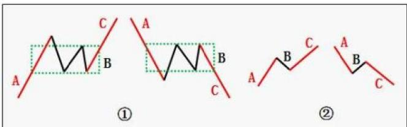
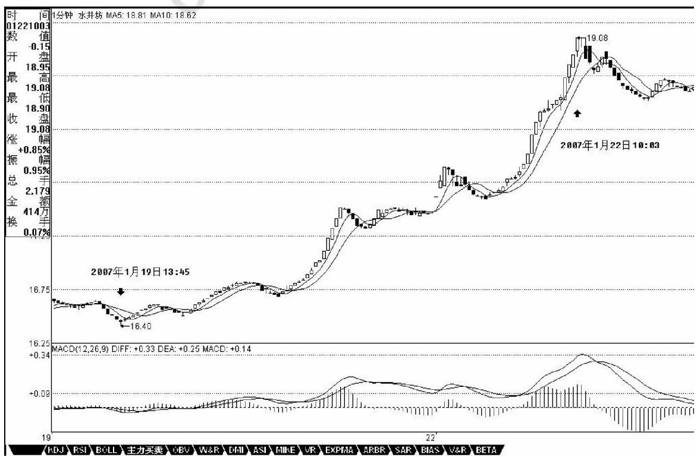
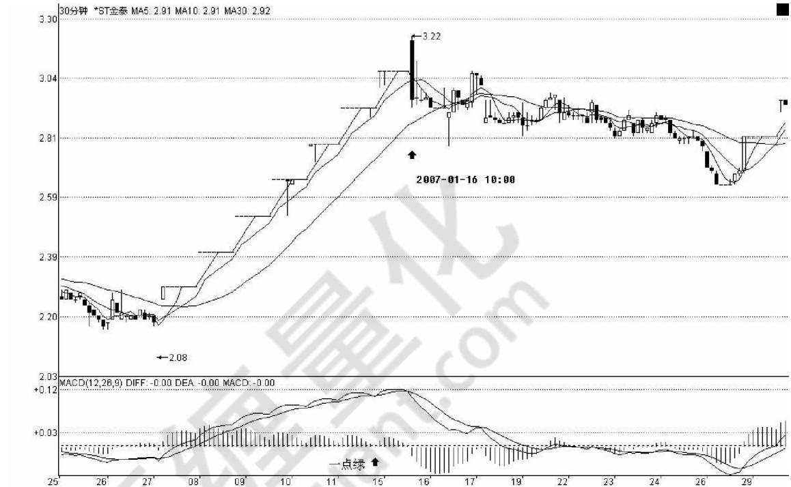

# 第四节 背驰与盘整背驰

# 一、基本概念

背驰：趋势力度比上一次趋势力度要弱，就形成背驰。换句话说，背驰其实就是力度衰竭的表现，如图 $\textcircled{1}$ ，C段和A段比。

盘整背驰：盘整中当下笔或线段比前一笔或线段力度要弱，就形成了盘整背驰，如图 $\textcircled{2}$ ，C段和 A段比。

背驰段：就是在某级别的某类型走势，构成背驰或盘整背驰的走势类型称为某级别的背驰段。

背驰-买卖点定理：任一背驰都必然制造某级别的买卖点，任一级别的买卖点都必然源自某级别走势的背驰。

# 二、概念要点

没有趋势，就没有背驰。在盘整中是无所谓“背驰”的，这点是必须特别明确的。

对于背驰与盘整背驰，前者是有着最基础意义的，而后者，只是利用前者相应的力度分析方法进行的一个推广用法，主要用在与走势中枢震荡相关的力度比较中。注意， $a + B + c$ 中，a和 c的盘整背驰，其实都可以看成是B的走势中枢震荡，虽然a存在时，B还没出现，但也不妨这样看。

一个背驰后，无论是盘整背驰还是真正的背驰，理论只能保证其回拉原来的走势中枢，这是正确的思维方式。那么，回拉之后如何，这涉及预测。正确的思维是，把回拉后出现的情况进行完全的分类，根据每种分类对应的后果，决定你自己的对策。

# 三、分析理解

趋势，一定有至少两个同级别走势中枢，对于背驰来说，肯定不会发生在第一个走势中枢之后，肯定是至少是第二个走势中枢之后，对于那种延伸的趋势来说，很有可能在发生第 100个走势中枢以后才背驰，当然，

这种情况，一般来说，一百年见不到几次。第二个走势中枢后就产生背驰的情况，一般占了绝大多数的情况，特别在日线以上的级别，这种就几乎达到 90%以上。

如果在第一个走势中枢就出现背驰，那不会是真正意义上的背驰，只能算是盘整背驰，其真正的技术含义，其实就是一个企图脱离走势中枢的运动，由于力度有限，被阻止而出现回到走势中枢里。

背弛有级别的问题，一个 1分钟级别的背弛，在绝大多数的情况下，不会制造一个周线级别的大顶，除非日线上同时也出现背弛。但出现背弛后必然有逆转，这是没任何商量余地的。有人要问，究竟逆转多少？那很简单，就是重新出现新的次级别买卖点为止。由于所有的买卖点，最终都可以归到某级别的第一类买卖点，而背驰与该种买卖点密切相关，所以可以这样说，任何的逆转，必然包含某级别的背驰。

只要你看到某级别的背驰，必然意味着要有逆转。但逆转并不意味着永远的，例如，日线上向上的背驰制造一个卖点，回跌后，在 5分钟或 30分钟出现向下的背驰制造一个买点，然后由这买点开始，又可以重新上涨，甚至创新高，这是很正常的情况。

从纯粹走势中枢的角度对背驰给出另外的释义。对 $a + A + b + B + C$ ，背驰的大概意思就是 c段的力度比 b的小了。那么，站在B这个走势中枢的角度，不妨先假设 $b + B + c$ 是一个向上的过程，那么b可以看成是向下离开走势中枢 B，而 c可以看成是向上离开走势中枢 B。所谓顶背驰，就是最后这个走势中枢，向上离开比向下离开要弱，而走势中枢有这样的特性，就是对无论向上或向下离开的，都有相同的回拉作用，既然向上离开比向下离开要弱，而向下离开都能拉回走势中枢，那向上的离开当然也能拉回走势中枢里，对于 $b + B + c$ 向上的走势，这就构成顶背驰，而对于 $b + B + c$ 向下的走势，就构成底背驰。对于盘整背驰，这种分析也一样有效。其实，站在走势中枢的角度，盘整背驰与背驰，本质上是一样的，只是力度、级别以及发生的走势中枢位置不同而已。

同样，站在纯走势中枢的角度， $a + A + b + B$ ，其中B级别大于A的这种情况就很简单了，这时候，并不必然地B后面就接着原方向继续，而是可以进行反方向的运行。例如，a+A+b+B是向下的，而 a+A+b其实可以看成是对B一个向上离开的回拉，而对走势中枢来说，并没要求所有的离开都必须按照上下上下的次序，一次向上的离开后再一次向上的离开，完全是被允许的，那站在这个角度，从B直接反转向上，就是很自然的。那么，这个反转是否成功，不妨把这个后续的反转写成c，那么也只要比较一下a+A+b与c这两段的力度就可以，因为走势中枢B对这两段的回拉力度是一样的，如果 c比 a+A+b弱，那当然反转不成功，也就意味着一定要重新回到走势中枢里，在最强的情况下也至少有一次回拉去确认能否构成一个第三类买点。而a+A+b与c的力度比较，与背驰的情况没什么分别，只是两者的方向不同而已。如果用MACD来辅助判别，背驰比较的黄白线和柱子面积都在0轴的一个方向上，例如都在上面或下面，而 a+A+b与 c就分别在不同的方向上，由于这，也不存在黄白线回拉的问题，但有一点是肯定的，就是黄白线至少要穿越一次0轴。

# 四、MACD对背弛的辅助判断

MACD，当一个辅助系统，还是很有用的。MACD的灵敏度，和参数有关，一般都取用 12、26、9为参数，这对付一般的走势就可以了，但一个太快速的走势，1分钟图的反应也太慢了。如果弄超短线，那就要看实际

的走势，例如看600779的1分钟图，从 16.5上冲19的这段，明显是一个 1分钟上涨的不断延伸，这种走势如何把握超短的卖点？不难发现，MACD的柱子伸长，和乖离有关，大致就是走势和均线的偏离度。打开一个MACD图，首先应该很敏感地去发现该股票

MACD伸长的一般高度，在盘整中，一般伸长到某个高度，就一定回去了，而在趋势中，这个高度一定高点，那也是有极限的，一般来说，一旦触及这个乖离的极限，特别是两次或三次上冲该极限，就会引发因为乖离而产生的回调。这种回调因为变动太快，在 1分钟上都不能表现其背驰，所以必须用单纯的MACD柱子伸长来判断。注意，这种判断的前提是1分钟的急促上升，其他情况下，必须配合黄白线的走势来用。从该 1分钟走势可以看出，17.5元时的柱子高度，是一个标杆，后面上冲时，在 18.5与 19元分别的两次柱子伸长都不能突破该高度，虽然其形成的面积大于前面的，但这种两次冲击乖离极限而不能突破，就意味着这种强暴的走势，要歇歇了。

还有一种，就是股票不断一字涨停，这时候，由于MACD设计的弱点，在 1分钟、甚至5分钟上，都会出现一波一波类似正弦波动的走势，这时候不能用背弛来看，最简单，就是用 1分钟的走势中枢来看，只要走势中枢不断上移，就可以不管。直到走势中枢上移结束，就意味着进入一个较大的调整，然后再根据大一点级别

的走势来判断这种调整是否值得参与。如果用 MACD配合判断，就用长一点时间的，例如看 30分钟。一般来说，这种走势，其红柱子都会表现出这样一种情况，就是红柱子回跌的低点越来越低，最后触及 0轴，甚至稍微跌破，然后再次放红伸长，这时候就是警告信号，如果这时候在大级别上刚好碰到阻力

  
KDJRSIBOLL主力买卖BVW&RDHIASIIKEVREXPAARBRSARBIASV&RBETA

位，一但涨停封不住，出现大幅度的震荡就很自然了。例如600385，在2.92那涨停，MACD出现一点的绿柱子，然后继续涨停，继续红柱子，而 3.28元是前期的日线高位，结果 3.22涨停一没封住，就开始大幅度的震荡。

注意，如果这种连续涨停是出现在第一段的上涨中，即使打开涨停后，震荡结束，形成一定级别的走势中枢后，往往还有新一段的上涨，必须在大级别上形成背驰才会构成真正的调整，因此，站在中线的角度，上面所说的超短线，其实意义并不太大，有能力就玩，没能力就算了。关键是要抓住大级别的调整，不参与其中，这才是最关键的。

MACD对背弛的辅助判断：用MACD判断背驰，首先要有两段同向的趋势。同向趋势之间一定有一个盘整或反向趋势连接，把这三段分别称为 A、B、C段。显然，B的走势中枢级别比 A、C里的走势中枢级别都要大，否则A、B、C就连成一个大的趋势或大的走势中枢了。A段之前，一定是和B同级别或更大级别的一个走势中枢，而且不可能是一个和 A逆向的趋势，否则这三段就会在一个大的走势中枢里了。

归纳上述，用MACD判断背驰的前提是，A、B、C段在一个大的趋势里，其中 A之前已经有一个走势中枢，而 B是这个大趋势的另一个走势中枢，这个走势中枢一般会把 MACD的黄白线 (也就是 DIFF和 DEA)回拉到 0轴附近。而 C段的走势类型完成时对应的MACD柱子面积(向上的看红柱子，向下看绿柱子)比A段对应的面积要小，这时候就构成标准背弛。而盘整中，利用类似背驰的判断方法，也可以有很好的效果。这种盘整中的类似背驰方法的应用，称为盘整背弛判断。

背驰与盘整背驰的两种情况中，背驰是最重要的，一旦出现背驰，其回跌，一定至少重新回到 B段的走势中枢里。而盘整背驰，一般会在盘整中弄短差时用到，如果其间突破走势走势中枢，其回跌必须分清楚上面的两种情况。注意，盘整背驰出来，并不一定都要大幅下跌，否则怎么会有第三类买点构成的情况。

必须注意，无论背驰与盘整背驰，只要满足上面相应的标准，其技术上都是绝对的，没有任何的或然。问题不在于这种技术的准确性，而在于操作者判断的准确性，也就是说，必须先把什么是背驰，什么是盘整背驰，他们之间的标准是什么，如果连这些都搞不清楚，那是无法熟悉应用这项技术的。

必须说明的是，由于MACD本身的局限性，要精确地判断背驰与盘整背驰，还是要从走势中枢本身出发，但利用 MACD，对一般人理解和把握比较简单点，而这已经足够好了。光用MACD辅助判断，即使你对走势中枢不大清楚，只要能分清楚A、B、C三段，其准确率也应该在90%以上。而配合上走势中枢，那是100%绝对的，因为这可以用纯数学的推理逻辑地证明。

对背驰的回跌力度，和级别很有关系。如果日线上在上涨的中段刚开始的时候，MACD刚创新高，红柱子伸长力度强劲，这时候5分钟即使出现背驰，其下跌力度显然有限，所以只能打点短差，甚至可以不管。而在日线走势的最后阶段，特别是上涨的延伸阶段，一个1分钟的背驰足以引发暴跌，所以这一点必须多级别地综合来考察，绝对不能一看背驰就抛等跌 $5 0 \%$ 世界上哪里有这样的事情。

一般来说，一个标准的两个走势中枢的上涨，在MACD上会表现出这样的形态，就是第一段，MACD的黄白线从 0轴下面上穿上来，在0轴上方停留的同时，形成相应的第一个走势中枢，同时形成第二类买点，其后突破该走势中枢，MACD的黄白线也快速拉起，这往往是最有力度的一段，一切的走势延伸等等，以及MACD绕来绕去的所谓指标钝化都经常出现在这一段，这段一般在一个次级别的背驰中结束，然后进入第二个走势中枢的形成过程中，同时MACD的黄白线会逐步回到0轴附近，最后，开始继续突破第二个走势中枢，MACD的黄白线以及柱子都再次重复前面的过程，但这次，黄白线不能创新高，或者柱子的面积或者伸长的高度能不能突破新高，出现背驰，这就结束了这一个两个走势中枢的上涨过程。明白这个道理，大多数股票的前生后世，一早就可以知道了。

必须注意，MACD在 0轴附近盘整以及回抽 0轴所形成的走势中枢，不一定就是相应级别的走势中枢，而是至少是该级别的走势中枢。例如日线MACD的0轴盘整与回拉，至少构成日线的走势中枢，但也可以构成周线的走势中枢，这时候就意味着日线出现三段走势。

# 五、盘整背驰与历史性底部

盘整背驰最有用的，就是用在大级别上，特别是至少周线级别以上的，这种盘整背驰所发现的，往往就是历史性的大底部。配合MACD，这种背驰是很容易判断的。 $\mathcal { D } \boldsymbol { \mathscr { p } } _ { + } \mathbb { \boldsymbol { \mathscr { N } } }$

注意，第一类买点肯定是趋势背驰构成的，而盘整背驰构成的买点，在小级别中是意义不大的，所以以前也没专门当成一种买点，但在大级别里，这也构成一种类似第一类买点的买点，因为在超大级别里，往往不会形成一个明显的趋势，这也就是以前回帖曾说过的，站在最大的级别看，所有股票都只有一个走势中枢，因此，站在大级别里，绝大多数的股票都其实是一个盘整，这时候就要用到这因为盘整背驰而形成的类第一类买点了。这个级别，至少应该是周线以上。

类似的，在大级别里，如果不出现新低，但可以构成类似第二类买点的买点，在MACD上，显示出类似背驰时的表现，黄白线回拉0轴上下，而后一柱子面积小于前一柱子的。

