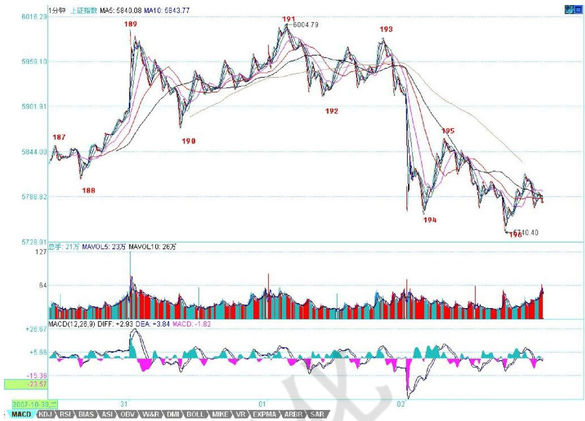

# 第六节 中阴阶段

# 一、基本概念

中阴阶段：就是一种走势类型完成后无法确定会转向何种走势类型，即是会出现反转变成新的走势类型还是延续原来的走势类型的过程阶段。如果说前一个走势类型的背驰或盘整背驰宣告了前一个走势类型的终结，那么到新的走势类型确立，这里有一个模糊的如同中阴般的阶段。

# 二、概念要点

一定要注意。为什么很多人逃了顶，最后还是被套住了——又买了；抄了底，最终还是没赚到钱——被震出来了。这就是被相应级别的中阴阶段给折腾的。而且，越大级别转折后的中阴阶段，越能害人。行情走势的中阴阶段，是多空齐杀，不断折腾转换。等最后转折确认时，就如同已经饭熟了，还找米，能有戏吗？

中阴阶段，无一例外，都是表现为不同级别的盘整（注意，这是只从截取这一阶段的形态说，并不是说新的走势类型一定是盘整）。也就是围绕前一走势的某一部分所构成的走势中枢震荡。即使是所谓的V型反转，也只是震荡的区域回得更深而已。虽然表现为走势中枢震荡，但并不是一般性的走势中枢震荡。

要把握这阶段的走势，必须把前一段走势的部分走势结合起来分析。也就是说，前一段走势的业力在发挥着作用，这个业力与市场当下的新合力构成了最终决定市场方向的最终合力。

# 三、分析理解

1、用一个例子，就很好地能说明这个阶段。

下图中，191的背弛宣告前一走势类型的死亡。按道理，新的走势类型，是从191开始分析的。但这时候，新的走势类型连第一段线段都没走出来，甚至走到193的位置，也依然轮廓不明，因此，这时候，就是典型的中阴阶段，必须借助前面189开始形成的走势中枢来完成分析与相应的操作。

如果从 191开始，192、193都很难说有什么可依据的。当然，可以说 193就是第二类卖点，这个自然没错，但站在189开始走势中枢的角度，这就存在一个走势中枢震荡的问题，这样，这个干瘪的第二类卖点，就有一个更大的可依靠的分析基础。一切关于走势中枢震荡的分析，都可以利用到关于192、193以及后面走势的分析中，这等于有了双重的分析保证。

当然，后面的 195的第三类卖点，也是站在中阴阶段的角度说的。但这一点是一个中阴阶段与新的走势类型确立阶段的分界点，195出来以后，新的走势类型最开始的形态就确立了，也就是至少是一个线段 的 类 下 跌 走势。这时候，分析的重心，就可以移到 191开始的新走势类型上了。这时候，就可以基本在这个

线段级别上，不用考虑 191之前的事情。但 191之前的走势并不是没有用了，而是在更大级别上，例如在 1分钟、5分钟等等级别上发挥作用了。191后面出现的走势，就和 191之前的，结合出大级别的走势形态。

因此，当各位熟练以后，标记上就不一定要不断地标记下去了。例如，如果你是按 1分钟级别操作的，那么，前面 191个线段记号，可能就可以一下简化为10个不到的 1分钟级别相关的记号。当 191后面的走势演化出的1分钟走势结束后，这1分钟级别的记号才再增加一个，这样，记号的数目就很有限了。当然，如果是5分钟级别、30分钟、日线等等，就更少了。

为了方便明确起见，还是把记号的级别进行分类，例如，用 Xn代表线段的记号，用 Yn代表 1分钟的级别，Wn代表 5分钟的记号，Sn代表 30分钟记号。日、周、月、季、年，分别也可以用 Rn、Zn、Mn、Jn、Nn来表示。其中的n都是具体的数字，这样，所有的走势，都可以被这个标号体系所标记而清楚异常了。例如，对于191这个点位，站在线段上，就是X191的标号，站在1分钟级别，可能就是某个 Yn的标号，而 189这个点，就只有线段的标号，这同时也显示了，191这点和189点的重要性是不同的。

什么是最牛的点？就是从线段一直到年，同时都有标号的那个点，如果是顶，那就是百年大顶。当然，是否有幸碰到这样的点，就看各位的运气了。

这个标号体系，不单单为了方便阅读、记号，首先就培养了各位一种综合的、系统的习惯。看一个走势，就要知道，不是单单是一个线段，而是在一个大的多层次系统里，这样才不会被每天的波动所迷失。其次，这个标记的过程，意味着什么？既然线段有中阴阶段，那么其他级别当然也有。所以无论任何级别，在一个顶点出来后，都有对应级别长度的中阴阶段。

其实任何转折，也就是第一类买卖点之后，都对应着某一级别的 V型反转，例如，191的转折，190-191与191-192，其实就是一个 V型反转，只是级别特别小。这个 V型反转的级别，决定了中阴的级别与力度。例如，站在日线图上看6124点前后N天的走势，其实就是某级别的V型反转，然后就同时进入中阴阶段。

注意，中阴阶段结束后，不一定就是真正的反转，也可以是继续延续前一走势类型的方向。例如上涨+盘整+上涨，这样的结构是完全合理的。但，上涨+盘整+下跌，上涨+下跌等等，同样是可能的选择。这时候，唯一正确的操作，只有一点：如果你技术好的，就在这个大的走势中枢震荡中走势中枢震荡操作一把；如果技术不好的，就拿着小板凳看戏，看它最后是升天还是下地狱，等市场自己去选择，然后再决定操作。

不过，站在本理论的角度，最大效率的，就是利用这个震荡去走势中枢震荡操作一把。学了本理论，就是要把技术练好，练好了，就自然不用整天小板凳了，上台自己票友一把不是更爽？ 所以，有真本事，什么情况都不怕，都可以折腾。关键，是要有真本事。

2、大概很多人都想，中阴阶段也没什么特别的，其实也是一个盘整，和其他的盘整也没什么不同。如果

有这种想法，就有大问题了。

中阴阶段能否处理好，关系到操作节奏的连接问题。很多人的操作节奏特乱，就是因为不知道中阴阶段的问题。中阴阶段，虽然表现为走势中枢震荡，但并不是一般性的走势中枢震荡。特别要注意，精确的理论，当然也可以很粗略地说。例如，所有人都知道，市场不是上就是下或者就是盘整，这本质上是废话。但废话的另一面，就是公理。这个废话，刚好表现了市场的本质。更重要的一点是，知道了公理，其实什么都没知道。这也是中国人思维里的一个大弱点。中国人喜欢大而化之地讨论问题，结果最终讨论的都是废话，都是所谓的公理，或者说就是我们的共业所生的东西。但科学，特别对于具体操作来说，这些大而化之的东西，没有任何意义。例如，市场上的操作，是一就是一，多一分不行，少一分也不行。所以，这里，必须有严密的逻辑思维习惯，而且是精确思维的习惯。我们从公理出发，并不意味着我们就停留在公理的水平上。否则，欧氏几何就是干瘪瘪的 5条公理，那还研究干什么？同样，讨论市场，不是上就是下或者就是盘，那样什么都别研究讨论了，抛硬币就可以。

中阴阶段的存在，就在于市场发展具体形式在级别上的各种可能性。这些可能性的最终选择，并不是预先被设定好的，而是市场合力的当下结果，这里有着不同的可能性。而这些可能性，在操作上并不构成大的影响，因为都可以统一为中阴过程的处理。

例如，这次从6004点开始的1分钟级别下跌背驰后，就进入中阴时段。首先，根据走势分解的基本定理，就知道，其后的行情发展，一定是一个超 1分钟级别的走势。但超 1分钟级别的走势，存在很多可能。这些可能，首先一个最基本的原则是，必须先出现一个5分钟走势中枢，因为无论后面是什么级别的走势，只要是超1分钟级别的，就一定先有一个5分钟走势中枢，这没有任何特例的可能。而这个 100%成立的结论，就构成我们操作中最大也是 100%准确的基本依据。而且，只有本理论才能明确给出这样的必然结论。有了这个结论，一切关于行情后续演化的争论都没有了意义。不管后面是什么，首先把这5分钟走势中枢给处理好，这才是唯一重要而且有着 100%操作性与准确性的事情。因此，你在操作中，脑子里必须有这样一个 100%准备的判断。而5分钟的走势中枢震荡如何操作，那是最简单的问题。如果还不懂，上面有第五节课程，请好好再学学。

当然，如果你转换成5分钟以上级别操作的，那么这个 5分钟走势中枢的中阴过程对于你来说可以说是不存在的，你可以根本不管。而这 5分钟走势中枢成立后，就必然面临一个终结的问题。如果这走势中枢不断延伸，搞成30分钟走势中枢了，那就按30分钟走势中枢的第三买卖点来处理。如此类推，总要面临某一个级别的第三买卖点去结束这个走势中枢震荡。一般性的，我们可以以 5分钟走势中枢后就出现第三类买卖点为例子，那么，这个 1分钟的走势，就演化为5分钟的走势类型。至于是只有一个走势中枢的盘整，还是二个走势中枢的趋势，那用背驰的力度判断就可以把握。如果已经形成的 5分钟走势中枢出现第三类卖点，那么，就算共同富裕的目标达不到，全面小康肯定是没问题了。

从上面就可以看到，本理论是这样把一个看似复杂，没有方向的走势中枢问题，以 100%准确的逻辑链连接成一个可以100%具有准确操作度的简单操作程序。而这，不过是本理论的最低级威力而已。

这里，必须再次说明，本理论的盘整和一般所说的区间震荡盘整的概念不是一回事。指数从10000点跌到0也可以是一个盘整，只要中间只有一个走势中枢。另外，盘整和走势中枢也不是一个概念。走势中枢如果是苹果，那么盘整就是只有一个苹果的苹果树；而趋势就是可以有两个以上直到无穷个苹果的苹果树。你说苹果和苹果树是一个概念吗？

另外，千万别以为盘整就一定比趋势弱，有些盘整，第一段就杀得天昏地暗的，后面一段，即使力度没有第一段力量，两者加起来，也可以超越所谓的趋势了。还是上面的比喻，只有一个苹果的苹果树，难道一定比有100个苹果的苹果矮？显然不是的。所以，那些连走势中枢、盘整、趋势都没搞清楚的，就请虚心点好好去学习。本理论，不会因为多一人学了而多一分准确性，更不会因为少一人学了多一人反对了而少一分准确性。

3、走势结构，最重要的就是有中阴部分的存在。有人可能认为，中阴存在是理论不完善的结果，其实，这是典型的一根筋思维，对于这种思维，世界就是机械的，任何时候都只有一个机械精确的结果。而实际上，世界更多是量子化的，是测不准的，中阴的存在恰好客观地反映了走势的这种特性。

中阴状态的存在，反映了行情走势生长阶段的未确定性，这种未确定性，不会对操作有任何的影响，因为中阴状态都可以看成是一个走势中枢震荡的整理，根据走势中枢震荡的操作就可以了。

很多人，一碰到中阴状态就晕，因为这时候，你不能对走势给出明确的划分。注意，这里不是指同级别的划分，而是一般性的划分。例如，一个线段性类上涨类背驰后，必然首先出现一个 1 分钟的走势中枢，也同时进入一种中阴状态，但你不能说这走势必然就是 1 分钟类型的，因为，最极端情况下，两个年走势中枢之间也可以是一个线段连接，甚至就是缺口连接，这在实际上都是完全可能发生的。因此，理论必须包括这些情

况。而且这些情况太常见了，并不是一个古怪的问题。

另外，根据结合律，连接走势中枢的走势，并不一定是完全的趋势类型，也就是说，一个线段类上涨后，可能第二类类走势中枢就消融在中阴状态的那个走势中枢里了。也就是说， $a + b + c + d + e + f = a + b + c + ( d + e + f )$ ，$a + b + c + d + e$ 是一个线段类上涨， $c + d + e$ 的重合部分构成最后的一个类走势中枢，f 是类背驰后的回调，这时候，就可以马上构成一个 1 分钟的走势中枢，然后后面直接继续上涨，构成 1 分钟的上涨是完全合理的。因为，最终的划分，就必须把 $a + b + c + d + e$ 给拆开了。因此，一般划分中，如果中阴状态中从前面的背驰点开始已经构成相应的走势中枢，例如在 a+b+c+d+e+f后又有 $g \backslash h \quad f \backslash g \backslash h$ 构成 1 分钟走势中枢，那么整个的划分就可以变成 a+b+c+d+e+（ $\mathsf { f } + \mathsf { g } + \mathsf { h }$ ），这样，原来的线段类上涨就可以保持了。

如果后面包括 ${ d / } { + e / } { + f }$ 延伸出 9 段，然后又直接上去了，划分中，必须首先保证 5 分钟走势中枢的成立。换言之，划分的原则很明确，就是必须保证走势中枢的确立，在这前提下，可以根据结合律，使得连接走势中枢的走势保持最完美的形态。由此可见，因为划分中的这种情况，我们就很明确地知道，走势的最大特点就是，连接走势中枢的走势级别一定小于走势中枢。换言之，一个走势级别完成后必然面临至少大一级别的走势中枢震荡。例如，一个5分钟的上涨结束后，必然至少要有一个30分钟的走势中枢震荡，这就是任何走势的必然结论，没有任何走势可以逃脱。

有了这个必然的结论，对于任何走势，其后的走势都有着必然的预见性，也就是其后走势的级别是至少要大于目前走势的级别。这里，一个很关键的问题就是，这个大的走势级别的第一个走势中枢震荡的位置，极为关键，这是诊断行情的关键。

首先，任何一个后续的更大级别走势中枢震荡，必然至少要落在前一走势类型的最后一个走势中枢范围里，这是一个必然结论。换言之，只要这走势中枢震荡落在最后一个范围里，就是正常行为，就是正常的。也就是说，这种中阴状态是健康的。其次，一旦其走势中枢震荡回到原走势类型的第二甚至更后走势中枢里，那么，对应的中阴状态就是不健康的，是危险的。而原来走势的最后一个走势中枢，就成了一个关键的指标位置。

注意，危险是相对的，对于原下跌走势的中阴危险，就是意味着回升的力度够强，对多头意味着好事情。结合分型，例如，一个日分型的出现，意味着笔中对应的小级别走势里出现大的走势中枢。因此，这个分型对应的走势中枢位置，就很关键了。这几乎决定了该分型是否是最后真正的顶或底。

# 四、中阴阶段结束时间的辅助判断

注意，这里给出的是中阴阶段结束时间的辅助判断，并不是一个绝对性的判断，如同用 MACD 判断背驰一样，只是一个辅助性，但由于准确率极高，绝对的判断反而因为太复杂而不实用，所以就可以一般性地利用这进行判断。一般来说，这个中阴阶段结束时间的辅助判断的有效性可以达到接近 $1 0 0 \%$ 很少有例外。

当然，由于是辅助性判断，所以技巧性与熟练程度就很关键了。这就如同玩杂技，训练有素的上台出错的几率很小，而一个训练都没有的一上台肯定出错。

这个辅助判断，可以利用所有软件都有的一个指标：布林通道。一般在软件上都用 BOLL 表示。该指标一般都三条线，上、中、下三个轨道。一般性地，在上轨以上和下轨以下运行是超强状态，一般走势中枢移动时肯定会出现，唯一区别是前者是上涨超强，后者是下跌超强。

注意，用这个指标有一个很好的辅助判断第二类买卖点，有时候也可以用来判断第一类买卖点。一般来说，从上轨上跌回其下或从下轨下涨回其上，都是从超强区域转向一般性区域，这时候，如果再次的上涨或回跌创出新高或新低但不能重新有效回到超强区域，那么就意味着进入中阴状态了，也就是第一类买卖点出现了。

但更有效的是对第二买卖点的辅助判断，一般来说，在进入中阴状态，上轨和下轨都会滞后反应，也就是等第一次回跌或回升后再次向上或下跌时，上轨和下轨才会转向，而这时候转向的上轨和下轨，往往成为最大的阻力和支持，使得第二类买卖点在其下或其上被构造出来。布林通道最有用的，还是关于中阴结束时间的预判上。一般来说，布林通道的收口，就是对中阴结束时间的最好提示。但这里有一定的技巧性，不是 1 分钟级别就一定要看 1 分钟的布林通道的。例如，一个 5 分钟的中阴过程，对应的是看 30 分钟的布林通道。

一般来说，某一级别的布林通道收口，就意味着比这低级别的某个中阴过程要级别扩展或结束了，一般都对应着有相应的第三类买卖点。

注意，这个辅助判断，比 MACD 那个技巧性还要高点，必须不断看图，自己去总结自己的经验才会有所得。本理论这里只是把月亮指给各位，要把月亮变成自己的，还需要自己去努力。

