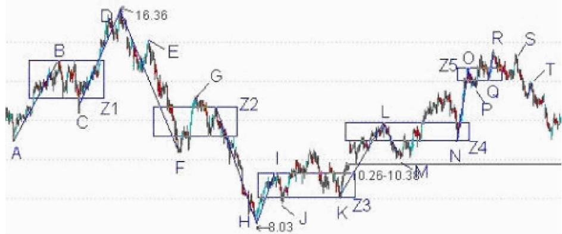
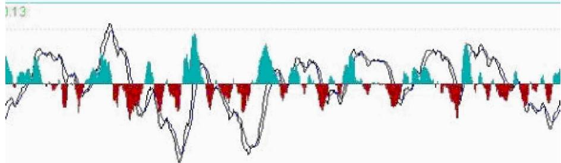

# 第四节 走势中枢与买卖点

# 一、基本概念

买卖点：就是买入或卖出股票的点位或者价位。市场交易，归根结底就是买卖点的把握。

100%安全的买卖点：就是这点之后，市场必然发生转折，没有任何模糊或需要分辨的情况需要选择。

第一类买点：某级别下跌趋势中，一个次级别走势类型向下跌破最后一个走势中枢后形成的背驰点。

第一类卖点：某级别上涨趋势中，一个次级别走势类型向上突破最后一个走势中枢后形成的背驰点。

第二类买点：某级别中，第一类买点的次级别上涨结束后再次下跌的那个次级别走势的结束点。

第二类卖点：某级别中，第一类卖点的次级别下跌结束后再次上涨的那个次级别走势的结束点。

第三类买点：某级别上涨趋势中，一个次级别走势类型向上离开走势中枢，然后以一个次级别走势类型回抽，其低点不跌破走势中枢上边缘ZG的走势中枢终结点。

第三类卖点：某级别下跌趋势中，一个次级别走势类型向下离开走势中枢，然后以一个次级别走势类型回抽，其高点不升破走势中枢上边缘ZD的走势中枢终结点。

买卖点定律一：任何级别的第二类买卖点都由次级别相应走势的第一类买点构成。

趋势转折定律：任何级别的上涨转折都是由某级别的第一类卖点构成的；任何的下跌转折都是由某级别的第一类买点构成的。

买卖点的完备性定理：市场必然产生赢利的买卖点，只有第一、二、三类。

升跌完备性定理：市场中的任何向上与下跌，都必然从三类买卖点中的某一类开始以及结束。换言之，市场走势完全由这样的线段构成，线段的端点是某级别三类买卖点中的某一类。

# 二、应用要点

无论前面的走势是什么情况，买卖点都唯一对应着一个走势中枢存在后走势的延续或转折。换言之，所

有买卖点都必然对应着与该级别最靠近的一个走势中枢的关系，这种关系便构成的三类买卖点。

只有在下跌趋势确立后的走势中枢下方才可能出现买点。这就是第一类买点。第一类卖点正好相反。

并不是走势中枢上方的任何回调回抽都是第三类买卖点，必须是第一次。

趋势转折定律中的某级别不一定是次级别，因为次级别里可以是第二类买卖点。而且还有这种情况，就是不同级别同时出现第一类买卖点，也就是出现不同级别的同步共振。所以这里只说是某级别。

# 三、分析理解

从走势中枢理论可知，走势中的任何一个点，必然面临两种可能：走势类型的延续或转折。例如对于一个必然的买点，必须满足以下的两种情况之一：一个向上的延续或一个由下往上的转折。对于延续的情况，能产生的，只能是在一个上升的过程中，否则就无所谓延续了。对于上升的延续中产生的买点，必然有一个走势中枢在前面存在着；对于转折，被转折的前一段走势类型只能是下跌与盘整。而无论是下跌还是盘整，买点之前都必然有一个走势中枢存在。归纳上述，无论前面的走势是什么情况，都唯一对应着一个走势中枢存在后走势的延续或转折。这分析对卖点同样有效。

某种类型的走势完成以后就会转化为其他类型的走势。对于走势中枢下形成的买点，如果该走势中枢是在上涨之中的，在走势中枢之下并不能必然形成买点。此走势中枢下的“买点”，有可能存在于下跌与盘整的走势类型中。换言之，一个上涨趋势确定后，不可能再有第一类与第二类买点，只可能有第三类买点。而对于盘整的情况，其走势中枢的扩张与新生，都不能必然保证该“买点”出现后能产生向上的转折，因为其扩张与新生完全可以是向下发展的。而对于走势中枢延续的情况，走势中枢形成后随时都可以打破而结束延续，也不必然有向上的转折。所以盘整的情况下，走势中枢下也不必然产生买点。因此，只有在下跌趋势确立后的走势中枢下方才可能出现买点。对于下跌的走势来说，一旦完成，只能转化为上涨或盘整。因此，一旦能把握下跌走势转化为其他类型的关节点买入，就在市场中占据了一个最有利的位置。这个关节点，就是第一类买点。因为无论是趋势还是盘整在图形上最终都要完成，所以在第一类买点出现后第一次次级别回调制造的低点，是市场中第二有利的位置。为什么？因为上涨和盘整必然要在图形上完成。而上涨和盘整在图形上的要求，是必须包含三个以上的次级别运动，因此后面必须且至少有一个向上的次级别运动，这样的买点是绝对安全的，其安全性由走势的“不患”而保证，这就形成了第二类买点。第二类买点，不必然出现在走势中枢的上或下，可以在任何位置出现，走势中枢下出现的，其后的力度就值得怀疑了，出现扩张性走势中枢的可能性极大，在走势中枢中出现的，出现走势中枢扩张与新生的机会对半，在走势中枢上出现，走势中枢新生的机会就很大了。但无论哪种情况，赢利是必然的。

该两类买卖点是被最基础的分析所严格保证的。就如同几何中严格定理一样，只要找准了这两类买卖点，在市场的实际走势中是战无不胜的，是波涛汹涌的市场中最坚实的港湾。关于该两类买卖点与走势及上述原理、定理间密不可破的逻辑关系，必须切实理解体会，这是所有操作中最坚实、最不能混淆的基础。

走势中枢有三种情况：延续、扩张与新生。如果是走势中枢延续，那么在走势中枢上是不可能有买点的，因为走势中枢延续必然要求所有走势中枢上的走势都必然转折向下，并回到走势中枢之中。在这时候，只可能有卖点。而走势中枢扩张或新生，在走势中枢之上都会存在买点。这类买点，就是第三类买点。也就是说，第三类买点是走势中枢扩张或新生产生的。走势中枢扩张导致一个更大级别的走势中枢；而走势中枢新生，就形成一个上涨的趋势，这就是第三类买点后必然出现的两种情况。对于更大级别走势中枢的情况，肯定没有马上出现一个上涨趋势的情况诱人。所以对于实际操作，尽量避免第一种情况就是一个最大的问题。但无论是哪种情况，只要第三类买点的条件符合，其后都必然要赢利，这才是问题的关键。

显然，第一类买点与第二类买点是前后出现的，不可能产生重合。第一类与第三类买点，一个在走势中枢之下、一个在走势中枢之上，也不可能产生重合。只有第二类买点与第三类买点是可能产生重合的。这种情况就是：第一类买点出现后，一个次级别的走势凌厉地直接上破前面下跌的最后一个走势中枢，然后在其上产生一个次级别的回抽不触及该走势中枢，这时候，就会出现第二类买点与第三类买点重合的情况，也只有这种情况才会出现两者的重合。当然，在理论上没有任何必然的理由确定第二、三类买点重合后一定不会只构成一个更大级别的走势中枢扩张。但实际上，一旦出现这种情况，一个大级别的上涨往往就会出现。

买点的情况说了，卖点的情况反之亦然。

至于第一、二、三买卖点，归根结底都可以归到第一类买卖点上，只是级别不同。那么为什么不仅说第一类买卖点？因为这样，就会涉及不同的级别，等于同时用不同级别的显微镜去看，太乱，实际用起来更乱。因为不同级别的买卖点意义是不同，因此要在同一个级别上研究，才有三类买卖点的分别。当然，最充分的操作，就是按分笔的买卖点，这样所有波动的最细微波动都可以把握了。但这在实际中是不可能的。人需要反应的时

间、有交易成本等等。因此，忽略掉某些波动，按更大的级别统一操作，就是客观条件的必然要求。本理论可不是什么先验理论，而是根本客观条件充分反映当下可能的充分可操作性的理论，这必须要彻底明确。因此，三类买卖点，都不能偏废，不能说哪一个更重要，站在同一级别上，三者都重要。

# 四、操作指导

1、站在纯操作的角度，由于任何买卖点，归根结底都是某级别的第一类买卖点。因此，只要搞清楚如何判断背驰，然后选好适合的级别。当该级别出现底背驰时买入，顶背驰时卖出，就一招鲜也足以在市场上混好了。不过，任何事情都应该究底穷源。这有点像练短跑，跑到最后，提高0.01秒都很难。所以越往后，难度和复杂程度都会越来越深。如果一时啃不下来，就选择可以把握的，先按明白的选择好操作模式。等市场经验多了，发现更多需要解决的问题，有了直观感觉，再回头看，也不失为一种学习的办法。当然，都能看懂并能马上实践，那最好。  
2、这三类买卖点，都是被理论所保证的，100%安全的买卖点。如果对这三类买卖点的绝对安全性没有充分的理解，就绝对不可能也绝对没有对缠中说禅技术分析理论有一个充分的理解。所谓 100%安全的买卖点，就是这点之后，市场必然发生转折，没有任何模糊或需要分辨的情况需要选择。市场交易，不能建筑在或然上。这市场的绝对必然性，是交易中唯一值得信赖的港湾。  
3、第一类买卖点，就是该级别的背驰点。这足以应付最大多数的情况。但有一种情况是不可以的，就是前面反复强调的小级别转大级别的情况。为什么？假定30分钟操作级别，当1分钟级别背驰时，并未触及 30分钟级别的第一类买卖点，所以按 30分钟级别就无须操作。对这种情况，就需要第二类买卖点来补充。第二类买卖点，不是专门针对这小转大情况的。一般说，高点的一个次级别向下、再一个次级别向上，如果不创新高或盘整背驰，都构成第二类卖点。而买点的情况反过来就是了。所以，在有第一类买卖点的情况下，第一类买卖点是最佳的，第二类只是一个补充；但在小级别转大级别的情况下，第二类买卖点就是最佳的，因为在这种情况下，没有大级别的第一类买卖点。  
4、第二类买卖点，站在走势中枢形成的角度，其意义就是必然要形成更大级别的走势中枢，因为后面至少还有一段次级别走势且必然与前两段有重叠。所以，无论如何，当出现第二类买卖点时，绝对可以操作。第二类买点有哪几种可能的情况？

# 4.1 最强的情况

第二类买点刚好构成原来下跌的最后一个走势中枢开始的震荡走势的第三类买点，也就是第二、三类买点合一了，这是最强的走势，这情况，一般都对应 V 型反转的快速回升，是最有力度的。

# 4.2 最弱的情况

第二类买点跌破第一类买点。也就是第二类买点比第一类买点低，这是完全可以的。这里一般都构成盘整背驰，后面对应这从顺势平台到扩张平台等不同的走势。

# 4.3 一般性走势

也就是前面两者之间的走势。这种情况下，第一、二、三买点，是依次向上，一个比一个高。

站在原来下跌最后一个走势中枢的角度，第一、二、三类买点都可以看成是走势中枢震荡的结果。因此，在第二类与第三类之间，可能会存在着更多的走势中枢震荡走势，不一定如第一、二之间是紧接的。那第二类与第三类买点之间的震荡买点，一般就不给特别的名称了，也可以看成是第二类买点。

注意，只有在这回升的中阴状态下才有第一、二类买点，中阴状态结束后，所有的走势中枢震荡只存在第三类买卖点以及走势中枢震荡的买卖点，就不存在第一、二类买卖点了。

5、第三类买卖点比第一、二类要后知后觉，但如果抓得好，往往不用浪费盘整的时间，比较适合短线技术较好的资金。但一定要注意，并不是任何回调回抽都是第三类买卖点，必须是第一次。而且，第三类买卖点后，并不必然是趋势，也有进入更大级别盘整的可能。但这种买卖之所以必然赢利，就是因为即使是盘整，也会有高低点出现。操作策略很简单，一旦不能出现趋势，一定要在盘整的高点出掉，这和第一、二类买点的策略是一样的。  
6、实际操作中，最干脆的做法，就是不参与走势中枢震荡，只在预先设定的买卖点上买卖。但对于大资金来说，或者对于有足够操作时间和熟练度的资金来说，走势中枢震荡当然是可以参与的。而且如果走势中枢级别足够，其产生的利润往往更大而且稳定。而在趋势的情况下，一般小级别的买卖点并非一定要参与。如果技术特别好或大资金，同样可以参与，这只是为了提高资金的利用率，加快成本变0或增加筹码的过程。当然，这种小级别的参与，就与该级别能容纳的资金量有关。  
7、总体围绕走势中枢的操作原则很简单：每次向下离开走势中枢只要出现底背驰，那就可以介入了；然

后看相应回拉出现顶背驰的位置是否能超越前面一个向上离开的顶背驰高点，不行一定要走，行也可以走；但次级别回抽一旦不重新回到走势中枢里，就意味着第三类买点出现了，就一定要买回来。而如果从底背驰开始的次级别回拉不能重新回到走势中枢里，那就意味着第三类卖点出现，必须走。然后等待下面去形成新的走势中枢来重复类似过程。围绕走势中枢的操作，其实就这么简单。当然，没有本理论，是不可能有如此精确的分析的，就像没有牛顿的理论，人们只能用神话去讲述一切关于星星的故事。

8、本理论特别强调：宁愿卖错，绝对不能买错。很多人，被自己的贪嗔痴疑慢所迷惑，宁愿用十几点去对赌几百点，用 1%的可能去对赌 99%的可能。如果 1%可以换来 100倍的收益，那当然没问题，但事实上根本不是这样。那么，为什么还要坚持？说白了，只有五个字：贪嗔痴疑慢。

对于散户来说，本质上没有卖错，只有买错。为什么？卖错又不会亏钱，买错就不同了。卖错了，有钱，这么多股票可以选择，为什么要一棵树吊死？实际上，只要你不被自己的贪嗔痴疑慢所左右，根本也不存在卖错的问题。很多人，在连日顶分型的雏形都没有的情况下就卖，为什么？不过是觉得高了、觉得恐慌了，觉得惊吓了。而到真正的顶分型出来了，反而要假设这顶分型是假的，调整一下就可以突破的，就不觉得高了，不觉得恐慌了，不觉得惊吓了，人的颠倒，往往如此。

学了本理论，如果真想洗心革面，就要首先掌握本理论，然后用该理论去操作，在操作中把自己培养成钢铁战士，钢铁战士的最基本标准是什么：

8.1 买点总在恐慌的下跌中形成。但只要买点出现，就要义无返顾地买进。  
8.2 上涨总在不同情绪的交织中进行。抵抗住各种情绪的干扰，用钢铁般的意志把股票持住，决不中途给抛下车。  
8.3 卖点总在疯狂的上涨中形成。只要卖点出现，手起刀落，让股票见鬼去吧。  
8.4 任何的操作失误，只是一次跌倒。跌倒就爬不起来的，绝对不可能是钢铁战士。失误就要总结，绝对不在同一错误上犯上两次。  
8.5 买错比卖错严重。一旦确认买错了，一定要手起刀落，让股票见鬼去。如果市场给你第一次改正错误的机会你没把握，也就是第二类买卖点，那就回家卖豆腐；如果市场给你第二次改正错误的机会你没把握，也就是第三类买卖点，那就直接回家磨墙。  
8.6 市场只有你才能帮助你，被市场毁掉的是你，战胜市场的也是你，你比市场强悍，市场就是你的；否则，你就是市场的点心。  
8.7 踏准市场的节奏，就可以在刀山火海中逍遥游。  
8.8 没到那水平，没到能在刀锋上舞蹈的水平，就别玩悬的，干自己能力范围内的事情。市场中最大的毛病之一，就是杀牛用鸡刀，屠龙用鸭刀，最后都被鸡了鸭了去了。市场上不是每一笔钱都适合任何人去赚的，面对市场的机会，少点贪嗔痴疑慢，认清自己的能力，这比什么都重要。市场是连续的，高位走了不是天堂，高位没走不是地狱。大跌，不过是下一买点后大反弹的前戏。这一切，都逃不过本理论，而是否参与，则与你的操作级别相关，也和你的操作能力相关。

没有人天生就是胜利者，也没有人天生就与失败为伍。人人是佛，无一人可度，无一人需救，人人有明珠一颗，照破山河大地，又何必憋屈了自己？

# 五、经典战例

下图为 600078澄星股份 30F图。看起来眼花缭乱，但如果真能看懂这个图，三类买卖点就基本掌握了。具体分析如下表：

<table><tr><td colspan="4">买点</td><td colspan="4">卖点</td><td>利润</td></tr><tr><td>一类</td><td>二类</td><td>三类</td><td>价位</td><td>一类</td><td>三类</td><td>价位</td><td>二类</td><td>百分比</td></tr><tr><td>A</td><td></td><td></td><td>11.19</td><td>D</td><td></td><td>16.38</td><td>E</td><td>46.38%</td></tr><tr><td>H</td><td></td><td></td><td>8.03</td><td></td><td>I</td><td>9.93</td><td></td><td>23.66%</td></tr><tr><td></td><td>J</td><td></td><td>8.78</td><td>L</td><td></td><td>11.91</td><td></td><td>35.65%</td></tr><tr><td></td><td></td><td>M</td><td>10.55</td><td>O</td><td></td><td>14.00</td><td></td><td>32.70%</td></tr><tr><td></td><td></td><td>P</td><td>13.28</td><td>R</td><td></td><td>14.66</td><td>S</td><td>10.39%</td></tr><tr><td></td><td></td><td></td><td></td><td></td><td>T</td><td>最后纯复利</td><td></td><td>325.14%</td></tr><tr><td colspan="9">注：1. 最后纯复利计算已分步扣除手续费和操作误差费合计2%；2. 时间跨度为A-R(20080213-20080528)共3.5月。</td></tr></table>

注：股票图是缠友“同心结”相告。

