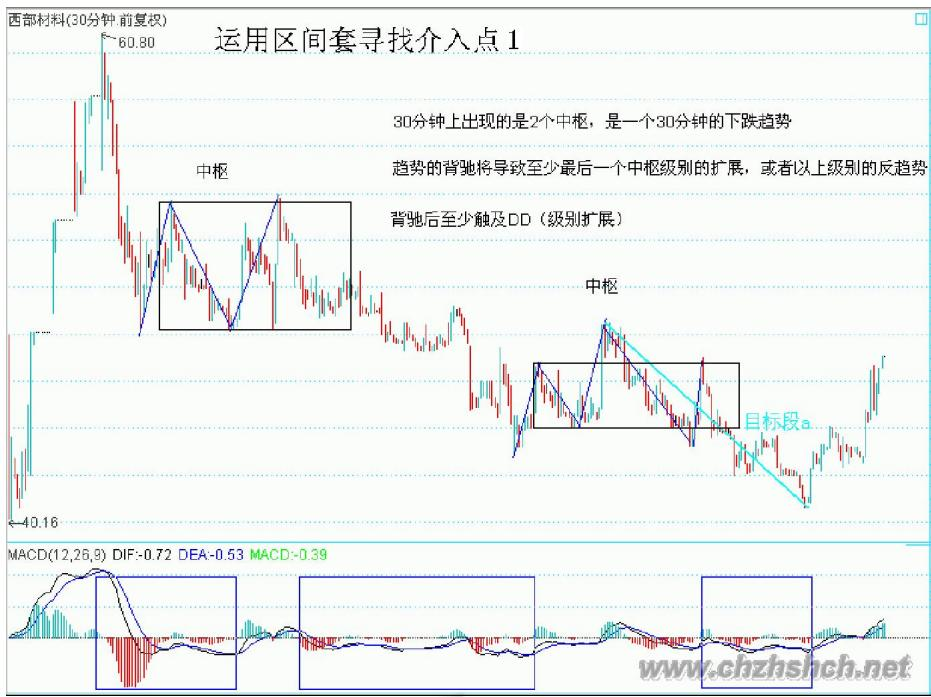
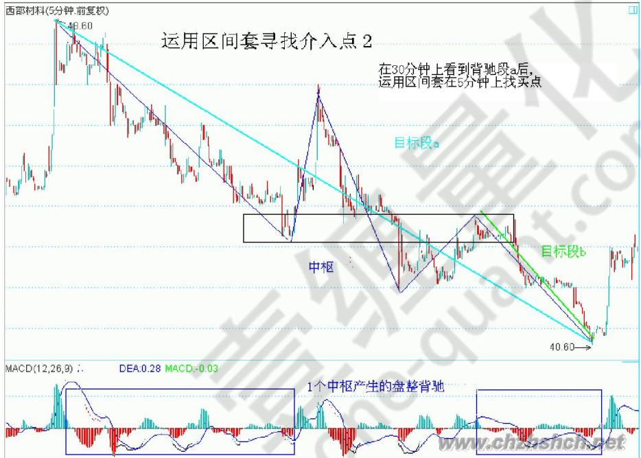
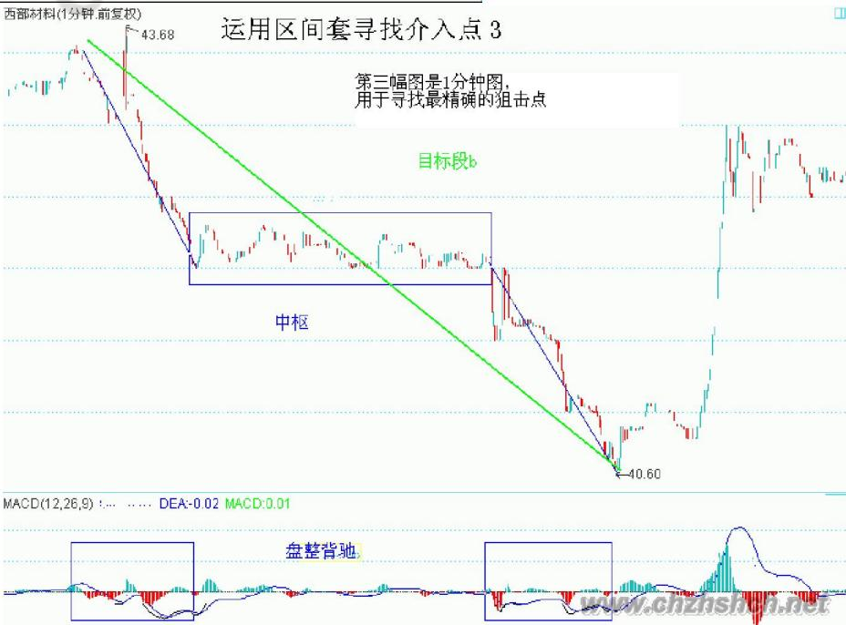

# 第六节 区间套

# 一、基本概念

区间套：就是根据背驰段从高级别向低级别逐级寻找背驰点(即买卖点)的方法。

精确大转折点寻找程序定理：某大级别的转折点，可以通过不同级别背驰段的逐级收缩范围而确定。

# 二、应用要点

某大级别的转折点，先找到其背驰段，然后在次级别图里，找出相应背驰段在次级别里的背驰段，将该过程反复进行下去，直到最低级别，相应的转折点就在该级别背驰段确定的范围内。

# 三、分析理解

区间套寻找背驰点的理论依据：低级别背驰是本级别背驰的必要条件而非充分条件，换句话说，就是只有在低级别发生背驰时，本级别才可能背驰。所以，我们可以从低级别去发现本级别背驰的精确点，也就是说次级别的背驰决定了背驰点，我们说某个级别的走势背驰了，那么必须确定它以下所有级别都转折了，这是所有背驰的前提。

# 四、操作指导

第一种情况最普遍。其特点是时间和级别完全契合。具体方法就是本级别进入背驰段后，到次级别去寻找背驰点，然后逐级找下去，直到所有的级别都在背驰段，最小的级别最终背驰。这种方法要求使用者对本级别以下的所有级别都同时关注，就像一个魔方，只对一面是不够的，只有多个面都对好才有价值。

第二种情况是小转大。本级别并未进入背驰段，由于小级别的突发情况，导致本级别背驰，这种情况是无法抓到第一买点的，只能在次级别回抽确认之后才能买到。这种情况发生在空头/多头陷阱，在本级别一个猛烈的上或下，但随后就反转了。

第三种情况是反复背离。注意是背离不是背驰，所谓的背了又背就是这种情况，就是本级别进入了背驰段，但次级别以下的力度很大，导致本级别迟迟无法背驰，在本级别上就显示背了又背。但是只要没有打破背驰段，就要密切注意。这种情况发生在筑顶/底的时期，反复地诱多或诱空，诱多时要快出，诱空时可以战略

建仓。

