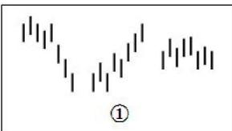
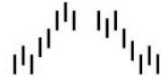
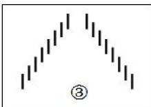

# 第八节 每日走势分类

如果是按某级别的严格操作，每天具体怎么走是关系不大的，走势不会因为交易是按天来的就有什么本质的不同。但针对每天的走势进行一些分类，至少是一个好的辅助。

一天的交易是 4小时，等于有 8个 30分钟 K线组成的一个系统。把 3个相邻 30分钟 K线的重叠部分当成

一个每天走势上的一个走势中枢，那么任何一天的走势，无非只有三类：

# 一、只有一个走势中枢(图 $\textcircled{1}$ )

这种走势，是典型的平衡市。一般情况下，开盘后前三根30分钟K线就决定了全天的波动区间。而全天的极限位置，基本上，至少有一个都出现在这前三根 30分钟 K线上，

不是创出当天高点，就是创出当天低点。当然，这不是完全绝对的。因此可以对这种情况进行更细致的分类。

# 1、在前三根 30分钟 K线出现当天高点

这可以称为弱平衡市。其中最弱的是当天低点收。注意，这和当天是否红盘无关，高开最后红盘收也可以形成这种最弱的弱平衡市。次弱是收在走势中枢之下。收在走势中枢是一般的弱平衡市。收在当天高点附近的是最强的一种。

# 2、在前三根 30分钟 K线出现当天低点

这可以称为强平衡市。其中最强的，就是以当天高点收。同样，这与当天是否红盘无关。次强是收在走势中枢之上。收在走势中枢是一般的强平衡市。收在当天低点附近的是最弱的一种。

# 3、在前三根30分钟K线不出现当天高低点

这可以称为转折平衡市，同样可以像上面情况一样根据收盘位置定义其强弱。

注意，以上三种情况走势中枢的位置不一定是前三根30分钟 K线的重叠，可以是后面几根的。

# 二、两个走势中枢(图 $\textcircled{2}$ )

根据两走势中枢的前后方向可以分为向上、向下两种。讨论向上的情况，向下的情况反过来就是。

  
$\textcircled{2}$

两个走势中枢，显然不能有重叠的地方，否则就会转化成上面的情形。因此，这种形态，最大的特点就是这两个走势中枢之间有至少有一个 30分钟 K线，其中有部分区间是不属于

两个走势中枢的任何一个。这个区间，成为单边区间，这是这种走势最重要的特点，是其后走势的关键位置。注意，具有单边区间的K线不从属任何一个走势中枢。

由于只有 8根 30分钟 K线，根据单边区间所在位置，无非是两种可能：1、单边区间在第四根 30分钟 K线。2、单边区间在第五根 30分钟 K线。由此就知道，为什么所有出现单边走势的，变盘时间都在中午收盘的前后 30分钟之内。

当然，第 4第5根30分钟 K线可以同时具有单边区间。如果只有第4根K线具有单边区间的情况，那么第八根K线，有可能出现穿越单边区间的情况。

显然，对于上涨的情况来说，最强的就是收盘在第二走势中枢的上方，最弱的，就是出现第八根 K线出现穿越单边区间的情况，最终收在第一个走势中枢的之下。然后根据收盘的位置，可以依次定出其他的强弱。

# 三、没有走势中枢(图 $\textcircled{3}$ )

这是最强的单边走势。8根K线，没有相临3根是有重叠部分的，一旦出现这种情况，就是典型的强烈走势。一旦出现这种走势，该日 K线都是具有重要意义的。一般来说，这种走势很不常见。但别以为出现这种走势就一定会继续趋势，往往很多骗线就是故意用这类走

势构成。特别是在大的日 K线走势中枢中出现这种情况，更大可能是骗线。当然，如果是在一个第三类买卖点后出现这种走势，出现大级别的强势趋势的可能性就极大了。

