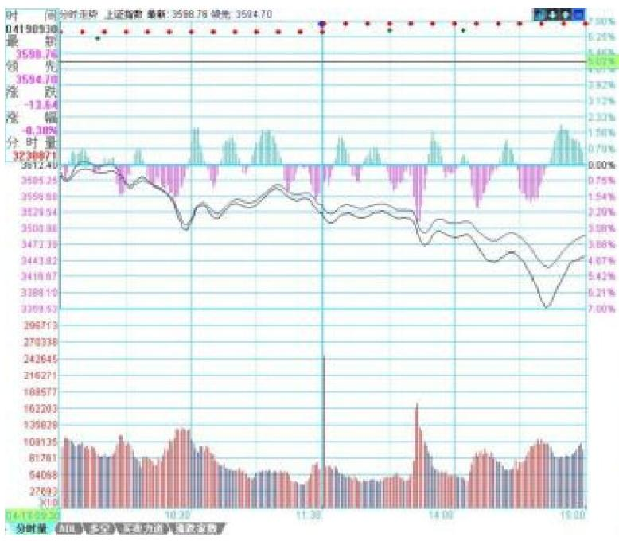
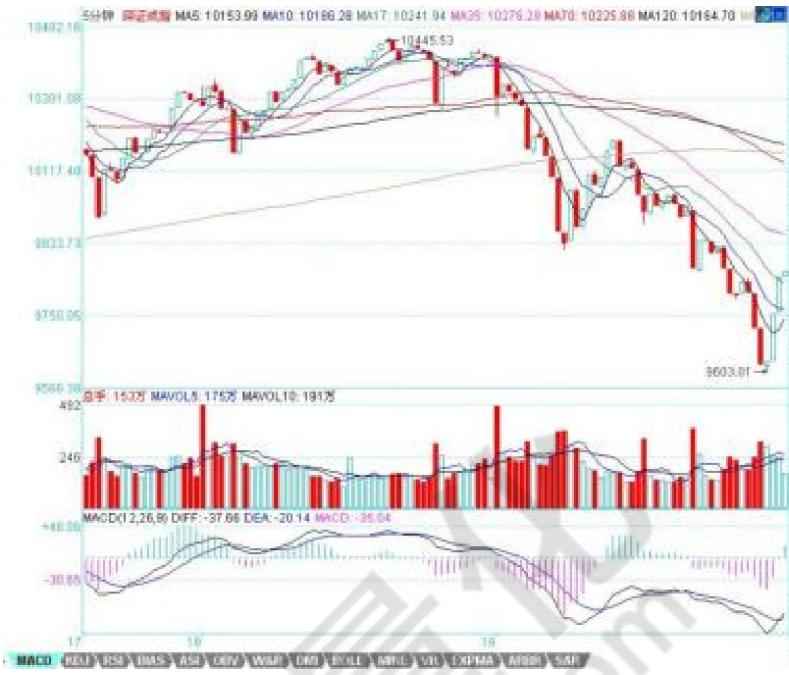
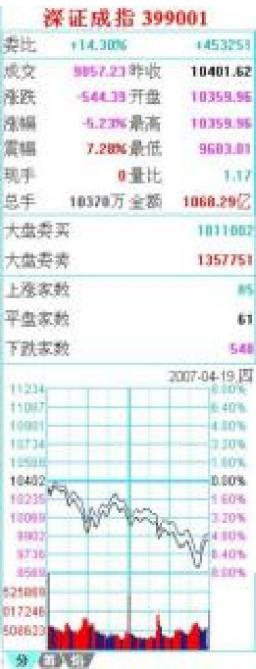

# 第九节 牛市中的爆跌行情分析

对于空头日夜盼望的暴跌，其实永远与空头无关。因为真跌了，空头就只会口头上快感一下，心理上满足一下。人的思维惯性，使得空头永远没机会在他们满意的地方获得满意的筹码。暴跌，对于牛市行情来说，猛烈而刺激。但实质上，暴跌后，该干什么还是什么。

牛市调整能力的积聚，也需要宣泄。这种宣泄，与熊市最大的不同，就是猛烈而疯狂。这和熊市中的大反弹是一样的。最出名的熊市大反弹，大概就是停国债期货那次，三天，指数从550不到翻上 920上。结果，后面依然继续下跌回来。而牛市中的暴跌，最出名的算是 96年12月那次，由于政策打击，连续跌停下来，1250点上几天跌到850点附近，结果依然继续上涨。所有真正的大顶，都是反复冲击出来的，有足够的时间让你去反应判断。那种V型顶，在大型走势中基本不会构成真正的顶部。暴跌后继续长时间下跌的机会基本为 0。所以，那些天天希望暴跌的人，最终都会给废掉，不会有好结果的。

正确去对待震荡、调整。显然，在大盘中短线能量耗尽后，大盘会出现大规模的调整，如果说 227、419都是在日线上爆跌，那么在周线上、月线上、季线上、甚至年线上出现爆跌的可能性在这长达至少20年以上的大牛市中，都是绝对存在的。但这决不是空头用嘴欢呼的借口，而是真正操作者减低成本、增加筹码的大好时机。当然，操作的精确度是一个技术问题。技术高的，就能把成本降更低，筹码增得更多。这是绝对正常的事情，技术高的就该有更好的收益，这是天经地义的。但精确度是可以用市场磨练来达到的。而思路、方法的错误，则是不可救药的，这才是问题的根源。

站在纯技术的角度，把握爆跌的级别很重要。一个日线上的爆跌与一个年线上的爆跌，显然力度上不一样。在这次从 2005年中开始的大牛市行情中，至6000点为止，本质上，在周线上都没有出现过爆跌。周线上两次大的调整，周跌幅都是 $7 \%$ 还赶不上 227的日爆跌。月线上更是连一次真正有意义的下跌都没有。但为什么这么多人，天天依然如惊弓之鸟一般？

如果你把握不住日线的爆跌，证明你的技术程度达不到把握日线爆跌的程度，那么就去把握周线、月线的，那对技术精确的要求要低。给自己安排一些力所能及的活动。爆跌也是有级别的，能否在各级别的爆跌中游刃有余，是对你技术把握度的考验。

一个很显然的道理，对市场了解越多，对走势的把握越精确。例如，20070419的爆跌行情，跌破 5日线后有一个反抽，在11:08刚好构成对前一天走势中枢的第三类卖点，这就是最后的、被本理论所保障的离开机会。那么，后面去走，就完全与本理论无关了，在一个下跌里，除了最后那一个位置，所有的卖出都是对的，但这和本理论无关。这类似赌博，就赌不是最后的位置。

有人可能要说，就算跌破5日线，也可能很快就拉起来。确实，存在这种可能性。但市场是否选择这种可

能性，就是当下的。如果很快拉起来，那自然会有一个符合本理论的买点出现，这只要市场自己去选择。既然已经卖出，就耐心等待。而其中，当然与分析的精确度有关。有些人分析不到位，会回补早了，那很正常。技术更熟练的，当然应该享受更精确的买点。但节奏是重要的，站在小级别操作的角度，就算你补早了，也比没走傻看着强。补早了，就以后多总结经验，使自己的技术精度更高。

<table><tr><td colspan="3">上证指数1A0001</td></tr><tr><td></td><td>+2.22%</td><td>+87443</td></tr><tr><td>成交</td><td>3449.02万收</td><td>3612.40</td></tr><tr><td>涨跌</td><td>-163.38开盘</td><td>3610.02</td></tr><tr><td>涨幅</td><td>-4.52%最高</td><td>3617.44</td></tr><tr><td>跌幅</td><td>7.18%最低</td><td>3350.93</td></tr><tr><td>现手</td><td>0量比</td><td>1.19</td></tr><tr><td>总手</td><td>10000万金额</td><td>1095.76亿</td></tr><tr><td colspan="2">总手（含权证）</td><td>26467万</td></tr><tr><td colspan="2">金额（含权证）</td><td>2023.29亿</td></tr><tr><td colspan="2">大盘买卖</td><td>2015738</td></tr><tr><td colspan="2">大盘套利</td><td>1926287</td></tr><tr><td colspan="2">上涨家数</td><td>174</td></tr><tr><td colspan="2">平盘家数</td><td>69</td></tr><tr><td colspan="2">下跌家数</td><td>750</td></tr><tr><td>上证指数</td><td>3449.02</td><td>-163.38</td></tr><tr><td>上证100</td><td>7057.64</td><td>-328.17</td></tr><tr><td>上证A股</td><td>3624.90</td><td>-171.79</td></tr><tr><td>上证日股</td><td>192.52</td><td>-8.58</td></tr><tr><td>上证基金</td><td>2650.75</td><td>-115.94</td></tr><tr><td>深证成指</td><td>9057.23</td><td>-544.39</td></tr><tr><td>成份A指</td><td>10358.03</td><td>-572.72</td></tr><tr><td>成品日指</td><td>4152.61</td><td>-234.34</td></tr><tr><td>深证综指</td><td>960.83</td><td>-49.63</td></tr><tr><td>基金指数</td><td>2532.49</td><td>-110.34</td></tr></table>

不过，必须强调的是，上面说的，都是针对资金比较小，操作级别比较小的说的。如果是按日线级别操作，那这些震荡根本无须理会。

其实，如果你对市场理解更多点，就知道，这一夜情走势的当天低点，其实是很容易把握的。这就和上节所说的当日走势分类有关。最后一个第三类卖点对 5日线进行反抽出现在 11:08。前面 3个 30分钟 K线，没有重叠。也就是说，下面走势显然不可能出现存在两个走势中枢的单边走势。三大类里，第二类是不可能出现了。对于第一类，平衡市的走势，最好的情况，也只能是当日走势中枢在 11点后那个 K线范围内。至于出现第三类，也是就没走势中枢的走势，那意味着后面有巨大跌幅。而第三类卖点后面，至少都会出现一个次级别的跌势，也就是一个 1分钟以下级别的向下走势是必须完美的。所以，站在纯理论推理的角度，可以 100%确定地安排后面可能的回补。也就是，从 11:08开始的向下走势至少要出现走势的完美。注意，这些分析，在11:08后就马上可以给出，并不需要预测或事后编排，都是根据可以根据本理论严格分析出来的。

下午开盘后，到13:30点，就知道，第三类可能不存在了。因为当日一个连续 3个 30分钟 K线的重合已经出现，也就是当日的走势中枢出现了。就是说，到1330分钟，市场已经自己给出了选择，市场不可能出现227那天的无走势中枢下跌，最多就是一个弱的平衡市。因此，10:30到 13:30这个走势中枢，就是最值得关注的。用走势中枢震荡的观点，需要比较的就是10:30前的下跌与13:30点后的下跌。这时候，大盘还没有真正对该走势中枢破位，但已经可以100%肯定地知道一旦破位，需要去看什么来决定买卖点。用 MACD辅助，显然1分钟图并不适合看。因为 10:30到 13:30分钟前，这个MACD已经有绿柱子了，这样看起来费劲，可以选择更大级别的图，5分钟的。在5分钟图上，10:30前的下跌刚好构成一个绿柱子面积，而 10:30到 13:30刚好出现回拉，所以黄白线没有明显到0轴，但红柱子是有了，所以，用走势中枢震荡的看法，后面的下跌，出现的背驰不会是5分钟级别的，只能是5分钟以下级别的，甚至就是分笔级别的最小背驰，然后引发大幅度回拉该走势中枢附近。当然，如果是特小级别的背驰，并不一定有足够力度决定其一定能拉回该走势中枢，但由于这走势中枢的存在，其力度是可预期的。

上面的分析，在大盘 13:30没真正继续破位前，就可以 100%明确地给出。里面都是纯逻辑的推理，和任何预测无关。假设你已经在11:08的第三类卖点出去了，而且你又是小级别操作者，那你需要的就是回补。所以有了如上分析，你就可以耐心等待，看5分钟图去比较其力度了。而且，你应该知道，强力回拉，并不一定需要一个 1分钟的背驰。在大幅度下跌后，一个分笔的背驰就足以引发盘中大幅回拉该走势中枢。特别，由于10:30前下跌引发的反抽也是一个分笔的背驰造成。一般来说，走势中枢震荡都有对称性。虽然不是绝对，但已经足以让你不会忽视分笔背驰引发小级别转大级别的极大可能。（分笔背驰，一般可以用 1分钟 MACD柱子的长度来辅助）

在大盘进入再次下跌时，你已经有足够的准备去等待。而且，你可以很明确地知道，在跌破 10:30到 13:30的走势中枢后，首先会有一个小的第三类卖点。小的第三类卖点后，有两种演化的可能，一是变成一个大一点级别的盘整，一个是形成下跌，至少再有两段向下。对第一种情况，在这盘整出现后，有足够的时间去选择介入，所以不用着急。而后面市场的真实选择，现在都很清楚了，就是第二种，在一个小的第三类卖点后，再出

现两波下跌。

对于一个跌破走势中枢的下跌来说，第三类卖点后再来两波就可以随时完美。这个完美，由于该下跌是 1分钟以下级别的，因此从该下跌的细部，是找不到根据1分钟背弛去确认的买点的，只可能根据分笔背驰。而根据预先知道的走势中枢震荡看法，唯一需要确认的是，13:30后的下跌与 10:30前下跌的力度比较。从5分钟MACD两柱子面积的比较可以看到，前者并不比后者的力度大，这一点，参考看深圳成指的图就更明显了（请看下图）。所以，可以断言，这13:30开始的下跌，一定会有强力回拉。

实际走势，在该第二波的分笔背驰（看 1分钟图 14:43的 MACD柱子，该K线还是所谓的早晨之星）后，大盘出现大幅度回拉，这其实是理论 100%保证的事情。注意，并不是下跌的分笔背驰就一定存在大幅回拉，而是这天的当日平衡市的走势类型的走势中枢位置与时间决定的。而且，反抽的最低位置也很清楚，就是这下跌最后一个反弹处，结果收盘也真的是在该位置，这其实也是理论所保证的。

当然，如果你懂的东西更多点，对该最后位置的确定是可以很精确的。首先，日线的布林通道中轨和 20天线都在 3351点，按一般的技术分析，这是一个强力支持位置，而实际低点在 3358点。另外，在 1分钟图上的下降通道下轨，也在该位置，几个因数相配合，该位置出现反抽就完全在把握中了。

后面的走势很简单，关键是那走势中枢，由于分笔背驰只保证回抽到下跌最后一个反弹处，收盘已达到。而分笔背驰并不 100%支持对该走势中枢的完全回拉。所以理论上，依然完全存在继续跌出一个更大级别的背驰再回拉的可能。当然，也可以直接上去，这必须由市场来选择。但无论哪种情况，该走势中枢都是一个新的走势中枢形成前的判断关键。而420当天走势中枢的位置，就决定了今后走势可能的演化。

以上，是一个分析的范本，这些分析，都是可以当下进行的，里面不涉及任何预测，市场当下的每一步走势，都相应给出分析的选择。对本理论熟悉的，其实1秒就可以把当下情况分析清楚，然后采取最正确的操作。但必须强调，这只是为了说明如何去分析，并不是鼓励所有人都去弄这种超级短线。当然，如果你连这么精确的分析都能当下完成并指导自己的操作，那么那些大级别的操作，就更没问题了。如果有 $T + O$ 对于小资金来说，这些就是有绝对实战意义的事情，当然，在 $\mathsf { T } { + } 1$ 的环境下，就算 3358买的，在第二天，还有出不掉的风险。而如果是 $T + a$ ，那就不存在了，因为对于超级短线来说，回拉最后反弹位置就可以出来，然后看市场下一步的选择再选择下一买点。再次强调，这只是为了说明理论，并不说都要按这么小级别去操作，只不过大级别的分析是一样的，切记。

当然，如果你对当日走势的辅助判断有更深的了解，那么用当日对冲等方法来降低成本，也是可以做到的。有时间，可以去研究一下与大盘节奏不同个股的走势，感受一下大盘这外在因数对个股的影响是如何首先必须有个股的内在原因的，例如，大盘的下跌反而使得某些股票构造出第二、三类买点，而在走势中枢上移强力延伸的股票，甚至不搭理大盘。也可以去参考一下，那些随大盘下跌的股票，是本来就存在卖点，大盘只是加大了卖点后向买点运动的幅度，但并不会改变卖点与买点的内在逻辑结构。明白了这一点，对本理论的理解会更深点。

