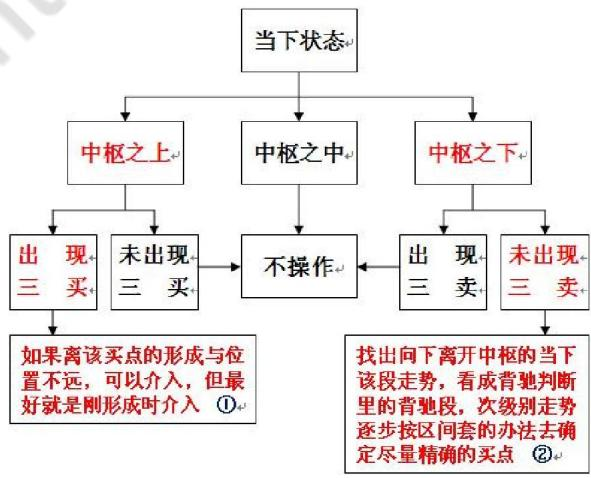

# 第二十一节 最大利润操作法

# 一、基本概念

最大利润操作法，即利润率最大的操作模式。

# 二、操作指导

很显然，由图可知，对于一个走势中枢来说，最有价值的买点就是其第三类买点以及走势中枢向下震荡力度出现背驰的买点。前者即 $\textcircled{1}$ ，最坏的情况就是出现更大级别的走势中枢，这可以用其后走势是否出现盘整背驰来决定是否卖出。一旦不出现这种情况，就意味着一个向上走势去形成新走势中枢的过程。这种过程当然是最能获利的。至于后面一种即 $\textcircled{2}$ ，就是围绕走势中枢震荡差价的过程。通过高抛低吸，可以降低成本、增加筹码。

