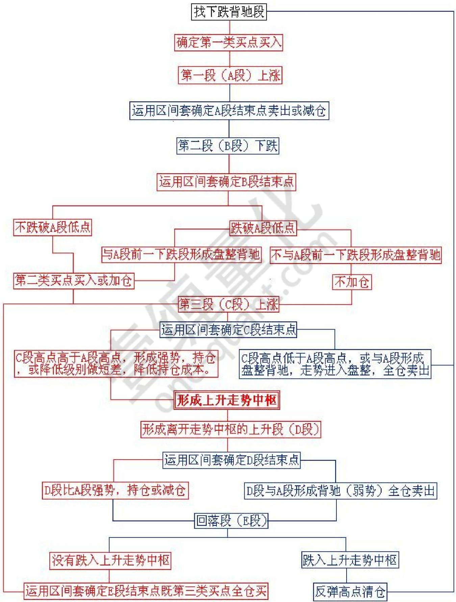

# 第二十三节 机械化操作

# 一、基本概念

机械化操作，就是按既定程式来操作，并严格执行。

# 二、应用规范

1、既定程式：不妨从一个下跌背驰开始，（以一个 30分钟级别的分解为例子，按 30分钟级别的同级别分解）必然首先出现向上的第一段走势类型，根据其内部结构可以判断其背驰或盘整背驰结束点，先卖出，然后必然有向下的第二段，这里有两种情况：  
1）、不跌破第一段低点，重新买入；  
2）、跌破第一段低点，如果与第一段前的向下段形成盘整背驰，也重新买入，否则继续观望，直到出现新的下跌背驰。

在第二段重新买入的情况下，然后出现向上的第三段，相应面临两种情况：

1）、超过第一段的高点；  
2）、低于第一段的高点。

对于第二种情况，一定是先卖出；

第一种情况，又分两种情况：

1）、第三段对第一段发生盘整背驰，这时要卖出；  
2）、第三段对第一段不发生盘整背驰，这时候继续持有。

这个过程可以不断延续下去，直到下一段向上的30分钟走势类型相对前一段向上的走势类型出现不创新高或者盘整背驰为止，这就结束了向上段的运作。向上段的运作，都是先买后卖的。  
一旦向上段的运作结束后，就进入向下段的运作。向下段的运作刚好相反，是先卖后买，从刚才向上段结束的背驰点开始，所有操作刚好反过来就可以。  
2、操作级别：根据资金量和操作熟练程度、股性确定。  
1）、1F级别肯定不适合大资金运作，即使出现了买卖点，也未必能够买得进、卖得出。  
2）、熟练程度低，反应慢，加上交易成本，过于频繁的买卖，不一定盈利。  
3）、股性活跃度低的股票，小级别的买卖差价加上反应时间，不一定够交易成本，就没有操作价值。  
3、选定级别的统一性：一旦选定了操作级别，就一定要严格按照该级别的买卖点进行操作。不能朝三暮四，打乱了操作节奏。例如：选定了 30F级别，30分以下的波动一概不考虑！这样讲并不妨碍运用区间套原理，在小级别里精确定位买卖点！这一点要充分地加以理解！

# 三、图示

为了方便理解，把它做成了图，这样就一目了然了，更便于操作。

  
机械化买卖程序

