# 第二十五节 具体走势的分析

1、今天本不该说股票，连续两天都说股票也太浪费资源，不过回帖里有人提出这个问题很有代表性，所以有必要回答一下。今天等着看足球，十分无聊，上网419，还不如把这帖子给写了，先贴出来，让等看球的先消耗点无聊的时间。

请远离所有借股票收费者！

注意，看下面分析之前，不能太饿也不能太饱，不能太兴奋不能太不兴奋，否则一定晕。由于一般的图都没有这么复杂，所以看完之后千万别信心受到打击，而是应该信心百倍，知道只要精通本理论，这么细微、古怪的图，都可以当下精确分析并指导操作，从而对本理论关于走势的绝对把握性有一个更清楚的认识。后面就是要多看图，多磨练的问题了。

如果概念不清，看到这样的图，基本都要晕头转向。好了，大家开始深呼吸，放松脑筋，别抽筋了。

这图有个条件，就是 d1=g2，d2=g4。其实这条件有还是没有，并不影响分析，但有这些条件，就会增加

分析的难度。这里，就从 18.5元（设为 g0）开始分析。

昨天刚好谈到，当你以某级别分析图形时，就先假设了次级别是线段。这图里，除了最后一个，其余每一个 dngn、gndn+1都是1分钟以下级别的，所以都可以看成没有内部结构的线段。

我们就从 g0开始，当下地进入图形中。显然，当下走到g1时，由于只有两段，所以不形成任何走势中枢，当然，如果你是一个分笔操作者，那么 g1就构成一个第二类卖点了。当走势发展到 d2时，一个 1分钟级别的走势中枢就形成，区间是[d1,g1]。后面出现的线段，就要以该区间来决定是走势中枢震荡还是第三类买卖点。由于d1=g2，那么 d2g2这段就属于[d1,g1]走势中枢的震荡。而到

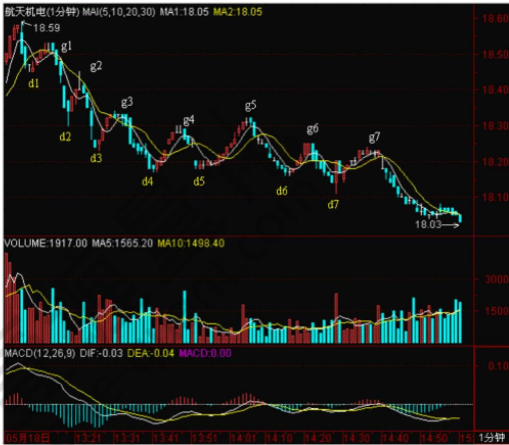

d3g3这段，显然已经不能触及[d1,g1]，所以g3就是第三类卖点。当然，如果前面 d1>g2，那g2就是第三类卖点了。

其实，由于 d1=g2，所以当行情发展到 d3，就可以当下地用结合律对走势进行多样性分析。这时候，有如下等式：

$$
\mathrm {g} 0 \mathrm {g} 3 = (\mathrm {g} 0 \mathrm {d} 1 + \mathrm {d} 1 \mathrm {g} 1 + \mathrm {g} 1 \mathrm {d} 2) + \mathrm {d} 2 \mathrm {g} 2 + \mathrm {g} 2 \mathrm {d} 3 = \mathrm {g} 0 \mathrm {d} 1 + (\mathrm {d} 1 \mathrm {g} 1 + \mathrm {g} 1 \mathrm {d} 2 + \mathrm {d} 2 \mathrm {g} 2) + \mathrm {g} 2 \mathrm {d} 3
$$

括弧里的是走势中枢。在后一式子看来，该走势中枢就是[d1，g2]，也就是一个价位，这时候，也并不影响前面关于g3就是第三类卖点的分析。而这种分解，比较符合一般的习惯，所以是可以采取的。

显然，以 MACD辅助判断，力度上，g1d2>g2d3>g3d4,相对来说，后者都是前者的盘整背驰。当然，在 1分钟图上，这种背驰都没有什么操作意义，但如果是日线、甚至年线图上，就有了。

分解图形，有一个原则是必须知道的：两个同级别走势中枢之间必须有次级别的走势连接，例如，g0d4=$\mathtt { g o d 1 } + ( \mathtt { d 1 g 1 } + \mathtt { g 1 d } 2 + \mathtt { d } 2 \mathtt { g 2 } ) +$ （g2d3,+d3g3+g3d4）这样的分解是不被允许的，因为括弧中的两个同级别走势中枢之间没有次级别的连接。（注意，这与下面三次级别构成走势中枢的情况不同，那种情况下，是允许三个括弧相加而之间没有次级别，因为那是扩展成高一级别走势中枢的情况，和这里两个同级别的情况不同。）

当行情当下走到d4点时，根据上面的原则，无非有下面两种可能的分解：

$$
\begin{array}{l} \mathrm {g} 0 \mathrm {d} 4 = \mathrm {g} 0 \mathrm {d} 1 + (\mathrm {d} 1 \mathrm {g} 1 + \mathrm {g} 1 \mathrm {d} 2 + \mathrm {d} 2 \mathrm {g}) + \mathrm {g} 2 \mathrm {d} 3 + \mathrm {d} 3 \mathrm {g} 3 + \mathrm {g} 3 \mathrm {d} 4 \\ = \mathrm {g} 0 \mathrm {d} 1 + \mathrm {d} 1 \mathrm {g} 1 + \mathrm {g} 1 \mathrm {d} 2 + (\mathrm {d} 2 \mathrm {g} 2 + \mathrm {g} 2 \mathrm {d} 3 + \mathrm {d} 3 \mathrm {g} 3) + \mathrm {g} 3 \mathrm {d} 4 \\ \end{array}
$$

d4g4是盘整背驰后的正常反弹，针对上面第一种分解，这只是第三类卖点后向一个新的同级走势中枢移动或形成更高级别走势中枢的一个中间状态，g4d5这段也是；针对第二种分解，由于 g4=d2，所以 d4g4是（d2g2+g2d3+d3g3）的走势中枢震荡，d5g5这段也是。

有人可能要问，在这种情况下，采取哪种分解？其实，哪一种都可以，但第一种，由于在中间状态中，没有一个确定的标准，所以对短线操作指导不足，而第二种，由于是走势中枢震荡，操作起来就指导明确了，所以从方便操作的角度，就可以用第二种。这就是反复强调的分解多样性的好处，一般来说，对于具体操作，一定要选择当下有明确意义的分解，例如是走势中枢震荡的，或有第三类买卖点的，但一定要注意，所有的分解必须符合分解的原则，否则就乱套了。

对于第二种分解，d5g5这段属于走势中枢震荡，但对于第一种分解，d5g5这段就有了一个重大的意义。因为那种第三类卖点出现后的中间状态，在 d5g5这段出现后就彻底消除了，一个更大级别的走势中枢就给确定了。具体如下：

$$
\mathrm {g} 0 \mathrm {g} 5 = \mathrm {g} 0 \mathrm {d} 1 + \left\{\left(\mathrm {d} 1 \mathrm {g} 1 + \mathrm {g} 1 \mathrm {d} 2 + \mathrm {d} 2 \mathrm {g} 2\right) + \left(\mathrm {g} 2 \mathrm {d} 3 + \mathrm {d} 3 \mathrm {g} 3 + \mathrm {g} 3 \mathrm {d} 4\right) + \left(\mathrm {d} 4 \mathrm {g} 4 + \mathrm {g} 4 \mathrm {d} 5 + \mathrm {d} 5 \mathrm {g} 5\right) \right\}
$$

三个小括弧里的1分钟走势中枢重叠构成了大括弧里的5分钟高一级别走势中枢。走势中枢的区间是[d2，g5]，注意，这时候，就要把1分钟的走势当成线段，小括弧里的都是线段，高低点就是这线段的端点。这样一来，后面的走势就十分简单了，例如，g7就是一个第三类卖点（d7g7，其中2、3根K线有一个较大的回试，然后有 5、6两个小十字星停在该区域，由此就知道这肯定构成1分钟走势中枢了，也就是内部可以画出一个1分钟以下级别的三段来，当然，具体的如果有1分钟以下图看就可以把握，特别对于级别大的图，这些时候都可以看小级别的图去确认，如果经验多的，一般看到这种情况，不用看小级别的都知道这么回事情。）

按 照 第 二 种 分 解 ， 相 应 的 5 分 钟 走 势 中 枢 要 到 g6 点 才 完 成 ， 这 样 g0g6=g0d1+d1g1+g1d2+{（d2g2+g2d3+d3g3） $^ +$ （g3d4+d4g4+g4d5） $^ +$ （d5g5+g5d6+d6g6）}

相应的 5分钟走势中枢区间就是[d3，g5]，在这种情况下，d7g7也是一个走势中枢震荡，但不构成第三类卖点，因为不符合条件。（为什么？本理论写了这么多，这么简单的问题，就当成作业请各位回答。）

注意，并不是说一定要形成该级别第三类卖点后才能大幅度下跌，完全可以用该级别以下小级别的第三类卖点就突破走势中枢，但有一点是肯定的，就是只要足够长时间，该级别的这第三类卖点一定会出现的，当然，在最极端的情况下，这个卖点离走势中枢很远的位置了，但有一点是肯定的，就是该卖点后一定继续向下。而上涨的情况相反，第三买点后一定继续向上，一个最好的例子就是600477在20070409日这个小级别的第三类买点，这买点离2月分的走势中枢很远了，但依然有效，而且还是在这么大监管的条件下，本理论继续发挥作用，为什么？因为那些监管并没有终结本理论成立的两个最基本的前提。还有的可以看 600837在 20070206的例子。至于暴跌的例子，现在很难找到，老一点的投资者应该都记得庄股跳水后，第一次反抽后再继续更大幅度下跌的例子，那就是第三类卖点。

必须注意，在这种大幅快速波动的情况下，一个小级别的第三类买卖点就足以值得介入。例如对一个周线走势中枢的突破，如果真要等周线级别的第三类买卖点，那就要一个日线级别的离开以及一个日线级别的反抽，这样要等到何年何月？因此，一个30分钟甚至5分钟的第三类买卖点都足以介入了。但这里有一个基本的前提，这种小级别的大幅突破必须和一般的走势中枢波动分开，这种情况一般伴随最猛烈快速的走势，成交量以及力度等都要相应配合。这种操作，如果理论把握不好，有一定风险，就是和一般的走势中枢震荡搞混了，因此理论不熟练的，还是先按最简单的来，例如对周线走势中枢的突破，就老老实实等周线的第三类买点。注意，卖点的情况，即使理论不熟练的，宁愿按小的来，因为宁愿卖早，决不卖晚。不过，对于大级别走势中枢来说，如果还要等到第三类卖点才卖，那反应已经极端迟钝了，那第一、二卖点去哪了？市场里可不能随地睡觉。

还有一种极端的例子，就是大幅度的走势中枢震荡，例如5分钟的走势中枢在10000元，最极端的，甚至可以次级别以下震荡到 0.01元，又拉回来，即使连续跌停到0.01元，然后连续涨停到100000000元，再跌回来10000元，这也是5分钟的走势中枢震荡。当然，这么有病的例子也只能是理论中的，但由此可见本理论的涵盖面之广。所以走势中枢震荡的操作，一定是向上力度盘整背驰抛，向下力度盘整背驰回补，而不是杀跌追涨，否则真出现这么有病的情况，那就真有病了。

关于追涨杀跌，如果在走势中枢震荡中，一定死定。但如果是在第三类买卖点后，却不一定，因为走势中枢的移动，并不一定恰好就是你买卖的位置就结束了，就算是，后面也还有走势中枢震荡出现，因此，在这种情况下追涨杀跌，也有活的机会，但这都不是长远之计，为什么有好好的第三类买卖点不用，一定要追涨杀跌？就算是追涨杀跌，也可以利用小级别的买卖点进去，为什么一定要瞎蒙？

回到上面的两种分解，其实这两种分解对于g7点来说，结论是一样的，而从MACD辅助看，这种两次拉回

0轴都冲不上去的走势，而且第二次红柱子还面积小了，这种情况也预示者后面有麻烦。但多种分解，其实并不是什么麻烦事，反而是相互印证的好办法。不过一定要再次强调，分解必须符合规范，不能胡乱分解。

按严格标准说，如果你能熟练地，无论任何图形，都能当下快速地按以上标准来分解并指导操作，那么对于本理论的学习，就大致可以小学毕业了。不过这样可能对信心不足或学习时分析能力比较一般的人打击过大，所以为了鼓励大家，本理论决定向教育部门学习学习，也来一个扩招，达到这种水平的，都统一发本科毕业证书，又鉴于最近北大已经堕落到连孔男人、李男人之流都可以教授教授了，所以决定毕业证书都统一成北大牌的，一律免费，这样大家应该可以放心学习了。

# 2、530印花税当日行情图解

本 来 不想 说股票的，但知道现在说其他，大多数人也反应迟钝，被股票所迷惑了，所以还不如将错就错，就继续股票一把，说说昨天这530印花税当日行情如何去当下地分析。

本来这个问题十分简单，而且本理论一大早 7点不到就发帖子提醒要在第二、三卖点把仓位减掉，很高兴看到不少

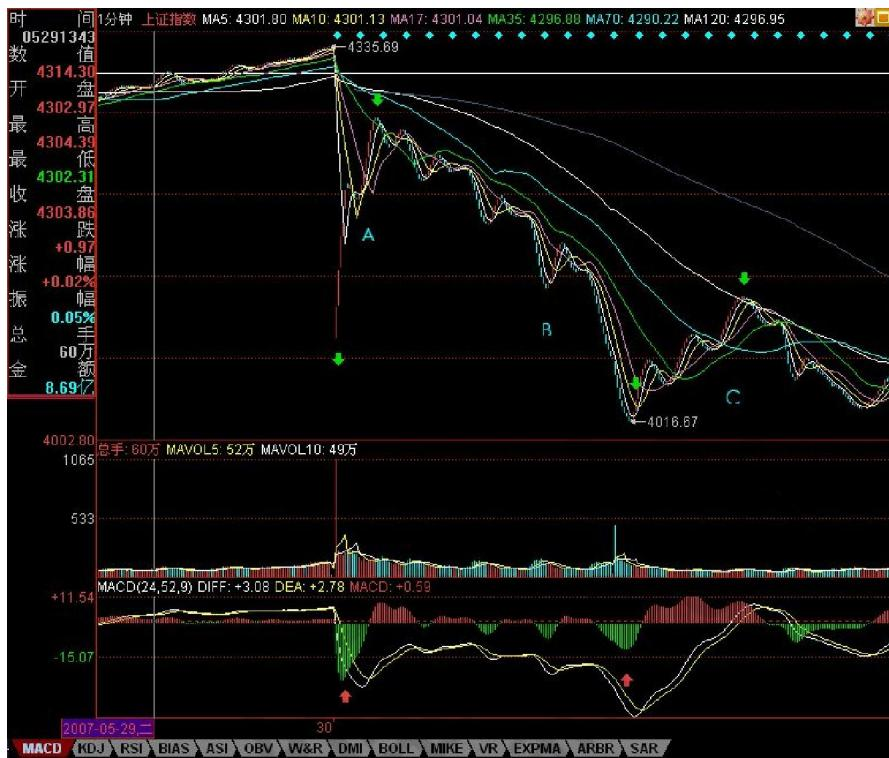

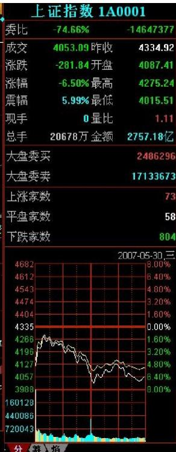

人都能发现9点48那第二类卖点。注意，为什么同时强调第三类卖点，因为有些特别弱的股票，可能就是一个第三类卖点，大盘的走势是一个平均走势，而且当天比很多个股都强，所以大盘是第二类卖点，并不意味着个股是第二类卖点。

很多人大概到现在都不明白为什么本理论中要有三类卖点，其实，第二类卖点除了在小级别转大级别上比第一类卖点优越，在一些特殊的突发情况下，就是最佳的卖点。例如这次，就是一个很好的例子。因为 529那天，虽然30分钟明显进入背驰段，但由于当天尾盘是高收的，所以用区间套定理并不能确认当时就是背驰了，毕竟还有第二天的走势。而晚上的突发消息，使得这个背驰被立刻确认，这时候，第一类卖点已经不可能在实际操作中存在，那么，唯一可以进行操作的，只能是第二或第三类卖点。这，在开盘前就可以有一个确定，也就是说，一旦大幅度低开，现实的、能被理论完全保证的卖点就是第二类或第三类卖点。

上图就是昨天走势的1分钟图。缺口，被看成最低级别的，而1分钟以下级别，在 1分钟图上，被看成没有内部结构的线段，所以缺口和 1分钟以下级别在1分钟图上是同级别的。图上绿尖头都指着两个 1分钟以下级别的分界点，两相邻绿箭头之间都是1分钟以下级别的走势类型。其中B段，看似要形成3个1分钟的走势中枢，但由于每一个的第三段其实都是向下倾斜下去的，其实都是第二段向下的一部分，不能算是形成走势中枢。昨天走势其实就这么简单，就是 5个1分钟以下走势类型的组合。

显然，这第一段的1分钟以下级别走势类型是以向下缺口的形成构成的，根据第二类卖点的定义，就知道，一旦一个 1分钟以下级别的向上过程不能创新高或背驰，都将构成第二类卖点。因此，当图中 A段走势出现时，一个构成第二类卖点的走势就当下地形成中。

有人可能有疑问，那怎么知道这A段一定构成第二类卖点而不是直接创新高强烈上升，这很简单，具体的方法和区间套定理是一样的，就是看 A段的内部结构，一旦内部出现背驰而当时位置没创新高或与前面走势产生盘整顶背驰，那么就一定是第二类卖点。在昨天的具体走势中，A段在内部出现上下上的内部结构时，其中的第二段向上明显出现背驰走势，这可以成交量，或从第一个红箭头所指的 MACD绿柱子与后面红柱子绝对值大小比较辅助判断。因此，这个第二类卖点，可以用理论完全明确地确认，一点含糊的地方都不会有。如果当

时当下不能明白，那就要抓紧学习了，因为这个问题确实太简单了。

第二类卖点后，从第二绿箭头开始的B段走势，其力度就要和缺口那一段来对比，比较MACD上两个红箭头指的绿柱子面积，注意，第二个要把前面的三个小绿柱子面积也加上，可以看出，即使这个，后者的力度也不大过前者，由此就知道，B段构成了盘整背驰，也就是后面的反弹一定回到第一个绿箭头位置之上。（注意，这里是1分钟以下级别的力度对比，只需要比较柱子面积，如果是1分钟级别的，就要同时考虑黄白线回抽 0轴的情况。）而后面C段的走势也证明了这一点。此外，C段的高点，用C段下方对应的MACD柱子高度对比不难用背驰的方法判断。由此，ABC三段就有了重叠，因此就构成了一个1分钟的走势中枢，区间在4087到4122点。这就成了直到后面、包括明天走势的最关键地方，究竟是走势中枢震荡，还是形成第三类买卖点，进而构成更大走势中枢或趋势，都以此为基准。而这是被理论所当下严格保证，毫无可以含糊的地方。

有些更细致的地方，其实还可以说的。例如，C段的高点，没有重回B段内部最后一个反弹的启始位置，这并不违反理论，因为在 B段内部，最后一段向下并没有背驰，他的转折，完全是小级别转大级别造成的（由于级别太小，可以从柱子的缩短参考看出），这自然就不一定能回到最后一个反弹的启始位置。而在B段内部，从绿柱子一个比一个面积大，就知道前面的向下都不会形成背驰而使B段结束，因此就可以当下地等待最后跌破 A段低点，形成B段与缺口段的盘整背驰。这个例子说明，一个大的盘整背驰段的内部结构，完全可以不必有该级别的背驰，完全可以小级别转大级别，昨天的图上就有这样一个标准的例子。

实际操作中，第二类卖点后，B段盘整背驰造成的买点是否要参与回补，这和你的操作级别有关，如果是股指期货，这对应的是100点的空间，当然是可以参与的，但由于 $T + O _ { 3 }$ ，而且现在交易成本提高了，对于股票是否参与，这就与你实际操作的股票有关了，这必须根据自己的情况灵活处理。但只要你明白了小级别的情况，大级别的操作是一样的，而且大级别的安全性、可操作性更高，操作的频率也更低而已。本理论说这里的例子，只是让大家对理论能更清楚地了解。

附录：

明白了上面的文章，今天的走势如果都不能把握，那就要继续加班学习了。昨天4087-4122的走势中枢，今天一大早的上冲没有触及 4087点，所以就构成了该走势中枢的第三类卖点。后面三波的下跌，与昨天的 B段比，明显背驰，其内部，最后一波，在1分钟图上，绿柱子明显缩短，所以内部也背驰，根据区间套就可以当下定位10点02分低点。这是本理论中最简单的技术的，如果今天没能这样的分析的，请好好研究补习。

后面的反弹，如本理论所指出的，第三卖点后不趋势就构成更大走势中枢，所以现在原来的1分钟走势中枢已经扩张到5分钟走势中枢。区间是4015点到 4122点，后面就是该走势中枢的震荡直到第三类买卖点出现。就这么简单，一点难度都没有。

大方面看，本理论反复强调的1/2线，依然是最重要的位置，大盘的强弱，以此为标准。目前，该线刚好在这次大震荡的中间位置上，由此就知道该线的意义有多大。在5月初的文章里已经明确说过，该线至少要管大盘 3个月，这观点不变。

今天的月线收盘，已经足够好了，至少上影线不太长，比最恶劣的倒T要好多了，因此下月，至少有了很大的画图回旋的余地。注意，最近的行情，又将以质优的一、二成分股为主，三线股一定要等到大盘基本稳定下来，才会慢慢恢复元气。但明天和周一，今天反弹比较弱的，会逐步表现，这和轮动是一个道理。

明天是周五，消息面又成了最大的心理压力，整个市场震荡要稳定下来，要等到下周了。当然，这种大幅震荡，就是本理论的天堂，在这里可以得到比单边更大的利润。注意，别以为本理论只会震荡，而是该震荡的时候震荡，该单边的时候单边，这都不明白，就白学了。

3、部分由于管理层的夜半歌声，本周已经说了4天股票，本理论就来一个大满贯，再说一天，不过下不为例，天天说股票，一周说5天，各位不审美疲劳，本理论也烦了。

看到很多人还是发蒙，因此，就用这两天的1分钟图，继续说说怎样进行图解。当然，这些图解都是可以当下进行的。今天看回帖，好象有人希望本理论在什么QQ上即时发布什么提示之类的，这绝对不可以，QQ对于本理论来说只是用来419的，用来说股票也太浪费了，而且，本理论那4小时是天王老子都不能打扰的，说句不太客气的话，本理论的资金，大概比来这里所有人的资金之和都多，本理论忙着上QQ，出问题了谁负责？所以，最多就这样形式了，很多事情，还是要靠自己多练习，本理论最多就是一个陪练的。

必须要再次强调，不熟练的投资者，一定不能全仓进行操作，基本的仓位应该拿着中长线的股票，部分仓位可以用来练习，否则全仓操作，一旦来几次半生不熟的折腾，到时候连本都没了。而且一定要注意，卖点是在涨的时候出现的，不是追杀出来的，如果你砍了地板价，那一定不是在卖点上。只要是赚钱的，就没有卖错，宁愿卖早，不要卖晚。如果卖错了，就不看这股票，除非有新的买点。

还有，有人误解，认为本理论的方法就是拼命弄短线，这些人大概是跟孔男人学的中文，所以就这水平了。用本理论的方法，如果你选择年线级别操作，那比巴菲特还巴菲特，大概一个年线的买点后，至少到等几十年才有卖点，你就拿几十年吧，就怕你拿不住。还有，如果你是按周线级别操作，那这两年，至少指数上你根本没有卖点。至于按30分钟操作的，在一个 30分钟第三买点后的走势中枢上移中，如果这上移是从 10元开始，只要不形成新的30分钟走势中枢，那么就算到了100000元，你还是要拿着，为什么？没有卖点。所以那些说学了本理论就拿不住股票的，自己好好反思一下，究竟你学了什么？

闲话少说，看图解图。

对着图，首先要确定最小分析级别，也就是说，这级别以下的都可以看成是线段，而站在最小分析级别的角度，每一线段就是其次级别走势类型，三个线段重合部分就构成最小分析级别的走势中枢。

当然这些线段本身，可能都属于不同级别，这问题在前面已经说过了。例如本图，最小分析级别先规定为1分钟级别的，所以所有1分钟级别以下的，都是线段，在图上标记着数字，所有的[N，N+1]，都是线段。有人可能要问，01段是跳空缺口，23段上上下下，很复杂，怎么都是线段？因为这都不是 1分钟的走势类型，里面没有 1分钟的走势中枢，所以都是 1分钟以下级别的，虽然缺口是最低级别的，当然比 23段这种要低级别，但在 1分钟级别显微镜下，没有区别，都可以看成是没有内部结构的线段。当然，如果你要考察23段的内部结构，也是可以的，但那就不是站在1分钟级别的基础上了。

由此可见，上图可以看成是10段线段构成的，线段中的波动，至少在分析1分钟级别的角度，就是可以忽略不计的。这里有一个地方是可能有疑问的，在23、78段5个带绿箭头指着的地方，似乎可以看成是一线段，但为什么没有？因为在这似乎是三段的结构中，第三段的都太微弱，把图形缩小后几乎就看不到了，对比一下89段带绿箭头的地方，这第三段就明显不同了，所以这是一个1分钟以下级别的上下上结构，而前面的

不是。当然，如果你一定要说78段那箭头的 地 方 很 明显，那么 78、89就合成一线段的上涨趋势了，这也可以，只是如果你是按 这 个 标 准的，那么所有和78段箭头位置微弱程度一样的，都要这样处理。本理论还是按图上的标记线段。

线段有了以后，一切都

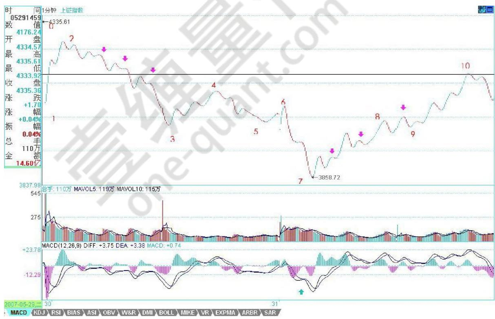

好分析了。当然，在当下时，例如在今早9点30分钟，是没有后面的线段的，但线段的标准，是一样的。你可以很精细地分析56段，是一个上下上的内部结构，其中下一段是跳空缺口，但无论如何，这就是一个线段。不过，由于前面12、23、34构成的走势中枢只有 1分钟级别的，那么其构成第三类卖点的次级别就是 1分钟以下级别的线段，这时候，就要考察一个有上下上结构的 1分钟的次级别结构了，而 56段显然符合这个结构，有明显的上下上，而45段也是符合 1分钟次级别的要求的，注意，当考察 1分钟的次级别时，就不能笼统地把所有 1分钟以下的都看成 1分钟的次级别了，因为这里的视点已经不同。显然，这个的 45、56，就构成了标准的次级别离开走势中枢与反抽走势中枢，而这1分钟走势中枢的区间是[4087，4122]，而56段只到了4077，所以这就是第三类卖点了。

当然，在具体操作中，还可以特别精细地去分析这个问题，56段里的上下上，后上对前上的力度，从下面对应的 MACD的柱子面积比就可以判断出不足来，因此这里就有很小级别的背驰，这都可以用当下分析的，

当然，这样的精确度，需要操作者十分熟练并且反应与通道都十分快，并不要求每个人都有这个可能，这里只是进行分析，对大的级别，道理是一样的。

同样道理，67段里的内部结构下上下，后下力度也比前下弱，这从下面红箭头所指两绿柱子面积的对比就可以知道，所以这内部就有了背驰。注意，这67中的上，幅度上也很微弱，但时间比较长，是一个小的时间换空间的反弹，所以是可以看成一个上的，更重要的是，这上使得绿柱子回缩到 0轴，这就更证明了这是一个不能忽视的有技术分析意义的反弹。

当行情走到 6点时，34、45、56这三段，就可以看成是一个 1分钟走势中枢了，当然，这种分法和原来[4087，4122]走势中枢的分解不同，但站在多义性的角度，这是绝对符合结合律的，当然是一个分解的方法。这分法，就使得 23、67成为这走势中枢的一个震荡，从而可以用力度的方法来发现背驰。对于23、67下所有绿柱子面积之和，显然后者小，所以就知道，67只是针对[34、45、56]走势中枢的一个震荡，必然至少回抽走势中枢附近，而对 67内部用区间套的方法进行精确定位，具体的看上一自然段的分析。按这种方法，7那买点的把握，就是很简单的事情了。注意，这都是可以当下分析的，根据当下的走势，自然就能把握。如果那7当成是第一类买点，那么9就是第二类买点了，这符合次级别上，次级别下，不创新低或盘整背驰的定义，对比一下 2点和9点，一卖一买，都是第二类的。当然，在 78里，其中的下也是一个第二类买点，但该买点的级别比 9这点要低。

显然，这10个线段，已经组成了一个更高级别的 5分钟走势中枢，结合方式如下：（ $1 2 + 2 3 + 3 4$ ）+（ $4 5 + 5 6 + 6 7$ $+ \left( 7 8 \substack { + 8 9 + 9 1 0 } \right)$ ），该走势中枢的区间是[4015，4122]。这一点其实由 6这个第三类卖点的存在以及后面的背驰，就可以知道，这走势中枢级别的扩展，是必然的。

注意，这是为了示范才分析 1分钟的图，这类图是最复杂的，一般来说，级别越大的图越简单，而操作上，技术不好，通道不好的，一般不用1分钟的图，把级别放大点，这点必须明确。

附录：

今天的走势就是[4015，4122]的走势中枢震荡，至少指数是不难看明白的。周五出现这样的走势很正常，各种心怀鬼胎的到处散播这消息那消息，散户当然如惊弓之鸟了。但今天的走势，对今后是有利的。这次的问题并不在于国家公布了什么，而是其公布的手法，如此手法，必须得到严惩，一个最直接的压力必须让用这种恶劣手法的人承担：一个骂名。周五开始，舆论将逐渐转向，一轮新的反思将开始，注意，管理层也不是一言堂。还要注意一点，这两天同时公布的是财政部国债的发行，所以，经过这次风险教育，应该能分流些人去买国债了。

不过散户确实需要有点教育，前段时间，不是有人叫嚣散户已经统治市场了？但跌两天，散户就蔫了。大资金永远都是市场的中流砥柱，没有大资金，没有这几天的聚会，像这几天北京股的走势能出现？看那些企图限制大资金的政策还出不出？有些大资金，那些管理层换了几茬了，依然屹立不倒，不断壮大，这些脑子进水的政策，除了害散户，能害得了谁？周末，这样的局面，就让管理层去收烂摊子，如果他们还喜欢这边打压，后面又来救市的游戏，那就玩吧，这种游戏已经10几年了，真正的牛人，只会在这种游戏中越来越牛。

但对于散户，这几天确实心里压力大了点，但这其实也没什么，本理论前面反复提到这样的典故：96年连续3天指数跌停，后来还创出新高。所以，那天公布消息，本理论一大早7点不到就上来，告诉一定要在第二、三类卖点卖掉，没卖的，那就算了，到今天还卖什么？大反弹是必然有的，以后的位置一定比这个位置高，关键是该走的时候，就不要有幻想。

注意，那种杀已经跌了 $3 0 \%$ 去追买不跌反涨的所谓强势股，知道有补跌这种概念吗？在混乱的市场中，更应该专一。可以很理性地讨论这个问题，一个股票下跌 $4 0 \%$ 第一次反弹回 $2 0 \%$ ，出一半或 2/3，下来再买回来，在一次反弹上去，基本走的位置，就和没跌的时候差不多了，如果你现在有资金，在一股票下跌40%时补仓。这股票又不是什么被查庄股，那么，这种的操作基本风险很小，如果技术再好一点，看准一些买卖点，那么基本就等于高位走掉了。当然，以后再碰到这种情况，一定要在第二、三卖点出掉，那天，有多少人辜负了本理论 7点不到就上来发帖子？

其实，纯技术上，现在的大走势并不坏，六月的调整没什么可说的，本理论那 1/2线，现在也在4144点了，下面，这次上涨 1/3的位置在3734点，这位置是第一支持位。没有特别的事情，这位置有很强支持。否则就要考验一半的位置，3434点。但至少现在，没有任何看到该位置的理由。

从短线上看，还是[4015，4122]的走势中枢震荡，有技术的，继续按这震荡操作。下周最大的机会，就是暴跌个股的大反弹，特别注意那些下跌到年线、半年线等关键位置的个股，这些反弹的力度会厉害点。

大浪淘沙，能从容面对本周情况的，是你投资生涯重要的一课，好好珍惜、体会。

4、明天收盘后要出一次差，去一趟曾 419赋诗的地方，所以，先把课程送上，今后几天都没时间写帖子，但每天收盘后的解盘，都会尽量按时附上。至于其他内容的帖子，等出差回来再说了。

大盘大跌，除了清洗筹码，还可以清洗一下人。本理论说过，这里没必要有这么多人，来这里的，如果不是希望成为猎鲸者的，就没必要来了。那种跌个40%就惊慌失措的，也不大适合市场。市场从来都是血腥场所，这点在前面已经反复说到，见不了血腥场面的，还是把钱好好去买国债，这样比较安心。股票就是废纸，该卖的时候不卖，把股票当宝，这就是投资的最大软肋。如果你看图形操作时，做不到无我无股票，只有走势图形，那基本可以不看图了，因为有我有股票，被自己的贪婪恐惧所牵引，你看的图，也不过就是自己的贪婪与恐惧，那何必看图？

说一个最简单的例子，就算你没技术，只按最简单的跌破 5日线走，那请看看你该在什么时候走，且不说对于具体的个股了。这次是一个很好的实习机会，请回想一下那些卖点时，你自己究竟在干什么？心里是不是有很多幻想，被幻想蒙蔽了眼睛？看图操作，唯一的对象只有图，谁说都没用，市场是当下发生着的，没有人能替你去反应。

先把市场放一边，继续图解分析，把这次跌势的图形连续分析下去，这样大概对各位的理解与分析有一定的帮助。请看下图：

各位可能还会对如何去确定线段有很大疑惑，图上已经用数字标记了从30日开始的1分钟图上的线段。为什么这样标记？例如 14-15间带红绿箭头这一段为什么不是线段？这很简单，因为这段中的下-上-下-上-下中，没有任何的重合，也就是第二个上的终点没有触及第一个上的起点，这种图形，和直接的一个下没有任何区别。而一个线段，除非是缺口，否则必须由至少上-下-上或下-上-下的三折组成，只要互相相邻的上或下不重合，则这个模式可以一直延伸下去而依然还是一个线段。这里就不难明白 14-15为什么只是一段线段了。

那么为什么 14-15这线段不构成合适的买点，因为在下面的 MACD辅助中，可以看出这一段的力度比前面所有的都大（这从黄白线就一目了然了），那当然不构成任何的1分钟以上的背驰，最多就是 1分钟以下最小

级别的背驰。在 15下MACD小红箭头处，比较绿柱子的面积，就可以发现这个小的背驰，因此就有了 15-16的反弹，该反弹在14-15最后一个上附近受阻，十分技术。

而站在 10-13构成的 1分钟走势中枢来看，15-16这反弹反而是构成一个第三类卖点，本理论看了一下留言，有叫 CCTV也看出这个是一个第三类卖点，但他的理由好象是这反弹没突破 7这点所以是第三类卖点，这是不对的，因为如果

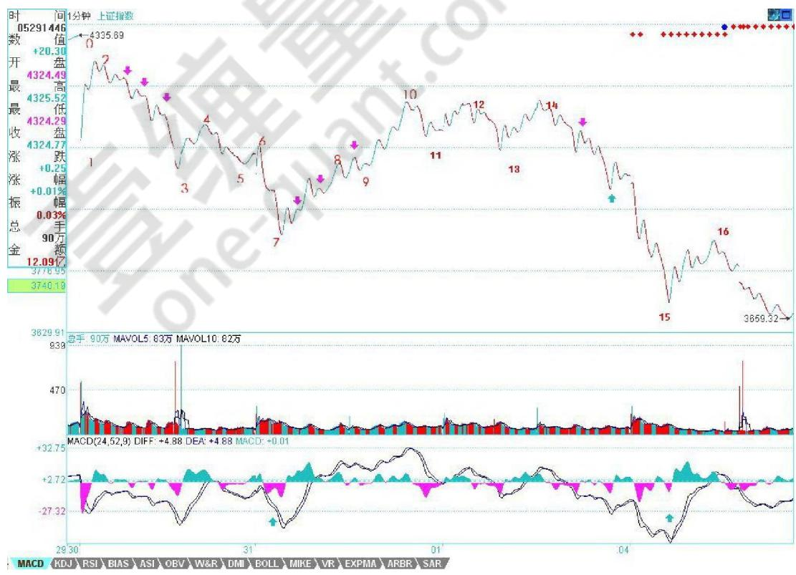

是那一点，那对应的走势中枢就乱了。注意，第三类买卖点必须是次级别离开，次级别反抽，而且是针对该级别中最近那个走势中枢，而以前也曾说过，对于一些快速变动的行情，往往第三类买卖点离开的距离会很远。

从 16开始的一段，有进入背驰段的可能，但由于明天的行情没有开始，所以如果明天突然加速下跌，就可以终结这可能，所以具体是否背驰成立，还要看明天走势的内部区间套的当下定位。如果出现背驰，那么一个反弹至少重新回到15这点上，这样就从15这点开始至少形成一个1分钟的走势中枢了。

而对于1-10这个5分钟走势中枢，该反弹如果不能重新回到4015之上，那就会形成一个 5分钟的第三类卖点。从目前的情况看，这种可能性有很大，所以这也预示着，今后几天，任何在 4000点下的反弹，都会构成一个卖点并至少引发一个更大级别的走势中枢，甚至是新一轮的下跌，除非这反弹能重回 4000点之上。显

然，从走势中枢的分析中，可以很绝对地分析出今后一段走势的一些操作性质。

站在更大的层面上，大盘要重新站稳，就要形成一个较大级别的走势中枢，而从 10开始，一个新的 5分钟走势中枢都没形成，如果新的 5分钟走势中枢最终和1-10这个5分钟走势中枢没有重合，那么就形成一个5分钟级别的下跌，那其后的压力就更大了，所以，那 CCTV也蒙对了一点，就是7这点有这极强的技术含义，如果一个5分钟背驰引发的反弹都能重回该点之上，那么大盘的走势就会有好转的可能，否则短线压力依然。

别看本理论的分析似乎很复杂，但其中绝对条理清晰，每个结论都是严格，没有任何含糊的。但关键，首先要把图给分解对，否则就乱套了。这点必须多看图，多实践。所以，今后一段课程，都继续把这图分解下去，至少看到一个日线走势中枢的生成为止，有这样的具体分析，对各位的理解和把握应该有所帮助。

附录：

本理论要马上开车去419的地方，不能多说。今天，如果你还看不明白昨天说的背驰段，然后今天如何精确定位的，那就好好学习吧。上图的 19段结束位置是3404点（为什么，如何当下去判断，好好研究好，这是真工夫），后面的走势，上面已经提及，下午走的是第 20段，该段结束后，就进入上面说的走势中枢震荡中。明天的任务，就是看好这第 20段的结束。

大走势，就是月线的 5均线，今天盘中假突破，而且还是 3434点一般的位置，这不难看出来。

对不起，不能多说了，本理论该干的干了，该说的说了，是否能成为你自己的东西，那就不是本理论能决定的。

明天解盘见，帖子就写不了了。

5、出差，必须用三张图才能把落下的走势补上。对于初学分析的人，最难搞的就是分清楚线段，所以，在每张图上，都继续用数字标记每一段线段，从中不难学会究竟线段是如何分的。

有人 可 能要问，为什么有些线段延续上百点甚至更多，而有些很短。这没什么奇怪的，是否线段，关键看走出来的形态，如果任何低点比前一个高点都高，那么即使这情况无限延续下去，也依然只是一线段，这和幅度没关系。

还有，前后两线段间，不可能是同向的，同是向上或向下不可能构成两个前后相邻的线段。而且，由于线段都至少呈现上下

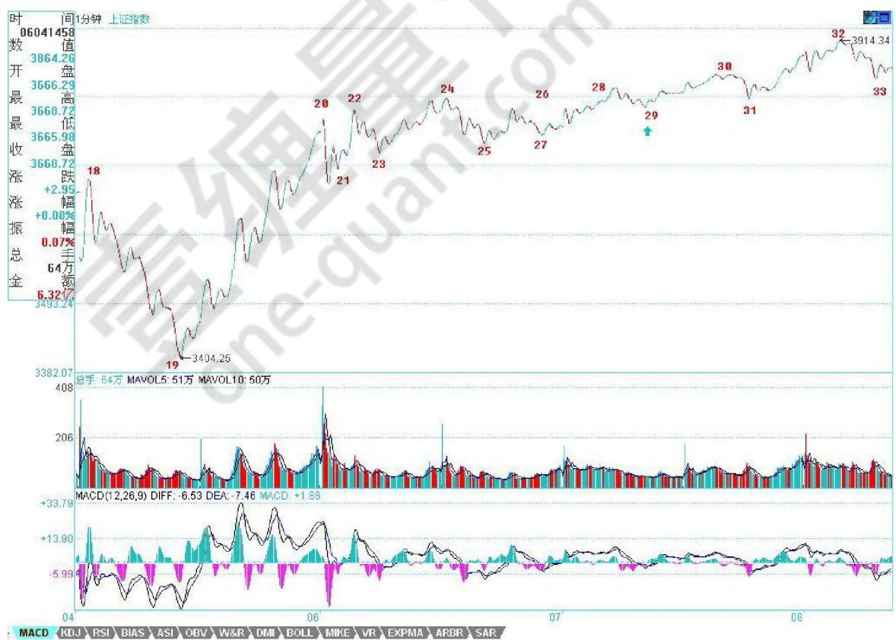

上或下上下，所以线段不存在一条直线走平的可能，由此也知道，为什么一字涨停，无论如何延续，还是低于线段的级别，是最小级别的。

下面，先把三张图列出来，三者之间是连续的，根据上面的标记可以明白。由于K线太多，不能放到一张图上，否则看不清楚。

图一中，20-23构成的1分钟走势中枢产生延续，29是这走势中枢的第三类买点。图二中，33是 28-31，37是 32-35的 1分钟走势中枢第三类买点。图三中，由于红箭头处比绿箭头高，所以不能确定该线段已经完成，还要看后面走势，由此可以知道如何去把握线段的结束：一般来说，线段的结束与大级别的走势段是一样的，在趋势中用背驰来确认，其他情况用盘整背驰来确认，如果有突发性事件，就要看第二类的买卖点，其道理是一样的，只是所用到的级别特别小而已。而对于图三，后面的走势，与 42-45的 1分钟走势中枢相关，无

非就是走势中枢震荡直到出现其第三类买卖点。

注意，在前面一课的7-8-9中，由于8下来的低点3994.57与 7中 最 后 一 个 高 点3994.21极为相近，如果点数只用到个位的精度，两者就完全一样的，所以在这种情况下可以看成是有重合的，因此可以分成三个线段。当然，如果精度要求到小数点后两位，那么这 7-8-9其实可以看成是一个线段。一般来说，如果这两者如此相近，而且8中也带着

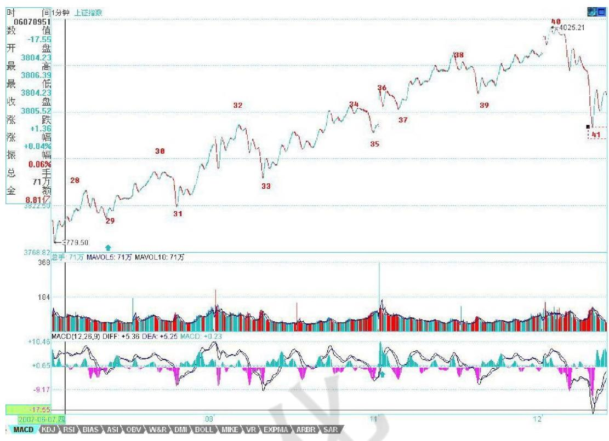

明显的下上下，所以还是看成三线段比较好。当然，如何看，关系到你事先确认的精度，关键是统一去看，至于按哪种精度，都没有任何实质影响。

有人可能又要问，怎么总是说1分钟的图？其实，看什么图并不重要，从1分钟图看起，只不过意味着这分析的基础有一个1分钟图的精度前提，在这个前提下，当然要看1分钟的图，而这不影响对大级别的分析。

例如，1-19，就构成一个5分钟的走势类型，而这走势，最终确认并没有形成两个 5分钟的走势中枢，所以只能算是一个盘整。而从19开始到45，由于41低于 32，所以这走势至少有一个 5分钟的走势中枢，但这新的 5分钟走势类型并没有最终完成。

对于 19-45这个未完成的 5分钟走势类型，可以进行仔细的研究。由于29比24低，则22-31也构成一个 5分钟走势中枢，而该走势中枢，就对应着另一

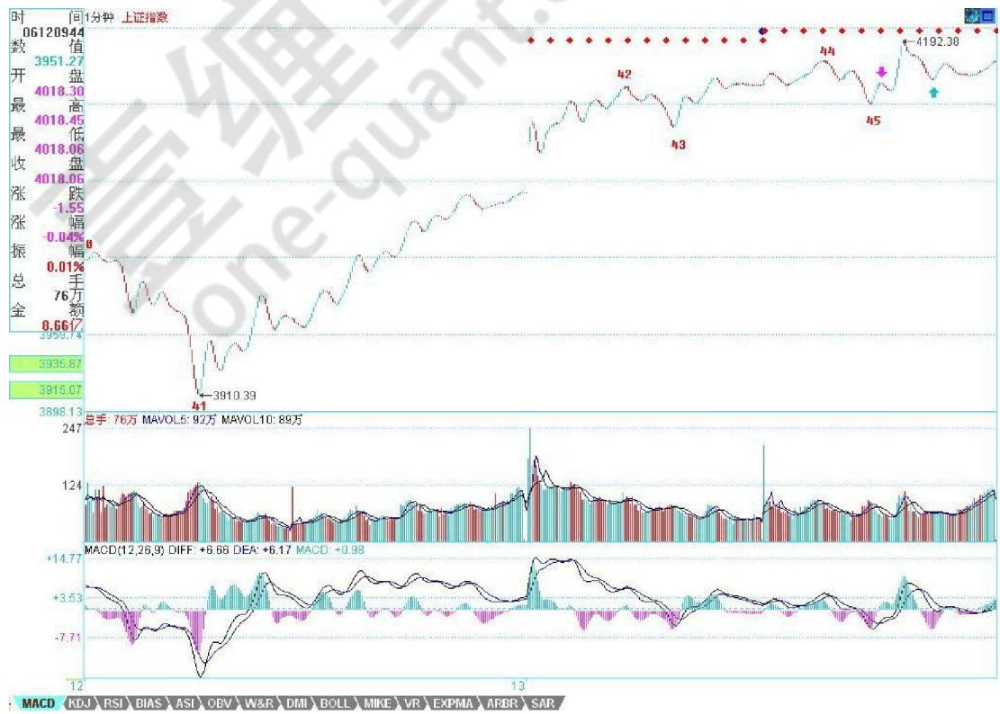

种分解。但无论如何分解，19-45至少是一个未完成5分钟走势类型的结论不变。当然，站在这种分解下，41就是22-31这5分钟走势中枢的第三类买点。因此，如果 41开始的上升最终形成5分钟走势中枢后不与 22-31这5分钟走势中枢重叠，那么这 19开始的走势类型就是 5分钟的上涨趋势了。

由上面的分析，对短线的走势就有一个明确的结论，只要关于 42-45的 1分钟走势中枢的震荡不出现第三类卖点，或者即使出现，但其后扩张的走势不触及 22-31这 5分钟走势中枢震荡区间，那么大盘的震荡就是强势的，即使最终形成 30分钟以上级别走势中枢，也是至少是围绕42-45的 1分钟走势中枢发展而来。否则，

大盘将以 22-31这5分钟走势中枢震荡区间为基础扩张出 30分钟级别的走势中枢来，相应的走势就比较弱了。而具体的操作，可以按照走势中枢震荡的手法，根据自己操作的级别，选择相应的走势中枢级别进行操作。

附录：

今天的走势没什么可讲的，昨天都已经描述得很清楚了。技术、心理、政策等压力，都需要在这里震荡消化。由于今天没完全补上缺口，因此该位置依然是短线的关键，当然，上面说的 42-45的 1分钟走势中枢，已经延伸 9段，成为一个 5分钟走势中枢了，后面具体的分析，在上面的文章里已经写了，就不再多说。深圳受到13700点的吸引，短线，能否站稳该线对大盘走向有极大的引导作用。

注意，在走势中枢震荡中，安全的作法应该是先卖后买、形成节奏。其实这问题很简单，从低位上来的筹码，当发现单边走势结束，进入较大级别震荡时候，其标志就是出现顶背驰或盘整背驰，这就要求减磅，然后等震荡下来，出现底背驰或盘整背驰再回补，这样差价才出来，成本才下降。如果是先买后卖，那唯一可能就是在单边的时候，你的仓位不高，所以才会不卖股票也有资金，这其实是节奏先错了的表现。

当然，这些都需要通过练习才能熟练。而且必须注意，一旦震荡的力度大于前面有可能形成第三类卖点时，就一定要停止回补，等待第三类卖点引发的下跌出现买点时再介入，很多人经常出问题，就是心里先假设一个可能的跌幅，觉得肯定跌不深，这都是大毛病。一定要养成只看图形操作的习惯。

还是那句话，无论是政策、心理、消息等，都是市场的分力，而走势是合力的结果，这才是问题的关键之处。

6、其实，枯燥的图形，里面包含着很深的心理学意义。走势，本质上是预期的合力。而预期，本质上是心理层面的。只不过对于市场来说，可以被当成分力去形成市场合力的预期，都是被外化为市场买卖行为的。你的恐惧，如果光是在那里恐惧而没有实际的行动，那并不构成市场的交易行为。因此，所有市场行为，其实已经被如此的心理模式给过滤一遍了。

举一个简单的例子，同级别走势从B0下跌到 A1反弹到 B1，再跌破下跌到A2，再反弹到B2，这可以分为两类：一、B2低于A1，二、B2不低于A1。显然，第二种情况，会构成某更大级别的走势中枢，而第一种情况没有，因此这两种情况是有着本质区别的。在心理层面上，A1这第一个反弹的起点，有着很强的心理暗示意义，而再次的跌破，使得这A1的价格成了一个很重要的心理位，而交易本质上都是预期的，这价位就构成了一种实在的预期分类：一、预期能重新上去A1并实际交易，二、预期不能重新上A1并实际交易、三、观望。第三种，在实际的走势中不产生实际的交易，因此一、二种心理预期构成了市场合力，而市场的走势是这合力

的当下痕迹，

因此这两种心理 预 期 的 大小，并不需要实际去测量，因为市场的走势就实际反映出来了。例如，如果实际上不能重新上去，出 现 第 一 种B2低于 A1的情况，那么显然在当下的情况下，第二种心理预期大于第一种。

消息面、政策面、资金面，这面那面，最终作用的都

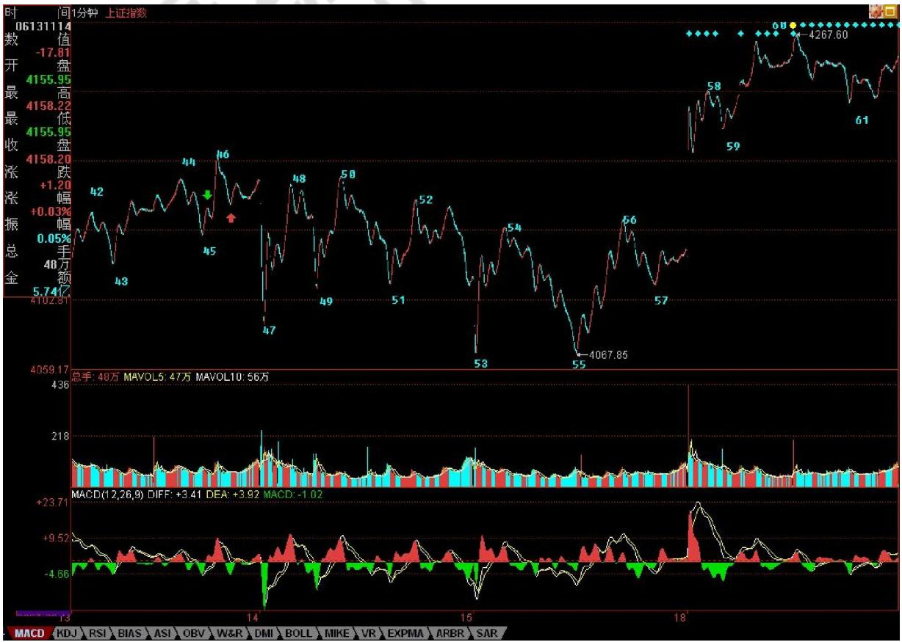

是人心，人心因预期而交易，这里关系的就是人的贪婪与恐惧、人的贪嗔痴疑慢。而本理论从不预测，没有预

期，只跟随着市场合力、市场走势而行，这里无须贪婪恐惧，看图作业，如此而已。但光知道这点还远远不够，因为没有预期可能就是最大的预期，没有贪婪恐惧可能就是最大的贪婪恐惧。不预测、不预期，并不是不可预测、不可预期，而是不为贪婪恐惧而预期、预测，是根据走势的自身规律来。

走势是有规律的，这规律是不患的，这不患的根源在于人贪嗔痴疑慢的不患。为什么本理论要强调当下分解的多样性？因为走势本身就是当下形成中的，是市场各种预期的合力当下画出来的，而每种画法都是不患的，都是源自人的贪嗔痴疑慢，因此每种多样性的分解都是符合理论的，多样性不是模糊性，而是多角度去让市场本身自己去画地为牢，由此使得市场的走势万变不离本理论的控制之中，而这，恰好是市场自身的规律之一。

不妨看看上图，上一课刚好说到“红箭头处比绿箭头高，所以不能确定该线段已经完成，还要看后面走势，由此可以知道如何去把握线段的结束”，有人可能问，为什么在这个位置不可以去预测、预期？因为市场自身并没有完成。但这里的未完成，是站在人观察的级别上说的，因为所谓的走势，首先是你观察的走势，没有离开你观察的走势。不同倍数的显微镜下的世界是不同的，但市场操作的成本、交易通道、资金规模等限制了人观察并能实际操作走势的显微镜倍数不可能无限小下去，所以必须确定一个最低级别的线段，把其下一切波动给抹平了。当然，根据严格的理论，用每笔成交当成最低级别，然后以此构筑线段，这样可以严格地分辨任何级别的走势，但这根本不具有操作性，特别现在交易成本增加，可操作的级别必然要增大，因此，一些可操作级别下的波动，必须要忽视掉。

站在最严格意义上，45-46线段构成43-44线段的盘整背驰（注意，力度比较的是下面所有红柱子的面积之和。）而细致分别线段以下级别，就知道45-46其实是一个小级别转大级别，而红箭头后第一次拉起不创新高，就可以出掉了，为什么，因为后面必然形成下上下的重叠结构，也就是有一个小走势中枢了，而线段以下级别的同级别操作，是不参与这类走势中枢的。当然，这是按最严格的，并没有太大操作意义的分析。而实际的操作中，大概真在有意义的操作，都至少是1分钟以下线段级别的。因此，在该图中，如果你是按30分钟级别操作的，46-47的波动就可以不管的，从 3404开始的反弹，一个标准的 5分钟级别的上涨，因此你的持有就至少一直等待这5分钟级别的上涨出现背驰或突发终结为止。

显然，46-55是一个5分钟的走势中枢，55跌破53后明显盘整背驰，各位也不难发现，如果把 55当成第一类买点（严格来说，盘整背驰无所谓第一类买点，只是这样来类比），57就是一个第二类买点。55-60，是一个标准的线段级别的上涨，59-60的背驰足够标准，看看下面 MACD标准的黄白线回拉 0轴，然后 60新高，而柱子面积与黄白线高度都比前面不如，由此就知道了。因此，按照理论，60后必然有调整回拉 58之下，而实际上61就比 58低，也就是说，58-61形成一个新的1分钟走势中枢，该走势中枢是否扩展成5分钟的，以及上一个 5分钟走势中枢的最高点，也就是46，是否被重新跌破，都是今后走势的关键。如果46不再被触及，那就是超强走势，意味着 3404点开始的 5分钟上涨走势依然延续。

这里必须强调突发消息对市场走势以及操作的影响是不必过于在意的，本质上，任何突发的消息，不过增加了一个市场预期的当下分力，因此，最终还是要看合力本身，或者说是市场走势本身。一般情况下，由于背驰的精确定位需要用区间套的方法，所以突发消息，最不幸的，就是在这精确定位期间出现，例如这次 530，就是这样。当然，这是一种小概率事件，更多情况，突发消息在背驰的精确定位后出现，这样突发消息对操作的影响就是0了。而对于那种最不幸的情况，用一个第二类卖点就足以应付，因此，突发消息出来后，在实际的操作中就不能放过这第二类卖点。不过要注意，并不是任何第二类卖点都需要反应的，这和级别有关，例如你是月线级别的，那这次所谓的大跌，看都不用看，爱跌不跌，随他去。即使你是5分钟级别操作的，如果某突发消息连一个1分钟的走势中枢都没终结，只制造了1分钟以下级别的震荡，那么在所谓的第二类卖点，也是不用管的。原则很简单，任何消息，都只是分力，关键是看对合力的影响，看他终结了多大级别的走势，这一切都反映在实际走势中，看图作业就可以了。

注意，突发消息终结的级别越大，越不一定等相应级别的第二类卖点。例如，一个向下缺口把一个日线级别的上涨给终结了，那么，消息出来当天盘中的 1分钟，甚至线段的第二类卖点，都是一个好的走人机会，如果要等日线级别的第二类卖点，可能就要等很长时间、而且点位甚至还比不上这一点，因为走势是逐步按级别生长出来的。还有，级别只是区分可操作空间的，为什么按级别？因为级别大，操作空间按通常情况下就大。但在快速变动的行情中，一个 5分钟的走势类型就可以跌个 $5 0 \%$ 例如这次大跌，因此，一个这样的 5分钟底背驰，其反弹的空间就比一般情况下 30分钟级别的都大，这时候，即使你是按 30分钟操作的，也可以按 5分钟级别进入，而不必坐等30分钟买点了。

附录：

今天的走势昨天已经说得很清楚，4224点下不出现第三类卖点，就是强势震荡。今天的走势，显然符合

这个要求。4224点，就是上图 61这位置，从 60开始的 1分钟走势中枢[4224，4254]，今后两天就看这走势中枢的第三类买卖点。换言之，还和昨天说的一样，只要不在 4224点下出现 1分钟级别的第三类卖点，那就是强势，至于大盘要展开新一轮上攻，就要在4254上出现 1分钟级别的第三类买点，否则大盘就在该区间内震荡继续走势中枢震荡延伸。

关于大盘的剧本不变，但个股之间显然会有分化，因此不能光看大盘，现在的股票，在技术上无非几类：一、创新高后回试的，这可以用第三类买点来把握；二、在前期高位下盘整蓄势的，这可以用小级别的第三类买点把握其突破，或在震荡低点介入；三、反弹受阻拉平台整理的，这个第二同样处理，只是位置与前期高位有距离；四、依然在底部构筑双底、头肩底之类图形的，这可以用第一、二类买点把握。

具体个股就不说了，来这里，如果希望一点脑子都不动，那是不行的。动脑子得到的东西是你自己的，否则永远都不行。

# 7、区间套定位标准图解

有人经常担心，万一人人都学会本理论，那么本理论还有用吗？问这种问题的，基本就没搞明白本理论。而且，人人都学会本理论，这本来就是一个假命题，像孔男人这样的文科生，本理论从来都觉得他们能学会的机会比较渺茫。注意本理论这里是有定语的，没有打击所有文科生，而是说孔男人这样的文科生。当然，如果有人爱自己往孔男人这样的文科生的套里去，本理论没什么意见。

有些无聊问题总是被提着，诸如走势中枢的意义是什么？对于一个实际操作者来说，走势中枢的意义就是没有意义，而没有意义就是最大的意义，因为你只要根据走势中枢的实际走势去反应，问题的关键是你去看明白走势的分解而不是走势中枢的意义，更重要的就是根据走势的分解去采取正确的反应。如果孔男人之类的文科生想探讨什么走势中枢意义，那么就让他们探讨去好了，就如同基督教的神甫千百年来 YY上帝的意义一样，对于本理论来说，上帝有什么垃圾意义并不重要，关键是如果真有什么上帝，那么也只是被面首的对象。股票是用来操作的，而不是用来意义的。

还有些人不断地问，为什么1分钟的顶背驰，有时候跌幅很大，有时候很小，究竟什么时候该走？这种问题是典型的垃圾问题。如果你的操作级别是1分钟级别的，那么1分钟的顶背驰你就该走了，至于后面的跌幅是大是小，和你有什么关系？你只要耐心等待市场走出新的1分钟底背驰就可以。反之，如果你的操作级别是月线的，那么1分钟的顶背驰和你有什么关系？你既然已经决定是按月线进出的，那么 1分钟级别的所有震荡都是可以接受的，可以忽略的。别说1分钟的，就算这次 530所谓的大跌，如果你真是月线级别操作的，看都不用看，这种级别的震荡根本就在月线可忍受的范围内，只有那些如孔男人那样的文科生才会认为本理论只能看1分钟的图，本理论已经多次说过，如果你按年线的级别，那么你比巴菲特还要巴菲特，关键是你有没有这样的耐心。

好了，没必要为孔男人这样的文科生浪费时间，看看下图，一个区间套定位的标准图解。如果上学时学过基本的数学分析课程，应该不难明白区间套定位，如果没学过的，那就费点劲，虽然前面的课程已经反复说过，但当昨天2007年 6月 20日 13点30前后大盘走势实际地走出来时，能当下看明白的有几个人？因此，以下的分析请仔细研究。

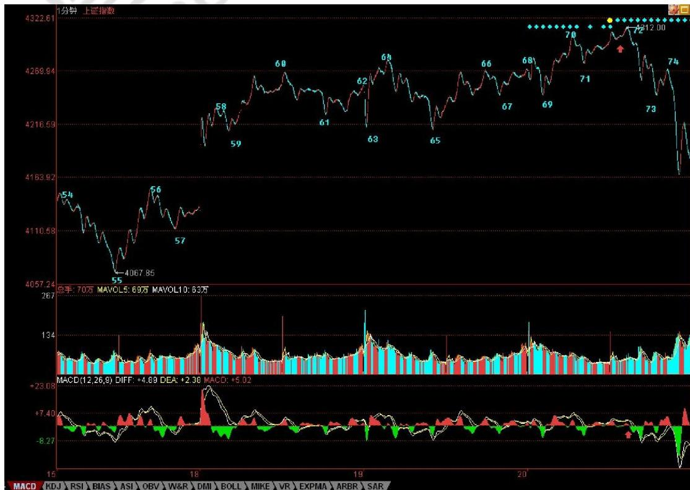

要比较力度，发现背驰，首先要搞清楚是哪两段比较，其实，只要是围绕一走势中枢的两段走势都可以比较力度。显然，对于 60-65这个 1分钟走势中枢，55-60与 65开始的一段之间就可以比较。在实际操作中，65开始的走势，由于没实际走出来，所以在和 55-60比较时，都可以先假设是进入背驰段。而当走势实际走出来，一旦力度大于前者，那么就可以断定背驰段不成立，也就不会出现背驰。在没有证据否定背驰之前，就要观察从65开始的一段其内部结构中的背驰情况，这种方法可以逐次下去，这就是区间套的定位方法，这种方法，可以在当下精确地定位走势的转折点。

对于65开始背驰段的内部走势，当下走到69时，并不构成任何背驰，为什么？因为背驰如果没有创新高，是不存在的。所以，只有等70点出现时，大盘才进入真正的背驰危险区。由于69-70段与67-68段比并没有盘整背驰，所以70点并没有走的理由，除非你是按线段以下级别操作的。而71点，构成对 66-69这1分钟走势中枢的第三类买点。按照本理论，其后无非只有两种情况，走势中枢级别扩展或者走出新的走势中枢上移。对后者，一个最基本的要求就是，从71点这第三类买点开始的向上段不能出现盘整背驰，而在实际中，不难发现，71点开始的走势力度明显比不上69-70段，而对于65-66段，69开始的走势力度也明显比不上，这从两者下面对应的MACD红柱子面积之和可以辅助判断。

因此，65开始的走势是第一重背驰段，69开始的是第二重背驰段，也就是 65开始背驰段的背驰段，而71开始的是第三重背驰段，也就是 65开始背驰段的背驰段的背驰段，最后当下考察 71开始的走势，从走势上红尖头以及MACD上红尖头可以当下知道，71的内部背驰也出现，也就是第四重的背驰段出现了。由此可见，72点这个背驰点的精确定位，是由65开始背驰段的背驰段的背驰段的背驰段构成的，这就构成一个区间套的精确定位，这一切，都可以当下地进行。

对于实际的操作，72四重背驰点出现后，卖是唯一的选择，而区别只在于卖多少。当然，如果是按 5分钟级别以及以下级别操作的，当然就全卖了，因为后面至少会形成5分钟的走势中枢震荡，实际上，60-69就是一个5分钟走势中枢。而对于大级别操作的，显然不可能因一个5分钟震荡而清仓，所以可以根据5分钟震荡可以容纳的数量进行对冲操作。小资金的利润率，在相同操作水平下，显然要远高于大资金的，例如像这样的卖点，小资金就可以全仓操作，大资金是不可能的。

如果说72的判断有点难度，需要知道区间套的精确定位，那么74的第二类卖点，就一点难度都没有了。唯一有点需要分辨的就是，这第二类卖点，同时又是一个1分钟走势中枢的第三类卖点，究竟哪个走势中枢？显然不是 70-73这个，因为这里需要满足结合律。一个第三类买卖点，至少需要有5段次级别的，前三段构成走势中枢，第四段离开走势中枢，第 5段构成第三类买卖点。其实，这里的答案很简单，74点是 69-72这个走势中枢的第三类卖点。也就是说，74点既是一个第二类卖点，又是一个第三类卖点，以前的课程已经说过，一旦出现二、三类买卖点同时出现的情况，往往后面的力度值得关注。实际上，74后面出现更大力度的下跌，这并没有任何奇怪的地方。

对于60-69这个5分钟走势中枢，69的4244点是一个关键位置，如果在其下出现第三类卖点，那么走势至少将扩展成一个 30分钟走势中枢，调整的幅度与压力就大了。而对于 72开始的走势，73很重要，要重新走强，必须冲破73这一点，该点位置恰好也是4244点。因此，短线的4244点十分关键，重新站稳，则大盘将最多是 5分钟走势中枢的延伸震荡，否则即使不演化成5分钟级别的下跌，也将扩展成30分钟级别的走势中枢震荡。

不管学什么，是否愿意学，首先请先把学的东西搞明白，否则浪费的是自己的时间，还不如不学。本理论，你爱学不学，就像无论你是否相信万有引力，无论你是上帝还是小布什，该存在的依然存在。本理论亦如此，无论任何人学与否，无论你是庄家、管理层还是什么玩意，都不增一分、不减一分，都一样。

因此，千万别学孔男人而成为如孔男人那样的文科生，究竟孔男人那样的文科生是一种什么玩意，看看下面两个连接就明白了。

如果在看过上面的课程，今天的走势都看不明白不会操作，那你大概要面临两种选择：一、去和孔男人为伍；二、洗心革面、好好学习。上面说到的4244点的技术意义，在今天走势中表露无疑，早上的杀跌补缺口，这次是一个明显的区间套底背驰定位，如果还看不明白，继续加倍努力学习或者放弃孔男人去，自己选择吧。

明天还是这个4244点，站稳就走强，否则继续5分钟的走势中枢震荡，并且要小心出现第三类卖点。明天又是周末，利空又准备漫天飞，本理论早在前面说过，这里必须用震荡来化解技术、心理、政策的压力，如果整天还是周一看没消息就跳空，然后继续不断震荡等周五，然后周末等消息，这样轮回下去，是走不出坚定有力的行情的，所以关键还是心态，整个市场的心态必须在震荡中修复。今天最低4147点，和本理论反复说的1/2线4144点相差不远，中线关键还是看这线，不破就是强势。

# 8、股市里不动 脑子只有死路一条

由于要出差，先把这线段图贴出来，否则回来就积累一大堆 K 线，要分很多张图了。昨天说的很清楚了：“明天还是这个 4244 点，站稳就走强，否则继续5 分钟的走势中枢震荡，并且要小心出现第三类卖点。” ”

今 天的 走势 在4244 点上精确地被再次压制，然后出现大幅度跳水，这些在今天走势的当下都

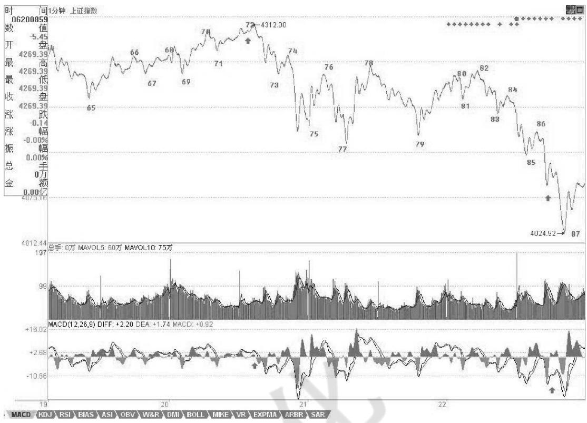

很容易分析。81-82 的盘整背驰、84 点的第二类卖点，后面走出一个线段的标准下跌，以红箭头所指微型走势中枢前后出现背驰，然后有 87 的转折，但这个转折，由于 86-87 没有背驰，所以，只能是线段下级别的，因此，并不能现在就确定该线段就走完了，除非重新突破 85 的 4131 一点。

站在走势中枢的角度，75-84 这个 5 分钟走势中枢下边在 4188 点，如果后面的走势不能重新站上去，就要提防形成 5 分钟第三卖点。而前面已经说过，现在的情况 46-87 已经构成一个 30 分钟的走势中枢，短线的问题只是这走势中枢的第三段是否完成。其后就是该走势中枢的一个走势中枢震荡，该走势中枢区间在[4067，4192]，该走势中枢要管大盘一段时间直到出现 30 分钟的第三类买卖点。

下周走势十分关键，由于关系到月线、特别是季线的收盘，季线如果留出很长上影，则 7 月到 9 月的行情压力都很大。所以，对于多方来说，下周的任务就是不让季线留下长上影。只要收在 4144 点的 1/2 线上，就是多方最大的胜利。本理论在 5 月初关于 4144 点的 1/2 线要管大盘至少 3 个月的断言，看来肯定是成立了。

个股方面，就看图作业吧，各位可能都发现，本理论一出差，本理论那些股票都走得没什么力，这也怪不了本理论，大家就当成是巧合，希望里面的大小庄家也别老是这样，这样有意思吗？希望这次有点改变。

# 9、一根筋是不适合玩震荡行情的

震荡行情是最容易玩出利润来的，但这绝对不适合一根筋思维的人。大盘的中线走势，

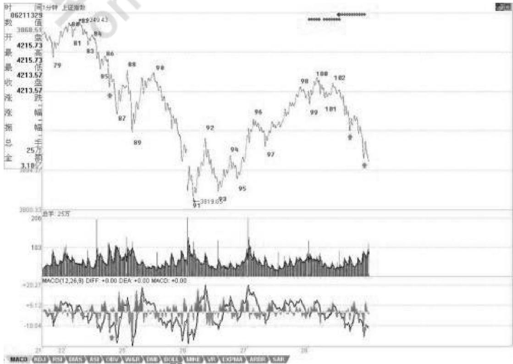

在前面 6 月 4日的文章里已经明确说过“而 5 月初给出的技术面分析依然有效，目前这 1/2 线已经上移到4144 点，深圳成分指数相应位置在 13700 点，能否最终有效站稳该线，是判断中期走势是否重新趋强的关键。在此之前，大盘走势将以震荡形式逐步消化技术面、政策面的压力。其中，目前在 3600 点附近的 5 月均线将是判断大盘是否正常调整的关键，只要该线不有效跌破，那么大盘的调整在正常的范围内，否则大盘的调整时间将大为增加。”本月的走势，基本就是在这 5 月均线与 1/2 线之间的震荡，而 7 月，这判断依然成立，但要密切注意突破的方向，因为 7 月时，5 月均线将上移，空间压缩，最迟 8 月初就要选择突破方向了。之前，就是大玩震荡，狠拉狠砸，把利润给洗出来，把差价打出来。

今天的大盘，冲不破昨天给出的 4131，调整就成了必然的。然后又跌破 4025 点，所以调整就加大了，这在盘中都很容易判断出来。实际操作，特别对待震荡行情，就是要敢卖敢买，该卖一定要卖，反而买却不一定，特别对技术有点问题的，仓位可以控制好。当然，技术没问题的，这里就是天堂，一定要记住本理论 的

多次忠告：股票都是废纸，只有能弄出差价来才是抽血，否则上涨下跌不过是坐电梯，和你有什么关系？而要弄差价，用走势中枢震荡的手法，就是最好的，这需要刻苦的学习和练习。

把图弄上来花了点时间，图中 100 的顶背驰都看不出来的，102 的第二类卖点看不出的，都要抓紧学习。102 后面的103 在收盘时还

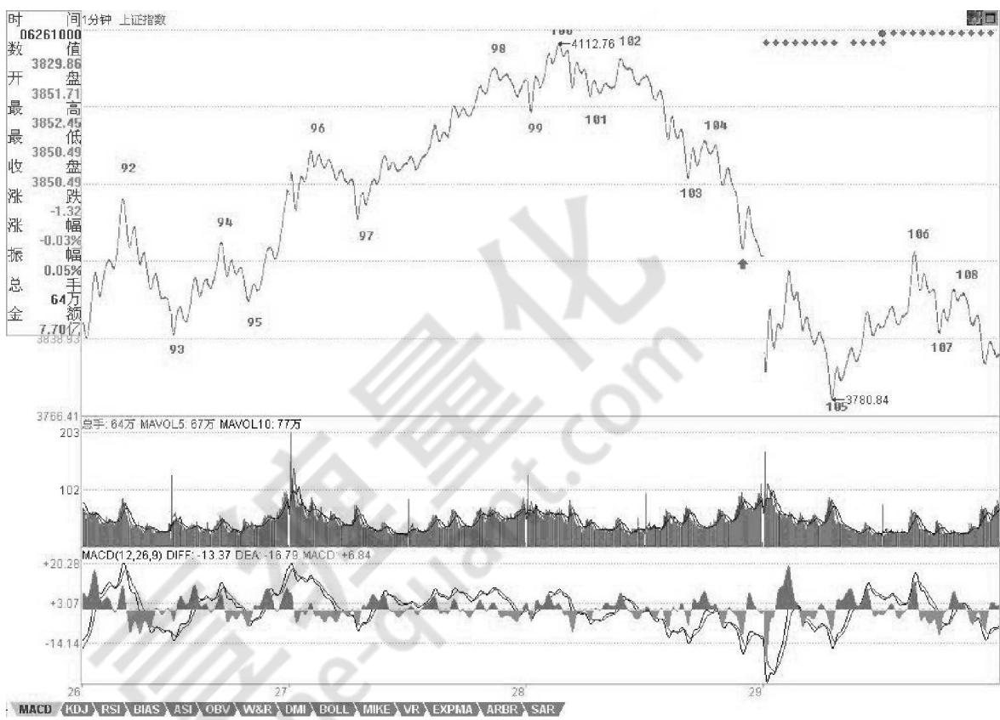

没走完，要 102 走完，就是要出现线段里的底背驰。而下面箭头位置，就是大盘短线的压力所在，特别是最下面一个，必须站稳，否则大盘就是最弱走势，至少要等待出现 1 分钟以上级别的背驰才有介入价值。

忙，晚上又有应酬，下周才能回北京，季 K 线收得不会太好看了，这中线的大震荡延续时间不会短，学会震荡操作，将让你在这中线大调整中获利良多，好好学吧。

多说句废话，中国第一只在德国交易所交易的股票将在 7 月初挂牌，这是中国第一创投公司的杰作，7月底还有韩国交易所的第一只股票，这两枪打响后，估计私人股权投资要加温了。

# 附录：

刚打开电脑，上来看看，发现有人对昨天的线段分法有疑问，这问题以前说过，就是关键是看你用多大的精确度。下图中，红箭头处是 4022.69，绿箭头处是 4022.42，按最严格的标准，精确到小数点后两位，这就没终结原来的线段，所以就不是新的线段。当然，如果统一按个位数是精确度，直接取整，那么这就等于两处有重合，那按这标准，就可以定义为新线段（像右图一样）。但如果按四舍五入，那前面是 4023，后面是 4022，就不能这样定义了。

新线段的一个最重要标准就是一定要终结老线段的结构，例如下跌的线段，后高点一定低于前低点。

为了照顾各位的习惯，也为了简单，以后就统一标准，用直接取整的办法来确认。所以，线段分类就可以改用右图了。

# 10、月线分段与上海大走势分析、预判

分型、笔、线段，在1分钟图上可以分辨，在月线图上的道理是一样的。但用月线图分辨，等于用一个精度超低的显微镜，只能看一个大概，但这个大概，却是最实质性的，是一个大方向。

下面，就是上海指数的月线图。绿箭头指着的是顶分型，红箭头的是底分型。打“X”的就是该分型不符合笔所要求分型的规范。这里，只要是两条：一、顶和底之间没有至少一K线；二、不满足顶必须接着底、或底必须接着顶。

例如，第一个红箭头和第二个绿箭头之间显然不能构成一笔，也就是说，这两个，只能取一个：如果取第一个红箭头，那么第二个绿箭头就不是笔中分型，那么第二个红箭头，显然是一个底分型，因此，就形成两个底分型连续的划分，显然，这时候，第一个就不算了，这和前面说取第一个红箭头对着的底分型矛盾。所以，这里，只能取第二个绿箭头，这时候，第一个绿箭头对应的顶分型，自然就不算笔中的顶了。

后面的各分型，带“X”的，都可以按照上面两个原则去分析。

人可能要问，这样分型的确定，在当下如何完成？这必须当下去完成。例如，当走势走到第一个红箭头时，显然，第一绿箭头的顶分型也可以暂时看成是确定的顶分型。但当第二绿箭头走出来后，这个问题就有了可修改的地方。

有 人 可能 要疑问，这样分型是否 随 时 可 以 修改？答案是否定的。一旦完成的图形，这修改就不可能了。分型可修改，证明图形没完成。例如，当第二个红尖头分型出现后，前面三个的分型的取舍就是唯一的。这个分型的可修改性，反而是一个对走势判断极为有利的性质，例如，第二个绿箭头走出来后，这图形未完成的

性质就是百分百确定了，但所有图形必然完成，走势必完美。如何才能完美，这样，在理论的框架下，只有极少的可能，而这些可能，就成为综合判断的关键条件。然后根据各级别图形的未完成性质，就可以使得走势的边界条件极端的明确与狭小，这对具体操作，就是极为有利的。注意，这可和概率无关，是百分百的纯理论保证，最终所依据的，就是在本理论最早反复强调的走势必完美原则。

其实，本理论的关键不是什么走势中枢、走势类型，而是走势必完美，这才是本理论的核心。但要真正理解这个关键，可不是看字面意思就能明白的。

显然，目前月线上的第 1、2段已经走出来，其中，按照线段里笔的类背驰，1的结束那顶与 2结束那底都是极为容易判断的。上海指数的历史大顶与底，根据这线段的划分，都不是什么难搞的秘密。那么，对现在依然进行中的第3段走势，有什么可百分百确定的呢？

一、显然，这一段要成为段，那至少要三笔，而现在连一笔都没走完，因此，这轮行情的幅度，可想而知。也就是说，即使该笔走完，一个笔的调整后，至少还有一个向上的笔。  
二、2245到998点是线段的类走势中枢，也就是说，只要调整那笔不跌破2245点，那么，将构成一个线段的类第三类买点，这也支持至少要走一笔。  
三、 笔的完成，必须要构成一个顶分型。而一个月线的顶分型将如何构成？这意味着什么，这个问题就当成是一个作业，各位去思考一下，然后给出这个结论对应的操作策略。从中也可以亲自实践一下，去明白一下理论指导下操作的力量。

最后，再提一个思考题：为什么本理论在7月份要大搞满江红，而8月以后就放手坐轿子，请利用分型的原理给本理论的行为一个技术上的解释。

# 11、一个教科书式走势的示范分析

2007-08-15 22:41:35

在前面的课程里，本理论反复说过，结合律是至关重要的。这里的人，认真学过抽象代数的人少，所以不大明白运算规则的选择对研究对象的决定性意义。对于走势来说，结合律就是连接走势之间关系最重要的规则，不深切明白这一点，如何能明白走势本身？

无论如何结合，本理论对走势的分析原则是不变的。可以这样认为，本理论，就是走势保持结合律下具有变换不变性的一套理论，而且可以严格地证明，是唯一能保持分解变换不变且保持结合律的一套理论。如果有点现代数学常识，对这理论的意义应该能多点了解。

这几天，随着走势的当下发展，本理论不断变换着所看的走势中枢，这根本的原因就在于结合律，因为结合律，我们可以对走势进行最有利观察的分解，这样，才能更容易明白走势究竟在干什么？

例如，到今天，走势一种最明显的划分已经自动走出来，就是 8-17构成 5分钟走势中枢，该走势中枢是4300点那个 5分钟走势中枢上来后的一个新的 5分钟走势中枢，这个走势中枢，在刚形成时，我们已经指出，而且任何学过本理论的，都可以当下指出。一般来说，形成这个 5分钟走势中枢后，在理论上只有三种走势：

1：向上出现第三类买点，走出 1分钟向上走势类型，然后构成新的 5分钟走势中枢；  
2、向下出现第三类卖点，走出 1分钟线向下走势类型，构成新的 5分钟走势中枢。  
3、走势中枢延伸，或出现第三类买卖点后扩展成大级别的 30分钟走势中枢。

显然，在行情发展中，没必要去预测走势选择什么，走势自然选择，只需要观察着就可以。现在，走势自然选择了第一种，为什么？因为17-38构成完美的 1分钟上涨走势，目前，围绕这1分钟上涨走势的最后一个1分钟走势中枢 32-35，正扩展出新的5分钟走势中枢的雏形。 $\mathcal { D } / \mathrm { ~ \Omega ~ } , \mathbb { O } ^ { * }$

这个 5分钟走势中枢，最终至少要完成的，至于是否继续扩展出大的 30分钟走势中枢，还是出现新 5分钟走势中枢的第三类买点继续上涨，再形成新的5分钟走势中枢，这无须预测，与 8-17那 5分钟走势中枢一样对待，如此而已。

那么，如果是按30分钟操作的，这些5分钟的走势中枢移动、震荡之类的活动根本无须理睬，只要看明白就是，根本无须操作；如果是按5分钟级别操作，那么就是不参与大于5分钟级别的震荡，那么就等 5分钟上涨出现背驰后走人；如果是按1分钟级别操作，那么今天早上就该先走，为什么？因为 1分钟的上涨出现背驰，按照本理论，后面必然回抽到最后一个1分钟的走势中枢之内，从而至少形成一个新的5分钟走势中枢。

然后根据 5分钟震荡的走势进行回补就可以。

注意，按照多样性分解原则，新的 5分钟走势中枢，暂时先从最后一个 1分钟走势中枢开始算起，后面的操作先以此为准，等走势走出最自然的选择再继续更合理的划分。按照这暂时的划分，并不影响任何操作，5分钟走势中枢该怎么操作就怎么操作，如

此而已。

在今天的背驰判断中，关键是知道哪一段相比，显然，27-32与35-38这两段去比。而实际的对比中，看1分钟图，去加两段对应的那些 MACD，太麻烦，所以可以看 5分钟图。这里，把5分钟图给放上来了，图上，相应对比的两段已经标记出来，下面MACD的红箭头，对应是回抽那一下，对应走势，就是最后一

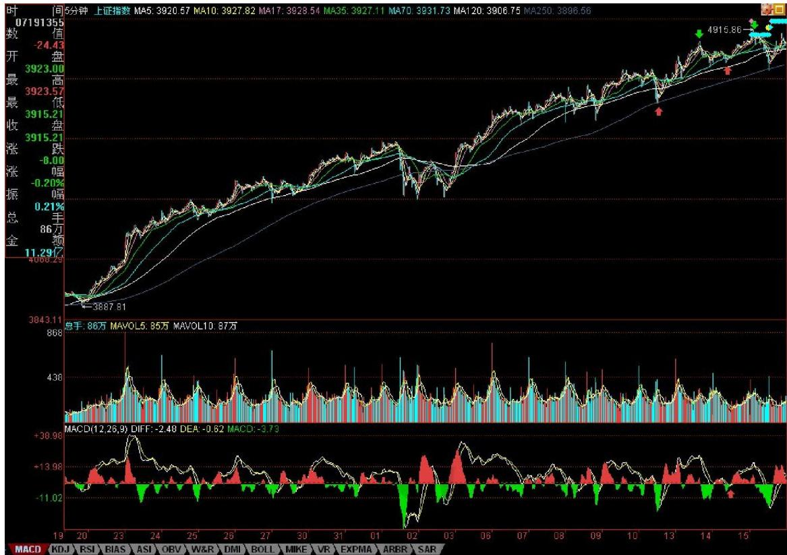

个 1分钟走势中枢形成的时候，前面两段的对比，极为教科书，请好好揣摩。

其实，只要基本概念明确，这些分析，在当下都不是什么难事。这里必须提醒一下，1分钟图上 38标记的位置用红箭头给出，显然，那不是最高的位置。为什么？没有人规定分段的结束位置一定是最高、最低的，关键要有至少三笔，因为从37开始到最高的位置，没有三笔，所以不能认为线段已经完成。但在1分钟级别上看，那么 37-38这一段，就结束在最高的位置，为什么？线段的存在，是为了让图形规范化，就如同在 5分钟走势中枢里，看1分钟走势类型的重叠，是把整个走势类型的波动区域算在一起看，道理是一样的。

1分钟图

5分钟图

12、现在的课已经越来越精细，特别用的是最小的 1分钟，一般的理论，在这么精细、偶然性那么大的图上都要乱套了，但却恰好能显示本理论的有力。别说1分钟图，分笔图也没问题，这就是本理论所构筑几何结构的力量。世界都是几何的，别说那几张无聊的走势图了。

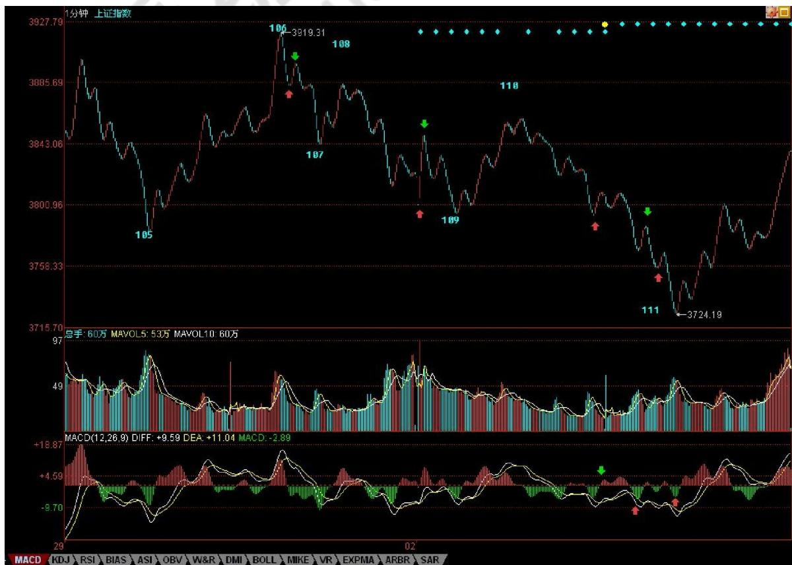

看下图，为什么下午的分段是这样？大概很少人现在就能全部搞清楚，所以，为了让各位能睡一个塌实觉，

也为了免得等一下飞机万一不听话，到时候只留下各位在这里争论不休没人再给解答，所以本理论在去机场的路上用本本给各位补上一课。

106到107这一段箭头所指的那一笔，用的是取整的前提，所以，只要你仔细去分析，就知道那一定是一笔。这个问题，本理论瞧了一下，见一位叫快乐vs菜虫的网友已说到。当然，你可能要问为什么一定要取整？这没有什么必然性，只是预设的前提，你可以采取严格到小数后两位的精确度，但其实不同软件，对1分钟这么精细的图，都会有数值上的细微差别，所以，所谓的精确，往往不一定就是，而在这么快速变动的市场中，数值有点细微差别，其实没什么不同，例如，还可以用这样的区别方式，就是两者相差0.5点内的看成是一样的。所有预设精度，唯一必须遵守的，就是精度一旦预设，就一定要一路保持。

注意，没有什么精度是十全十美的，例如用相差 0.5内看成是相同的，那么如果是 0.51呢？这和 0.49也没有多大区别。所以这些细节，其实问题都不大，关键是要统一，不要变来变去。由于现在只是示范，为了方便各位学习，就一直继续采用取整的精度，各位可以根据自己的情况来调整。

至于108-109，带箭头那笔为什么不被算成一段？也就是108-109为什么不是三段？这很简单，因为段必须是至少三笔构成，缺口如果包含在一笔中的，像今天早上低开的缺口，没有终结昨天那笔，是顺着昨天那笔下来的，所以这种缺口和一般的走势没什么区别，缺口还是包含在昨天的一笔里。但有些突然性的逆着走势来的缺口，就像530那个，就必然要当成一段，而不能光当成一笔或一笔里的了。有人可能说，缺口没有三笔？那你可以这样去看，就像 $0 = 0 + 0 + 0$ ，缺口可以看成是三个缺口的迭加，这样就有三笔以上了。还有，有位叫袖手旁观的网友理解得也不错，线段必须要被终结才算结束，但必须要强调的是，线段必须要被线段终结才算是真终结，单纯的一笔是不能终结线段的，这就避免了一些特偶然因数对走势的干扰。

至于110-111。红箭头那两个为什么不是最终精确定位的背驰点？这都是些以前就应该解决的简单问题。像第一个红箭头位置，第一次略微跌破109那位置，这时候把已经出现的面积和前面108-109的对应面积之和比，已经十分接近，也就是说110-111，刚起跌，这力度已经和前面的108-109差不多，这恰好说明这一段的力度是很强的，不但不可能是对108-109背驰，而且站在走势中枢震荡的角度，这种力度，一定是小级别转大级别以时间换空间或与更大力度的对比产生的背驰才能化解的。后面这种情况，在这个实际的图形中，就是与前面104-105的下跌力度比。110-111这段，相比较的，是104-105这段，中间的走势中枢震荡的走势中枢，是 105到110这个。因此，这里根本不存在与108-109对比的问题。站在105-107这个走势中枢的角度，110虽然不构成第三类卖点，但也极为接近，这种对走势中枢的离开，力度一般都很大，所以就算你搞不清楚和哪段比，也至少要等这段的结构被终结，才有介入的可能，而后面，上下上的两次反抽，根本就没有终结其结构，因此后面的破位下跌就是天经地义的。

机场到了，先保存起来。

挺好玩的，帖子分两段写，中间过一安检。继续。

至于第二红箭头那个，就更不可能是了。绿箭头那次反抽，等于对前面破位前那上下上的微型类走势中枢（注意，站在严格意义上，线段以下是没有走势中枢的，所以说是类走势中枢）的一个类第三类卖点，后面有两种变化，就是转大级别类走势中枢或类走势中枢移动直到形成新类走势中枢为止。而下面的黄白线，是一个典型的下上下结构中的第二下刚破上的低点，这是力度最大的一下，怎么可能有背驰出现？MACD第一个红箭头就指这大的下上下破的一下，这时候除非出现线段结构的突发性终结，否则不可能有什么背驰出现。而后的回拉，其实刚好构成一个奔走型的上下上结构（也就是第二上刚和第一上的低点稍微重合），这其实也就构成另一个微型类走势中枢。这和第一个红箭头指的那个一起，刚好构成两个类走势中枢的下跌走势。然后，后面的背驰判断就很简单了，和一般的趋势中背驰的判断一样。针对第二那奔走型的微型走势中枢的前后两段，MACD两个红箭头对应的绿柱子的比较，一目了然。（千万别再问这时候为什么不看黄白线之类的问题，这类问题回答过N次了。）

请各位好好把各类情况消化好，特别一些最基本的知识，一定要掌握，62、63课，要完全吃透，而且能当下应用。当然，这需要不断练习，不断研究不同的图形。

